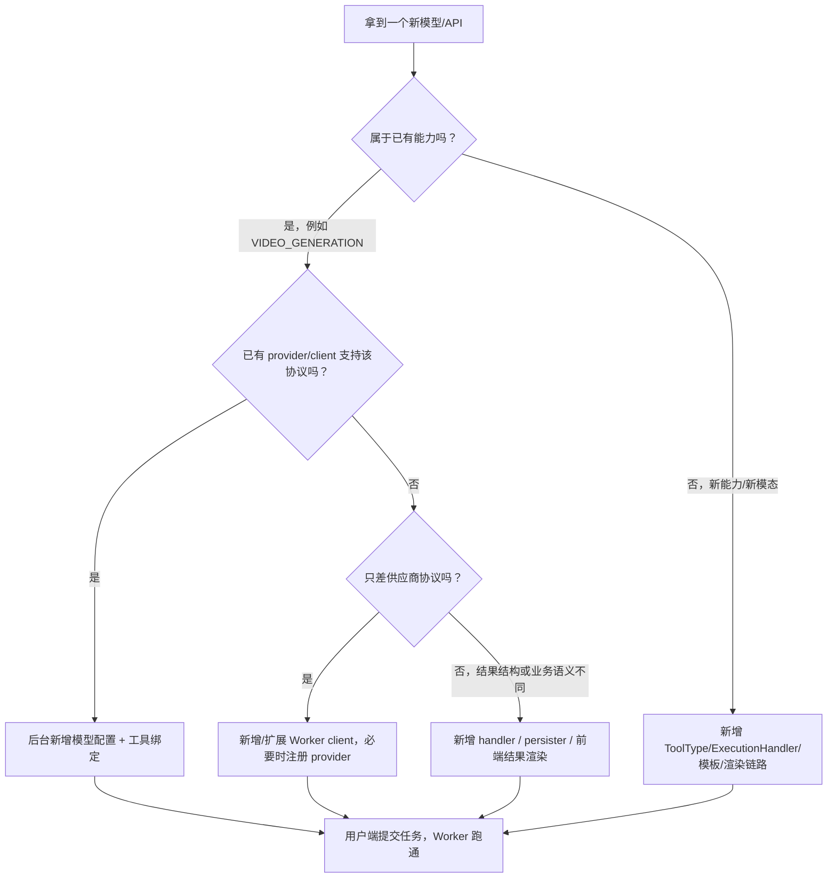

# AI 模型与模态配置指南

本文给后续接入模型时的开发者和 AI 助手阅读。目标不是复述后台怎么点，而是让接入前先判断：

1. 只需要后台配置，还是必须写代码。
2. 如果要写代码，应该写后端、Worker、用户端还是管理端。
3. 哪些概念必须保持一致，避免“模型能保存但任务跑不通”。

> 经验规则：后台配置决定“系统知道这个模型能干什么”，Worker 决定“任务真的怎么调用供应商”。如果供应商协议已经被 Worker 支持，通常不用写后端业务代码。

## 1. 一句话结论

新增模型先按下面顺序判断：



最常见情况：

| 场景 | 是否写后端 | 是否写 Worker | 说明 |
| --- | --- | --- | --- |
| 同供应商、同协议、换模型名 | 否 | 否 | 后台新增模型配置即可 |
| 同能力、同供应商协议、不同模型参数 | 否 | 可能否 | 先通过工具字段和 modelConfig 参数覆盖 |
| 新供应商，但接口协议类似现有 client | 通常否 | 是，扩展 client 分支或 provider 注册 |
| 新供应商，有签名、异步轮询、文件转换 | 通常否 | 是，新增 client 适配 |
| 新业务能力，例如生音乐、视频理解、文件解析 | 是 | 是 | 通常要新增 ToolType、模板、handler、渲染 |
| 新输出模态，前端不会展示 | 可能是 | 是 | 后端枚举、用户端结果渲染都要补 |

## 2. 四个必须对齐的核心概念

### 2.1 Provider：供应商协议

位置：

`backend/src/main/resources/model-providers.yml`

它告诉后台“有哪些供应商、供应商支持哪些能力”。例如可灵：

```yaml
providers:
  - code: kling_video
    label: Kling video/images
    capabilities:
      - VIDEO_GENERATION
      - IMAGE_GENERATION
    defaultBaseUrl: https://api-beijing.klingai.com
    defaultModel: kling-v2-6
    billingDefault: PER_CALL
    testStrategy: accept_only
    workerReady: true
```

规则：

1. `code` 是供应商协议编码，后台模型配置和 Worker 都依赖它。
2. `capabilities` 决定模型能不能被某类工具选择。
3. `workerReady=true` 只能在 Worker 已支持真实调用后设置。
4. 新增 provider 后，Worker 侧也要同步 `worker/providers/registry.py`。

### 2.2 Model Config：某个可用模型实例

后台路径：

`系统配置 / AI 模型配置`

它保存“供应商 + 模型名 + Base URL + 密钥 + 价格 + 能力”。一个 provider 可以配置多条模型，例如：

| provider | modelName | capabilities | 用途 |
| --- | --- | --- | --- |
| `kling_video` | `kling-v2-6` | `VIDEO_GENERATION` | 可灵图生视频 |
| `kling_video` | `kling-v3` | `IMAGE_GENERATION` | 可灵生图 |
| `seedance` | `doubao-seedance-1-5-pro-251215` | `VIDEO_GENERATION` | Seedance 视频 |

模型名必须和官方 API 文档一致。不要把后台展示名当成 `modelName`。

### 2.3 ToolType / Capability：工具能力类型

后端枚举：

`backend/src/main/java/com/aiminilab/aitoolmarket/common/enums/ToolType.java`

常用值：

| ToolType | 业务含义 | 典型输入 | 典型输出 |
| --- | --- | --- | --- |
| `TEXT_GENERATION` | 文本生成 | 文本/JSON | 文本 |
| `IMAGE_GENERATION` | 图片生成 | 文本/图片 | 图片 |
| `TEXT_TO_SPEECH` | 文本转语音 | 文本 | 音频 |
| `VIDEO_GENERATION` | 视频生成 | 文本/图片 | 视频 |
| `DIGITAL_HUMAN` | 数字人视频 | 文本/音频/形象 | 视频 |
| `AGENT` | Agent 对话 | 多轮上下文 | 文本/工具调用 |

后台工具里的“模型能力类型”必须和模型配置的 `capabilities` 匹配，否则模型下拉会看不到。

### 2.4 ExecutionHandler：Worker 路由

后端枚举：

`backend/src/main/java/com/aiminilab/aitoolmarket/common/enums/ExecutionHandler.java`

Worker 路由：

`worker/task_queue/redis_consumer.py`

| ExecutionHandler | Worker handler | 说明 |
| --- | --- | --- |
| `TEXT_GENERATION` | `worker/handlers/text_task_handler.py` | 文本生成 |
| `IMAGE_GENERATION` | `worker/handlers/image_generation_handler.py` | 图片生成 |
| `TEXT_TO_SPEECH` | `worker/handlers/text_to_speech_handler.py` | 音频生成 |
| `VIDEO_GENERATION` | `worker/handlers/video_generation_handler.py` | 视频生成 |
| `DIGITAL_HUMAN` | `worker/handlers/digital_human_video_handler.py` | 数字人 |

工具能保存不代表能跑通。真正执行时看的是 `executionHandler`。

## 3. 输入/输出模态怎么选

后端枚举：

`backend/src/main/java/com/aiminilab/aitoolmarket/common/enums/ToolModality.java`

| 模态 | 说明 | 示例 |
| --- | --- | --- |
| `TEXT` | 文本 | prompt、文案、脚本 |
| `IMAGE` | 图片 | 首帧图、参考图 |
| `AUDIO` | 音频 | TTS 结果、参考音色 |
| `VIDEO` | 视频 | 图生视频结果 |
| `FILE` | 文件 | PDF、素材包 |
| `JSON` | 结构化参数 | 表单参数、结构化结果 |
| `MULTIMODAL` | 多模态 | 文本 + 图片 + 文件 |

选择建议：

| 工具 | ToolType | inputModality | outputModality |
| --- | --- | --- | --- |
| 文生图 | `IMAGE_GENERATION` | `TEXT` | `IMAGE` |
| 图生图 | `IMAGE_GENERATION` | `IMAGE` 或 `MULTIMODAL` | `IMAGE` |
| 文生视频 | `VIDEO_GENERATION` | `TEXT` | `VIDEO` |
| 图生视频 | `VIDEO_GENERATION` | `IMAGE` 或 `MULTIMODAL` | `VIDEO` |
| TTS | `TEXT_TO_SPEECH` | `TEXT` | `AUDIO` |
| 数字人 | `DIGITAL_HUMAN` | `MULTIMODAL` | `VIDEO` |

注意：

1. 模态是产品和前端展示语义，不等于供应商原始 API 字段。
2. 图生视频虽然需要 `prompt`，但核心输入可以是图片 + 文本，所以常用 `MULTIMODAL`。
3. 如果用户端结果页无法展示某种输出，需要补前端渲染。

## 4. 哪些情况只配置后台即可

满足全部条件时，一般不用写代码：

1. provider 已在 `model-providers.yml` 注册。
2. Worker `providers/registry.py` 也注册了该 provider 能力。
3. 对应 `ExecutionHandler` 已经存在。
4. Worker client 已经支持该 provider 的协议。
5. 新模型只改变 `modelName`、价格、Base URL 或密钥。
6. 供应商返回结果能被现有 persister 和用户端结果页处理。

例子：

| 新增内容 | 操作 |
| --- | --- |
| 可灵同协议另一个图生视频模型 | 后台新增模型配置，provider 仍选 `kling_video` |
| Seedance 同协议新视频模型 | 后台新增模型配置，provider 仍选 `seedance` |
| MiniMax speech 换模型版本 | 后台新增模型配置，provider 仍选 `minimax_speech` |

## 5. 什么时候要写后端代码

后端是业务事实源。只有平台自己的“能力、字段、状态、计费、展示契约”发生变化时，才优先写后端。

### 5.1 必须写后端的情况

| 触发条件 | 常改文件 |
| --- | --- |
| 新增 ToolType | `common/enums/ToolType.java`、模板、测试 schema |
| 新增 ExecutionHandler | `common/enums/ExecutionHandler.java`、任务路由契约 |
| 新增 ToolModality | `common/enums/ToolModality.java`、前后端类型 |
| 数据库字段变化 | `DataInitializer.java`、实体、Mapper、`schema-test.sql` |
| 后台要新增配置字段 | DTO、Service、Mapper、管理端表单 |
| 模型能力过滤规则变化 | `ModelCapabilityService.java` |
| 任务状态/计费规则变化 | task service、credit service、测试 |
| 新结果类型要落库或展示 | task result DTO、用户端结果页 |

### 5.2 不建议写后端的情况

| 需求 | 推荐做法 |
| --- | --- |
| 只是换模型名 | 后台配置 |
| 只是增加供应商文档链接 | `model-providers.yml` 或后台模型配置 |
| 只是 AK/SK 鉴权 | 用 `extraAuthJson` |
| 只是不同 API path | 优先放到 Worker client 默认值或 modelConfig 覆盖 |
| 只是字段表单变化 | 后台“聊天输入控件”配置 |

## 6. 什么时候要写 Worker 代码

Worker 负责“把平台统一任务转换成供应商 API 调用”。只要供应商协议不同，通常要写 Worker。

### 6.1 常改文件

| 层 | 文件 | 作用 |
| --- | --- | --- |
| Provider 注册 | `worker/providers/registry.py` | Worker 侧能力校验 |
| Client | `worker/client/*_client.py` | 供应商鉴权、请求、轮询、解析 |
| Handler | `worker/handlers/*_handler.py` | 从 executionContext 取参数，调用 client |
| Persister | `worker/handlers/generated_*_persister.py` | 下载/保存结果，生成 `/generated/...` |
| Router | `worker/task_queue/redis_consumer.py` | 新 handler 路由 |
| Config | `worker/config.py` | 默认 URL、path、timeout、env |
| Test | `worker/scripts/run_fake_*_test.py` 或 `worker/tests` | 假链路验证 |

### 6.2 Worker client 要处理什么

新增 client 时要明确：

1. 鉴权方式：API Key、Bearer Token、AK/SK、JWT、签名、OAuth。
2. 请求方式：同步、异步任务、回调、分片上传。
3. 输入转换：URL、base64、本地文件、multipart。
4. 路径：创建路径、查询路径、取消路径。
5. 状态映射：供应商状态到平台 `SUCCESS/FAILED/TIMEOUT`。
6. 结果提取：图片 URL、视频 URL、音频 URL、base64、文件列表。
7. 错误信息：保留 status、body、request_id，方便排查。

可灵这次的两个关键点：

1. `image2video` 的 `image` / `image_tail` 不能直接传平台 URL，Worker 要转成纯 base64。
2. 图生视频创建后查询路径是 `/v1/videos/image2video/{task_id}`，不是 `/v1/videos/{task_id}`。

## 7. 什么时候要写管理端代码

管理端只负责让配置更容易填，不负责模型真实调用。

需要改管理端的情况：

| 场景 | 文件/区域 |
| --- | --- |
| 模型配置新增字段 | `admin-frontend/components/admin/agent-model-settings.tsx` |
| 工具新增字段 | `admin-frontend/app/tools/page.tsx` |
| 动态字段支持新控件 | `admin-frontend/components/admin/field-schema-editor.tsx`、`lib/tool-fields.ts` |
| 新 ToolType 中文展示 | `admin-frontend/app/tools/page.tsx` |
| 新 provider 下拉展示 | 后端 `model-providers.yml` + 管理端拉取接口 |

当前已支持的关键后台能力：

1. `extraAuthJson`：给 AK/SK 供应商使用，例如可灵。
2. `核心字段`：同一工具只能选一个，用来替代用户端底部主输入框。
3. 图片/文件字段：用户端支持拖拽上传，上传后自动回填 `/generated/uploads/...`。
4. 供应商入口：可配置控制台、余额、文档链接，方便运营查看。

## 8. 什么时候要写用户端代码

用户端负责提交参数和展示结果。

需要改用户端的情况：

| 场景 | 文件/区域 |
| --- | --- |
| 新输入控件 | `user-web/src/pages/Chat/CapabilityControls.vue` |
| 主输入框逻辑变化 | `user-web/src/pages/Chat/Page.vue` |
| 文件上传参数 | `user-web/src/api/aiToolApi.ts` |
| 新结果展示 | 任务详情/结果渲染相关组件 |
| 新路由或页面 | `user-web/src/router`、页面目录 |

现在图片/文件字段的设计：

1. 用户端上传文件到 `/api/v1/upload`。
2. 后端保存到 `data/generated-media/uploads/{yyyyMMdd}/`。
3. 前端字段值变成 `/generated/uploads/{yyyyMMdd}/{file}`。
4. Worker 如果供应商需要 base64，会自己读取或下载后转换。

不要让前端直接做供应商签名或保存密钥。

## 9. 字段 schema 与供应商 API 的关系

后台“聊天输入控件”配置的是产品字段，不要求一比一等于供应商字段。

建议字段命名：

| 语义 | 推荐 fieldKey | 兼容别名 |
| --- | --- | --- |
| 核心提示词 | `prompt` | `text`、`description` |
| 首帧图片 | `imageUrl` | `image`、`image_url`、`referenceImage`、`firstFrameUrl` |
| 尾帧图片 | `imageTail` | `image_tail`、`tailImage`、`lastFrameUrl` |
| 负向提示词 | `negativePrompt` | `negative_prompt` |
| 比例 | `aspectRatio` | `aspect_ratio` |
| 时长 | `duration` | - |
| 模式/质量 | `mode` | `qualityMode` |
| 声音 | `sound` | - |

核心字段规则：

1. 一个工具最多一个核心字段。
2. 核心字段会替代用户端底部主输入框。
3. 适合 `prompt`、视频描述、生成需求。
4. 核心字段依然会写入任务 params，例如 `{ "prompt": "..." }`。

`optionsJson` 示例：

```json
{"core":true}
```

如果字段有选项并且也是核心字段：

```json
{
  "core": true,
  "options": [
    {"label":"5 秒","value":"5"},
    {"label":"10 秒","value":"10"}
  ]
}
```

## 10. 可灵接入范例

### 10.1 Provider

```yaml
code: kling_video
capabilities:
  - VIDEO_GENERATION
  - IMAGE_GENERATION
defaultBaseUrl: https://api-beijing.klingai.com
defaultModel: kling-v2-6
workerReady: true
```

### 10.2 后台模型配置

| 字段 | 值 |
| --- | --- |
| Provider | `kling_video` |
| Model name | `kling-v2-6` |
| Base URL | `https://api-beijing.klingai.com` |
| Capabilities | `VIDEO_GENERATION` |
| Billing unit | `PER_CALL` |
| Unit price | 按实际成本填写 |
| API Key | 留空 |
| 额外鉴权 JSON | `{"accessKey":"...","secretKey":"..."}` |

### 10.3 Worker 关键逻辑

| 事项 | 当前处理 |
| --- | --- |
| AK/SK | Worker 生成 JWT，放入 `Authorization: Bearer <token>` |
| 创建接口 | `/v1/videos/image2video` |
| 查询接口 | `/v1/videos/image2video/{task_id}` |
| 图片输入 | URL、本地文件、data URL 均转成纯 base64 |
| 结果 | 提取视频 URL，下载到 `/generated/video/{taskId}/` |

### 10.4 可复用范围

| 接入目标 | 是否复用 `kling_video` |
| --- | --- |
| 可灵另一个图生视频模型 | 是，换 modelName |
| 可灵文生视频 | 是，走 text2video path |
| 可灵生图 | 是，但走 image handler |
| 其他供应商图生视频 | 不一定，要看鉴权、路径、payload、轮询 |

## 10A. oFox / OpenAI Images 中转站接入范例

### 10A.1 为什么要区分中转站

`oFox` 这类供应商本质上是“网关/中转站”：后台配置里看到的是 `oFox` 账号、`oFox` Base URL、`oFox` API Key，但真实模型协议仍然是 OpenAI 图片协议。

因此要分清三层：

| 概念 | 示例 | 作用 |
| --- | --- | --- |
| `provider` | `ofox_openai_images` | 后台下拉和凭证归属，表示这条配置来自哪个供应入口 |
| `providerProtocol` | `openai_images` | Worker 路由用，决定按哪种 API 协议组装请求 |
| `modelName` | `openai/gpt-image-2` | 真实模型名，必须和中转站文档一致 |

规则：

1. 如果以后只是换一个和 oFox 类似的 OpenAI 图片中转站，优先复用 `openai_images_gateway`，后台只改 `Base URL`、`API Key`、`modelName`。
2. 如果要运营上明确区分品牌，可以新增一个 provider code，例如 `xxx_openai_images`，但它的 `providerProtocol` 仍然填 `openai_images`，Worker 不需要再写一套。
3. 不要把图片模型塞进 `openai_compatible`。当前 `openai_compatible` 表示文本/聊天兼容协议，不表示图片生成协议。

### 10A.2 Provider 配置

```yaml
code: ofox_openai_images
label: oFox OpenAI images gateway
capabilities:
  - IMAGE_GENERATION
defaultBaseUrl: https://api.ofox.ai/v1
defaultModel: openai/gpt-image-2
billingDefault: IMAGE_TOKEN
providerProtocol: openai_images
vendorKind: gateway
upstreamVendor: openai
testStrategy: accept_only
workerReady: true
```

通用中转站槽位：

```yaml
code: openai_images_gateway
providerProtocol: openai_images
vendorKind: gateway
upstreamVendor: openai
```

### 10A.3 后台模型配置

| 字段 | 建议值 |
| --- | --- |
| Provider | `ofox_openai_images` 或 `openai_images_gateway` |
| Base URL | `https://api.ofox.ai/v1` |
| Model name | `openai/gpt-image-2` |
| API Key | 中转站给的 Key |
| Capabilities | `IMAGE_GENERATION` |
| Billing unit | `IMAGE_TOKEN` |
| 输入 Token 单价 / 1M | 按中转站价格表填写 |
| 输出 Token 单价 / 1M | 按中转站价格表填写 |
| 额外鉴权 JSON | 可选，用来覆盖特殊参数 |

`extraAuthJson` 可选项：

```json
{
  "endpointPath": "/images/generations",
  "quality": "medium",
  "responseFormat": "url",
  "connectTimeoutSeconds": 10,
  "readTimeoutSeconds": 300,
  "sslEofRetries": 0,
  "trustEnv": false,
  "imageTokenEstimate": {
    "1024x1024": {
      "medium": 1056,
      "high": 4224
    },
    "defaultOutputTokens": 1056
  }
}
```

### 10A.4 Worker 关键逻辑

当前 `openai_images` client 会：

1. 调用 `{baseUrl}/images/generations`。
2. 使用 `Authorization: Bearer <apiKey>`。
3. 发送 `model`、`prompt`、`n`、`size`、`quality`。
4. 支持解析 `data[].url`。
5. 支持解析 `data[].b64_json`，并保存为本地 `/generated/images/{taskId}/...`。
6. 如果响应有 `usage`，优先使用 `input_tokens/output_tokens/total_tokens`。
7. 如果响应没有 `usage`，按尺寸、质量、张数做图片 token 估算，并把 `promptTokens`、`completionTokens` 回传后端计费日志。

OpenAI 图片生成通常是同步接口，Worker 会在 `POST /images/generations` 上等待供应商返回结果，不是轮询。`readTimeoutSeconds` 建议配置为 `300` 或更高；不要对生成 POST 自动重试，避免供应商实际已扣费但本地又发起第二次生成。

如果遇到 `SSLEOFError: EOF occurred in violation of protocol`，这属于 HTTPS/TLS 连接在拿到 HTTP 响应前被中断。优先检查 Python `requests/urllib3/chardet/charset_normalizer` 版本、代理/VPN、公司网关 TLS 拦截、Base URL 是否正确。确认为偶发 TLS 断连后，可在后台临时设置：

```json
{
  "sslEofRetries": 1
}
```

这个重试默认关闭，因为生成接口重发存在重复扣费风险。

如果日志出现 `ProxyError: Unable to connect to proxy`，说明 worker 的 Python requests 正在读取系统或环境变量代理，例如 `HTTP_PROXY` / `HTTPS_PROXY`。某些中转站域名可能被代理断开，而其他模型域名不受影响。可在后台额外鉴权 JSON 中禁用环境代理：

```json
{
  "trustEnv": false
}
```

如果必须走固定代理，则显式配置：

```json
{
  "proxyUrl": "http://127.0.0.1:7890"
}
```

### 10A.5 计费注意

`IMAGE_TOKEN` 和普通 `PER_CALL` 不同：

1. `PER_CALL` 适合可灵、部分视频模型这种“一次生成固定成本”的模型。
2. `IMAGE_TOKEN` 适合 OpenAI 图片模型这种按输入/输出 token 计费的模型。
3. 第一版任务冻结仍然使用工具的 `estimatedCreditCost`，Worker 成功后会把图片 token 写入 billing 日志；后续如果要按 token 精确扣算力，需要让后端按 `promptTokens/completionTokens + 模型单价` 反算实际 `chargedCredits`。

## 11. 新模型接入请求包

让 AI 或开发同学接入新模型时，最好一次性给齐：

```text
目标：
- 接入供应商：
- 模型名：
- 能力：TEXT_GENERATION / IMAGE_GENERATION / VIDEO_GENERATION / TEXT_TO_SPEECH / ...
- 输入模态：
- 输出模态：
- 是否已有后台模型配置：

官方资料：
- API 文档地址：
- 创建任务 curl：
- 查询任务 curl：
- 成功响应示例：
- 失败响应示例：
- 鉴权方式：
- 价格：

业务要求：
- 用户端要展示哪些字段：
- 哪个字段是核心字段：
- 结果页要展示什么：
- 是否需要保存媒体文件：
- 失败时是否退还冻结算力：
```

如果没有创建和查询 curl，AI 很容易误猜 path 或字段名。可灵 404 就是典型例子：创建路径对了，但查询路径一开始猜错了。

## 12. 开发落地顺序

### 12.1 只配置后台

1. 确认 provider 已存在且 `workerReady=true`。
2. 后台新增模型配置。
3. 选择正确 capability。
4. 后台创建工具并绑定模型。
5. 配置聊天输入控件。
6. 用户端提交一次测试任务。
7. 看 Worker 日志和任务结果。

### 12.2 要补 Worker

1. 在 `model-providers.yml` 注册 provider。
2. 在 `worker/providers/registry.py` 注册 provider 能力。
3. 新增或扩展 `worker/client/*_client.py`。
4. 在对应 handler 中识别 provider 并构造请求。
5. 必要时新增 persister。
6. 增加 fake integration test。
7. 跑通假链路。
8. 后台配置真实密钥做冒烟测试。

### 12.3 要补新模态

1. 后端新增 `ToolType` / `ToolModality` / `ExecutionHandler`。
2. 更新数据库初始化和测试 schema。
3. 更新工具模板 Bootstrap。
4. 更新管理端展示和字段模板。
5. 更新用户端表单和结果渲染。
6. 新增 Worker handler/client/persister。
7. 更新 Redis consumer 路由。
8. 补 backend、worker、frontend 测试。
9. 写专项接入文档。

## 13. 常见错误与排查

| 现象 | 优先检查 |
| --- | --- |
| 后台模型下拉看不到模型 | provider capability 是否包含工具 ToolType，模型是否启用 |
| 保存工具报系统异常 | 看后端返回 traceId 和后台 console 的 responseBody |
| Worker 报 credentials not configured | 模型配置是否传了 apiKey 或 extraAuthJson，服务是否重启 |
| 401/403 | 密钥、AK/SK 是否填反，Base URL 是否正确，服务器时间是否准确 |
| 400 参数错误 | 对比官方 curl，确认字段名、类型、base64/URL 要求 |
| 404 | 创建 path 和查询 path 是否属于同一个任务类型 |
| 任务成功但结果打不开 | `/generated/...` 是否 200，`GENERATED_MEDIA_DIR` 是否一致 |
| 算力冻结未释放 | 任务是否走到 `markFailed`，是否需要超时扫描/对账修复 |

## 14. 推荐验证命令

后端：

```powershell
cd D:\0011\5.20\backend
mvn test "-Dtest=ToolApiTest,AdminToolFieldApiTest,ModelProviderRegistryTest"
```

管理端：

```powershell
cd D:\0011\5.20\admin-frontend
npm run build
```

用户端：

```powershell
cd D:\0011\5.20\user-web
npm run build
```

Worker：

```powershell
cd D:\0011\5.20
python worker\scripts\run_fake_kling_integration_test.py
python -m py_compile worker\client\kling_video_client.py worker\handlers\video_generation_handler.py
```

## 15. 最后检查清单

给 AI 或开发同学验收时，逐项确认：

1. provider code 唯一且后端/Worker 一致。
2. modelName 与官方文档一致。
3. capabilities 与工具 ToolType 一致。
4. executionHandler 与 Worker handler 一致。
5. input/output modality 与用户端体验一致。
6. 密钥只在后台或服务端环境变量中。
7. 图片、音频、视频结果能落到 `/generated/...`。
8. 失败时能看到清晰错误和 traceId。
9. 算力冻结能在失败/成功后正确释放或扣减。
10. 文档已同步后台操作教程或专项供应商教程。
