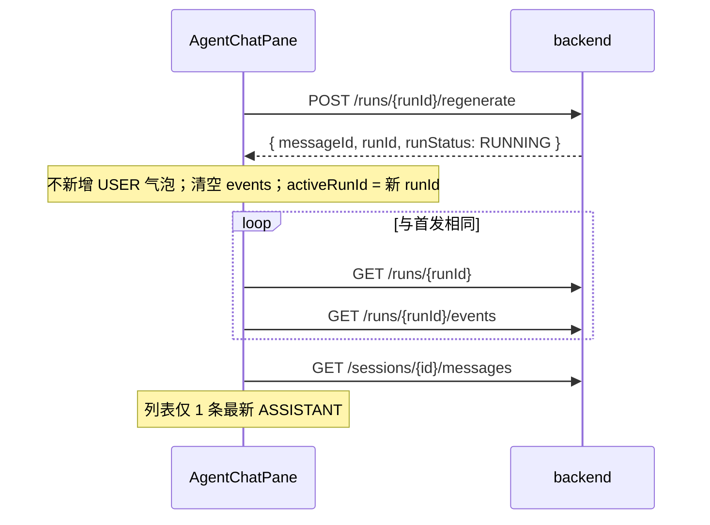
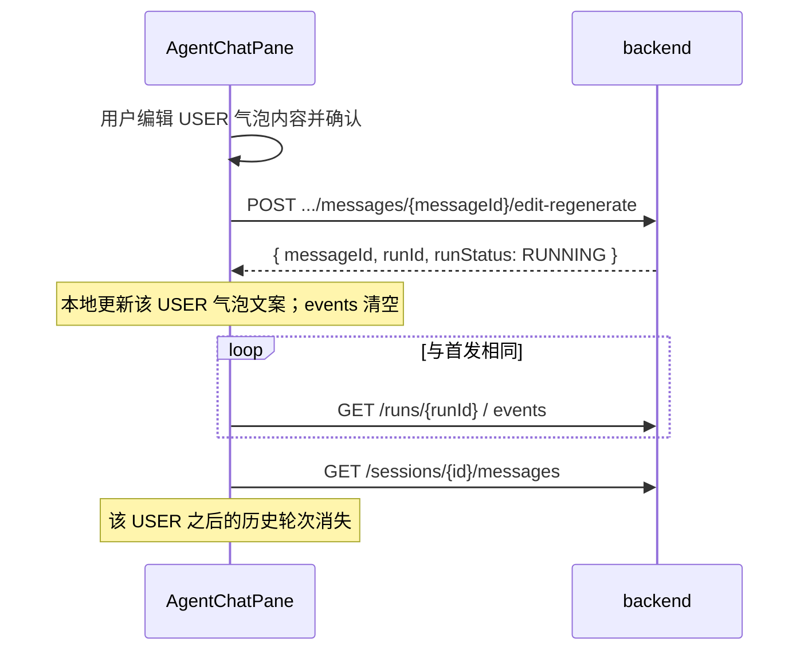

# Agent 消息重新生成 — 前端对接文档

| 项 | 内容 |
| --- | --- |
| 后端方案 | [Agent消息重新生成方案-A.md](Agent消息重新生成方案-A.md)（复用 USER，`messageId` 不变） |
| OpenAPI | [docs/api/openapi.yml](api/openapi.yml) — 标签 `AgentChat` |
| 适用端 | `user-web`（用户端 Agent 聊天页） |
| 更新时间 | 2026-05-20 |

---

## 1. 能力概览

| 用户操作 | 接口 | 说明 |
| --- | --- | --- |
| 发送新消息 | `POST .../sessions/{sessionId}/messages` | 已有，不变 |
| **重新生成** | `POST .../runs/{runId}/regenerate` | 不改 USER 原文，新建 run，旧 ASSISTANT 从列表消失 |
| **编辑后重新生成** | `POST .../sessions/{sessionId}/messages/{messageId}/edit-regenerate` | 更新 USER 内容，截断该轮之后所有消息，新建 run |

**方案 A 要点（前端必须知道）：**

- 重新生成 / 编辑后生成返回的 **`messageId` 仍是原 USER 消息的 id**，不会新增 USER 气泡。
- 每次操作都会返回 **新的 `runId`**，后续轮询 / SSE 跟这个 run 走。
- 会话消息列表接口 **只返回 `status=ACTIVE` 的消息**；被替代的 ASSISTANT 不会再出现。
- 前端 **不需要** 本地维护「版本树」；完成后 `GET .../messages` 刷新即可。

---

## 2. 新增 API

### 2.1 重新生成

```http
POST /api/v1/agent/runs/{runId}/regenerate
Authorization: Bearer <accessToken>
Content-Type: application/json

{
  "clientRequestId": "optional-uuid-max-64"
}
```

- **Body 可选**：不传 body 或 `{}` 均可。
- **`runId`**：通常取 **ASSISTANT 消息关联的 `runId`**，或用户点击「重新生成」时当前轮次的 run id（须为终态）。

**成功响应**（与发消息相同结构）：

```json
{
  "code": "SUCCESS",
  "message": "ok",
  "data": {
    "sessionId": 1,
    "messageId": 100,
    "runId": 103,
    "runStatus": "RUNNING"
  }
}
```

| 字段 | 说明 |
| --- | --- |
| `messageId` | **原 USER 消息 id**（方案 A 不变） |
| `runId` | **本次新运行 id**，用于 events / 状态轮询 |
| `runStatus` | 一般为 `RUNNING`；幂等重试时可能为当前库中状态 |

---

### 2.2 编辑后重新生成

```http
POST /api/v1/agent/sessions/{sessionId}/messages/{messageId}/edit-regenerate
Authorization: Bearer <accessToken>
Content-Type: application/json

{
  "content": "修改后的用户输入",
  "clientRequestId": "optional-uuid-max-64"
}
```

| 字段 | 必填 | 说明 |
| --- | --- | --- |
| `content` | 是 | 新 USER 内容，trim 后 max 8000 |
| `clientRequestId` | 否 | 幂等键，见 §5 |

**Path 参数：**

- `messageId` 必须是 **`role=USER`** 且 **`status=ACTIVE`** 的消息 id。

**成功响应**：同 §2.1 的 `CreateAgentMessageResponse`。

---

## 3. 已有 API 的变化

### 3.1 消息列表

```http
GET /api/v1/agent/sessions/{sessionId}/messages?pageNo=1&pageSize=100
```

**变化：**

- 仅返回 `status = ACTIVE` 的消息。
- 每条消息新增字段 **`status`**（前端类型建议补上）。

```json
{
  "code": "SUCCESS",
  "data": {
    "list": [
      {
        "id": 100,
        "sessionId": 1,
        "role": "USER",
        "contentText": "帮我写小红书文案",
        "contentJson": null,
        "runId": 103,
        "status": "ACTIVE",
        "createdAt": "2026-05-20T10:00:00"
      },
      {
        "id": 104,
        "sessionId": 1,
        "role": "ASSISTANT",
        "contentText": "这是最新回答…",
        "runId": 103,
        "status": "ACTIVE",
        "createdAt": "2026-05-20T10:00:05"
      }
    ],
    "total": 2
  }
}
```

**USER 行的 `runId`**：始终指向 **该问当前最新一次 run**（重新生成后会更新）。

---

### 3.2 运行状态与事件（复用现有逻辑）

重新生成 / 编辑后生成 **不需要新的事件接口**，与首发消息完全一致：

| 用途 | 接口 |
| --- | --- |
| 轮询 run 状态 | `GET /api/v1/agent/runs/{runId}` |
| 拉取事件（当前 `AgentChatPane` 用法） | `GET /api/v1/agent/runs/{runId}/events?afterEventId=&pageSize=100` |
| SSE 流式（可选） | `GET /api/v1/agent/runs/{runId}/events/stream?afterEventId=` |
| 取消 | `POST /api/v1/agent/runs/{runId}/cancel` |
| 工具确认 | `POST /api/v1/agent/runs/{runId}/tool-confirmations` |

**推荐事件类型（与首发相同）：**

- 进度：`run.started`、`intent.detected`、`tool.*`、`message.delta`（若后续接 SSE 展示流式正文）
- 结束：`run.completed` / `run.failed`
- 终态 run 的 `status`：`SUCCESS` | `FAILED` | `CANCELLED` | `TIMEOUT`

---

## 4. 前端交互流程

### 4.1 重新生成（不改 USER 文案）



**UI 建议：**

1. 在 **ASSISTANT 气泡**（或 run 已完成时的操作栏）展示「重新生成」。
2. 点击后：
   - `runId` = 该 ASSISTANT 的 `runId`（或配对 USER 的 `runId`）。
   - 调用 regenerate API。
   - **`events` 清空**，`activeRunId = res.runId`。
   - 调用现有 **`waitForRunComplete(res.runId)`**（或 SSE 等价逻辑）。
3. 完成后 **`refreshMessages()`**，ASSISTANT 内容变为新回答；旧回答不会出现。

**不要**在 regenerate 前再 push 一条 USER 乐观消息。

---

### 4.2 编辑后重新生成



**UI 建议：**

1. 在 **USER 气泡** 提供「编辑」→ 内联编辑或弹窗。
2. 提交时：
   - 若内容与当前相同 → 后端返回 `AGENT_USE_REGENERATE_PATH`，应引导用户点「重新生成」。
   - 成功则 **本地更新该条 USER 的 `contentText`**（`messageId` 不变）。
   - 若编辑的是 **较早一轮**，完成后列表里 **后续 USER/ASSISTANT 都会消失**（后端已 supersede），以 `refreshMessages()` 为准。

---

### 4.3 何时可点「重新生成」

| run.status | 可否 regenerate |
| --- | --- |
| `SUCCESS` | 可以 |
| `FAILED` / `CANCELLED` / `TIMEOUT` | 可以 |
| `RUNNING` / `CREATED` / `WAITING_USER_CONFIRMATION` | **不可以** → `AGENT_RUN_NOT_REGENERATABLE` |

**编辑后重新生成** 额外限制：

- 若 **同 session 有进行中的 run** → `AGENT_ACTIVE_RUN_EXISTS`（应先 cancel 或等待完成）。

---

## 5. 幂等 `clientRequestId`

与发消息、任务 regenerate 类似：

- 同一次用户操作生成一个 UUID，写入 `clientRequestId`。
- 网络重试时 **带相同 key 再请求**，后端返回 **同一 `runId`**，不会重复扣费启动多个 run。

```typescript
const clientRequestId = crypto.randomUUID()

await regenerateAgentRun(runId, { clientRequestId }, { token })
// 重试时使用同一个 clientRequestId
```

---

## 6. 错误码与文案建议

| code | HTTP | 场景 | 前端建议文案 |
| --- | --- | --- | --- |
| `AGENT_RUN_NOT_REGENERATABLE` | 400 | run 未结束 | 当前回复还在生成中，请等待完成或先取消 |
| `AGENT_ACTIVE_RUN_EXISTS` | 400 | 编辑时会话有进行中 run | 有任务正在进行，请等待完成或取消后再编辑 |
| `AGENT_MESSAGE_NOT_FOUND` | 400 | messageId 无效 | 消息不存在或已失效 |
| `AGENT_MESSAGE_NOT_EDITABLE` | 400 | 对 ASSISTANT 调 edit-regenerate | 只能编辑用户消息 |
| `AGENT_USE_REGENERATE_PATH` | 400 | 编辑内容未变化 | 内容未修改，请使用「重新生成」 |
| `AGENT_CREDIT_NOT_ENOUGH` | 400 | 算力不足 | 与首发相同 |
| `AGENT_ACTIVE_RUN_LIMIT` | 400 | 用户级并发上限 | 与首发相同 |
| `AGENT_RATE_LIMITED` | 400 | 限流 | 与首发相同 |
| `MODEL_CALL_FAILED` | 400 | 模型预检失败 | 与首发相同 |

统一错误结构：

```json
{
  "code": "AGENT_RUN_NOT_REGENERATABLE",
  "message": "当前运行不可重新生成",
  "data": null,
  "traceId": "..."
}
```

---

## 7. TypeScript 类型与 API 封装建议

在 `user-web/src/api/types.ts` 补充：

```typescript
export interface AgentMessage {
  id: number
  sessionId: number
  role: AgentMessageRole
  contentText: string
  contentJson?: string | null
  runId?: number | null
  status?: "ACTIVE" | "SUPERSEDED"  // 列表接口实际只会返回 ACTIVE
  createdAt: string
}

export interface RegenerateAgentRunRequest {
  clientRequestId?: string
}

export interface EditRegenerateAgentMessageRequest {
  content: string
  clientRequestId?: string
}
```

在 `user-web/src/api/agentApi.ts` 新增：

```typescript
export function regenerateAgentRun(
  runId: number,
  body: RegenerateAgentRunRequest = {},
  options?: { token?: string | null },
) {
  return apiRequest<CreateAgentMessageResponse>(
    "POST",
    `/api/v1/agent/runs/${runId}/regenerate`,
    { token: options?.token, body },
  )
}

export function editRegenerateAgentMessage(
  sessionId: number,
  messageId: number,
  body: EditRegenerateAgentMessageRequest,
  options?: { token?: string | null },
) {
  return apiRequest<CreateAgentMessageResponse>(
    "POST",
    `/api/v1/agent/sessions/${sessionId}/messages/${messageId}/edit-regenerate`,
    { token: options?.token, body },
  )
}
```

---

## 8. `AgentChatPane.vue` 改造要点

当前实现（`submitMessage` → `sendAgentMessage` → `waitForRunComplete` → `refreshMessages`）可复用。

### 8.1 抽取公共「跟 run」逻辑

```typescript
async function followRun(runId: number, opts?: { updateUserText?: { messageId: number; content: string } }) {
  if (opts?.updateUserText) {
    const msg = messages.value.find((m) => m.id === opts.updateUserText!.messageId)
    if (msg) msg.contentText = opts.updateUserText.content
  }
  events.value = []
  activeRunId.value = runId
  agentError.value = null
  await waitForRunComplete(runId)
}
```

### 8.2 重新生成

```typescript
async function regenerateReply(sourceRunId: number) {
  if (sending.value || hasActiveRun.value) return
  sending.value = true
  try {
    const res = await regenerateAgentRun(
      sourceRunId,
      { clientRequestId: crypto.randomUUID() },
      { token: props.token },
    )
    await followRun(res.runId)
  } catch (error) {
    agentError.value = formatAgentError(error)
  } finally {
    sending.value = false
  }
}
```

### 8.3 编辑后重新生成

```typescript
async function editAndRegenerate(messageId: number, newContent: string) {
  if (sending.value || hasActiveRun.value) return
  sending.value = true
  try {
    const res = await editRegenerateAgentMessage(
      props.sessionId,
      messageId,
      { content: newContent, clientRequestId: crypto.randomUUID() },
      { token: props.token },
    )
    await followRun(res.runId, { updateUserText: { messageId, content: newContent } })
  } catch (error) {
    agentError.value = formatAgentError(error)
  } finally {
    sending.value = false
  }
}
```

### 8.4 按钮挂载位置（建议）

| 位置 | 操作 | 条件 |
| --- | --- | --- |
| ASSISTANT 气泡工具栏 | 重新生成 | 对应 run 已终态，且当前无 `hasActiveRun` |
| USER 气泡工具栏 | 编辑 | `role === 'USER'` |
| 编辑确认后 | 调用 edit-regenerate | 内容有变化 |

**可选优化：** 重新生成进行中，隐藏或 disable 该 ASSISTANT 上的按钮，避免重复点击（后端也会因 `AGENT_ACTIVE_RUN_LIMIT` 拒绝）。

---

## 9. 与本地缓存 / 乐观 UI

当前 `AgentChatPane` 用 `localStorage` 缓存消息（`agent_messages_${sessionId}`）。

| 场景 | 建议 |
| --- | --- |
| regenerate 成功发起 | **不要**新增 USER；可保留 ASSISTANT 旧文案直到 `refreshMessages` |
| edit-regenerate | 立即更新本地 USER 文案；完成后 `refreshMessages` 同步 ASSISTANT 并去掉被截断的后续轮次 |
| 完成后 | 始终 `refreshMessages()` 再写回 localStorage，以服务端 ACTIVE 列表为准 |

---

## 10. 联调检查清单

- [ ] ASSISTANT 上「重新生成」：新 run 完成后列表只有一条新 ASSISTANT，内容已变。
- [ ] USER「编辑」后：该 USER 文案更新，后续轮次从列表消失。
- [ ] regenerate 进行中点击发送 / 再次 regenerate：有明确错误提示。
- [ ] `WAITING_USER_CONFIRMATION` 的 run 不能 regenerate；须先确认或 cancel。
- [ ] 工具确认流：regenerate 后若再次进入 tool 确认，仍走现有 `confirmAgentTool`。
- [ ] 断网重试：相同 `clientRequestId` 不重复出现两个 run（可通过 run 详情核对）。

---

## 11. 相关文件索引

| 说明 | 路径 |
| --- | --- |
| 后端方案 | [Agent消息重新生成方案-A.md](Agent消息重新生成方案-A.md) |
| OpenAPI | [api/openapi.yml](api/openapi.yml) |
| 现有 Agent API | `user-web/src/api/agentApi.ts` |
| 聊天页 | `user-web/src/pages/AgentHome/AgentChatPane.vue` |
| 类型定义 | `user-web/src/api/types.ts` |
