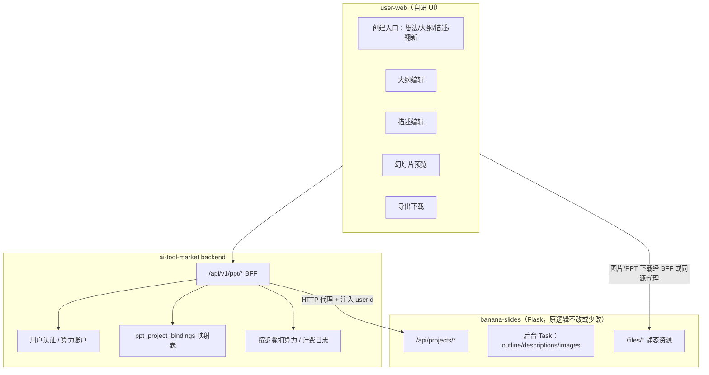
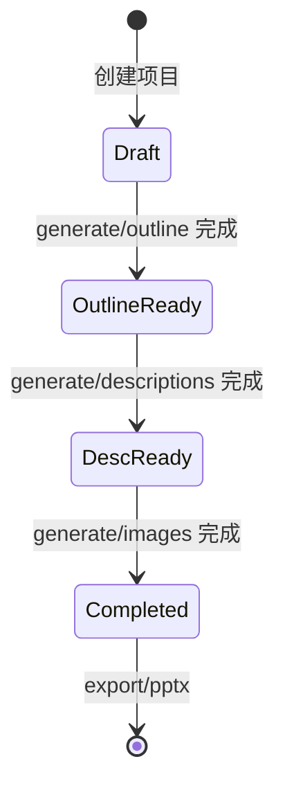

# PPT 生成工具接入 AI 工具超市 — 前后端开发文档

更新时间：2026-05-22

## 1. 目标与约束

| 项 | 说明 |
| --- | --- |
| 业务目标 | 将 `banana_slider/banana-slides` 的 PPT 生成能力接入 `ai-tool-market`，**流程与原项目一致**，**用户端 UI 自行设计** |
| 原项目主链路 | 创建项目 → 编辑大纲 → 编写页面描述 → 生成图片 → 导出 PPTX/PDF |
| 工具超市主链路 | 登录/算力 → 工具列表 → 使用工具 → 任务/结果（见 `docs/系统架构与边界.md`） |
| 关键约束 | 不把多步编排硬塞进「单次 Redis 任务 + DynamicForm」；Banana 引擎保持独立服务，超市侧做 **BFF + 自定义前端** |

## 2. 推荐架构（BFF + 引擎微服务）



### 2.1 为什么不走标准 Worker 单任务？

现有工具（如小红书文案、可灵视频）是：

1. 用户填 **动态表单** → 创建 `ai_tasks` → Redis → Worker 一次执行 → 回写结果。

PPT 工具是 **长流程、多异步子任务、可反复编辑**：

- 项目级状态机：`DRAFT` → `OUTLINE_GENERATED` → `DESCRIPTIONS_GENERATED` → `COMPLETED`
- 每步有独立 `task_id`（描述生成、图片生成等）
- 支持单页重生成、流式大纲、材料上传、PPT 翻新

若强行映射为「一个 ai_task」，会导致：

- 超时、进度粒度差、无法在中途编辑
- Worker 需重写整套 Banana 编排，维护成本极高

**结论**：引擎服务独立部署；超市 backend 做 **BFF（Backend For Frontend）** + 用户/算力/审计；前端做 **专用多页向导**，不复用 `ToolUse/Page.vue` 的动态表单。

### 2.2 与「AI 超市 Chat」的区别

`ai_market_tools` + `/chat/:toolId` 面向对话型 Agent，与 PPT 多步编辑器形态不同。PPT 建议：

- 在 `ai_tools` 注册一条工具（用于列表、封面、算力展示）
- `toolCode` 如 `banana_ppt_generator`
- 详情页「立即使用」跳转到 **自定义路由** `/tools/banana_ppt_generator/workspace`（见 §5）

---

## 3. 原项目流程与 API 对照（引擎侧）

引擎默认基址：`http://<banana-host>:5000`（以实际部署为准）。

### 3.1 标准流程（从想法创建）

| 步骤 | 用户操作 | Banana API | 项目 status / 任务 |
| --- | --- | --- | --- |
| 1 | 填写主题，创建项目 | `POST /api/projects` | `DRAFT` |
| 2 | 上传风格模板图（可选） | `POST /api/projects/{id}/template` | - |
| 3 | 生成大纲 | `POST /api/projects/{id}/generate/outline` | → `OUTLINE_GENERATED` |
| 4 | 编辑大纲（可选） | `PUT /api/projects/{id}/pages/{pageId}/outline` 等 | - |
| 5 | 生成全部描述 | `POST /api/projects/{id}/generate/descriptions` → 202 + `task_id` | 轮询 task → `DESCRIPTIONS_GENERATED` |
| 6 | 编辑描述（可选） | `PUT .../description`、`POST .../refine/descriptions` | - |
| 7 | 生成全部图片 | `POST /api/projects/{id}/generate/images` → 202 + `task_id` | 轮询 → `COMPLETED` |
| 8 | 导出 | `GET /api/projects/{id}/export/pptx` | 返回 `download_url` |

创建项目请求体示例：

```json
{
  "creation_type": "idea",
  "idea_prompt": "创建一份关于人工智能基础的 8 页 PPT",
  "image_aspect_ratio": "16:9"
}
```

`creation_type` 还支持：`outline`、`descriptions`、`ppt_renovation`（翻新走 `POST /api/projects/renovation` multipart）。

### 3.2 轮询约定

- **项目状态**：`GET /api/projects/{project_id}` → `data.status`
- **异步任务**：`GET /api/projects/{project_id}/tasks/{task_id}` → `data.status`（`COMPLETED` / `FAILED`）

集成测试参考：`banana-slides/backend/tests/integration/test_api_full_flow.py`。

### 3.3 常用补充 API

| 能力 | 方法 | 路径 |
| --- | --- | --- |
| 项目列表 | GET | `/api/projects` |
| 更新项目 | PUT | `/api/projects/{id}` |
| 删除项目 | DELETE | `/api/projects/{id}` |
| 流式生成大纲 | POST | `/api/projects/{id}/generate/outline/stream` |
| 单页生成描述 | POST | `/api/projects/{id}/pages/{pageId}/generate/description` |
| 单页生成图片 | POST | `/api/projects/{id}/pages/{pageId}/generate/image` |
| 单页改图 | POST | `/api/projects/{id}/pages/{pageId}/edit/image` |
| AI 润色大纲 | POST | `/api/projects/{id}/refine/outline` |
| 导出 PDF | GET | `/api/projects/{id}/export/pdf` |
| 导出图片包 | GET | `/api/projects/{id}/export/images` |
| 参考文件上传 | POST | `/api/reference-files/upload` |

---

## 4. 后端开发（ai-tool-market）

### 4.1 模块职责

| 模块 | 职责 |
| --- | --- |
| `banana-slides` | AI 编排、项目/页面/任务存储、文件存储、导出 |
| `backend` BFF | 鉴权、用户与 `project_id` 绑定、算力冻结/结算、代理转发、下载 URL 同源化 |
| `worker` | **本工具不经过 Redis 队列**（除非后续只做「一键全自动」薄封装） |
| `admin-frontend` | 注册工具元数据、模型配置说明、预估算力 |
| `user-web` | 自研多步 UI（§5） |

### 4.2 配置项（application.yml）

```yaml
ppt:
  engine:
    base-url: http://banana-slides:5000
    connect-timeout-ms: 5000
    read-timeout-ms: 300000
  billing:
    create-project-credits: 5
    generate-outline-credits: 10
    generate-descriptions-credits: 20
    generate-images-credits: 50
    export-pptx-credits: 5
```

模型 API Key 仍配置在 **banana-slides 的 settings**（或环境变量），与工具超市 `model_configs` 分离；若需统一密钥管理，可在 BFF 创建项目前调用引擎 `PUT /api/settings/`（需评估安全策略）。

### 4.3 数据库（建议新增）

```sql
-- 用户与 Banana 项目绑定
CREATE TABLE ppt_project_bindings (
  id BIGINT PRIMARY KEY AUTO_INCREMENT,
  user_id BIGINT NOT NULL,
  tool_id BIGINT NOT NULL,
  banana_project_id VARCHAR(36) NOT NULL,
  creation_type VARCHAR(32) NOT NULL,
  title VARCHAR(255) NULL,
  status VARCHAR(50) NOT NULL DEFAULT 'DRAFT',
  created_at DATETIME NOT NULL,
  updated_at DATETIME NOT NULL,
  UNIQUE KEY uk_banana_project (banana_project_id),
  KEY idx_user_tool (user_id, tool_id)
);

-- 可选：按步骤计费流水
CREATE TABLE ppt_step_billing_logs (
  id BIGINT PRIMARY KEY AUTO_INCREMENT,
  user_id BIGINT NOT NULL,
  binding_id BIGINT NOT NULL,
  step_code VARCHAR(64) NOT NULL,
  credits_charged INT NOT NULL,
  ai_task_id BIGINT NULL,
  created_at DATETIME NOT NULL
);
```

`step_code` 建议：`CREATE`、`OUTLINE`、`DESCRIPTIONS`、`IMAGES`、`EXPORT`。

### 4.4 BFF API 设计（对 user-web）

统一前缀：`/api/v1/ppt`，均需登录（`Authorization: Bearer`）。

| 方法 | 路径 | 说明 |
| --- | --- | --- |
| POST | `/projects` | 创建并绑定；body 透传 `creation_type`、`idea_prompt` 等；扣 `CREATE` 算力 |
| GET | `/projects` | 当前用户的项目列表（查 binding + 代理引擎详情） |
| GET | `/projects/{bindingId}` | 项目详情含 pages |
| DELETE | `/projects/{bindingId}` | 删除绑定并代理删除引擎项目 |
| POST | `/projects/{bindingId}/template` | multipart 转发 |
| POST | `/projects/{bindingId}/generate/outline` | 代理 + 扣费 |
| POST | `/projects/{bindingId}/generate/descriptions` | 代理 + 扣费；返回 `taskId` |
| POST | `/projects/{bindingId}/generate/images` | 代理 + 扣费 |
| GET | `/projects/{bindingId}/tasks/{taskId}` | 代理任务状态 |
| PUT | `/projects/{bindingId}/pages/{pageId}/outline` | 代理 |
| PUT | `/projects/{bindingId}/pages/{pageId}/description` | 代理 |
| POST | `/projects/{bindingId}/refine/outline` | 代理 |
| POST | `/projects/{bindingId}/refine/descriptions` | 代理 |
| GET | `/projects/{bindingId}/export/pptx` | 代理；返回超市同源 `downloadUrl` |
| POST | `/projects/renovation` | multipart 翻新；创建 binding |

**实现要点**：

1. 每个请求根据 `bindingId` 查 `banana_project_id`，校验 `user_id`。
2. 使用 `RestTemplate` / `WebClient` 转发；文件上传用 `multipart` 透传。
3. 引擎返回的 `/files/...` 在 BFF 层改写为 `/api/v1/ppt/files/...` 或 CDN 地址，避免前端跨域与泄露引擎地址。
4. 扣费：调用前 `creditAccountService.freeze`，失败 `release`；步骤成功 `settle`（复用现有算力服务）。
5. 错误码：将引擎 `error_response` 映射为超市 `BusinessException`（如 `PPT_ENGINE_ERROR`）。

### 4.5 工具注册（管理后台）

在 **AI 工具管理** 新增一条（用于列表展示，**不**走 DynamicForm 提交任务）：

| 字段 | 建议值 |
| --- | --- |
| toolCode | `banana_ppt_generator` |
| toolName | AI PPT 生成器 |
| toolType | `IMAGE_GENERATION` 或新增 `PPT_GENERATION`（若扩展枚举） |
| executionHandler | 可填 `TEXT_GENERATION` 占位，**实际不路由到 Worker** |
| inputModality | `MULTIMODAL` |
| outputModality | `FILE` |
| estimatedCreditCost | 预估算力总和（或按步说明写在 `configNote`） |
| status | ONLINE |

在工具详情/列表增加扩展字段（可选）：

- `customUiRoute`: `/tools/banana_ppt_generator/workspace`
- `integrationMode`: `PPT_ENGINE`

前端根据 `toolCode === 'banana_ppt_generator'` 或 `integrationMode` 跳转自定义页。

### 4.6 Java 包结构建议

```
com.aiminilab.aitoolmarket.ppt/
  config/PptEngineProperties.java
  entity/PptProjectBinding.java
  mapper/PptProjectBindingMapper.java
  service/PptProjectService.java      # 绑定 + 鉴权
  service/PptEngineClient.java        # HTTP 调用 banana
  service/PptBillingService.java      # 按步骤算力
  controller/PptProjectController.java
  dto/*.java
```

### 4.7 部署

| 服务 | 端口示例 | 说明 |
| --- | --- | --- |
| backend | 8080 | 对外 BFF |
| banana-slides | 5000 | 仅内网；配置 AI Key、上传目录 |
| user-web | 5173 | 开发代理 `/api` → backend |

`docker-compose` 建议将 `banana-slides` 与 `backend` 置于同一网络；**禁止**浏览器直连 5000。

---

## 5. 前端开发（user-web）

### 5.1 路由规划

在 `user-web/src/router/index.ts` 增加：

```ts
{
  path: "/tools/banana_ppt_generator/workspace",
  name: "PptWorkspace",
  meta: { requiresAuth: true },
  component: () => import("@/pages/PptWorkspace/Page.vue"),
},
{
  path: "/tools/banana_ppt_generator/workspace/:bindingId",
  name: "PptProjectEditor",
  meta: { requiresAuth: true },
  component: () => import("@/pages/PptWorkspace/Editor.vue"),
  props: true,
},
```

`ToolDetail/Page.vue` 中，当 `tool.toolCode === 'banana_ppt_generator'` 时，「立即使用」指向 `PptWorkspace`，而非 `/tools/:id/use`。

### 5.2 页面信息架构（自研 UI）

与原项目能力对齐，界面可完全不同，建议拆为：

```
pages/PptWorkspace/
  Page.vue              # 项目列表 + 四种创建入口
  components/
    CreateIdeaForm.vue
    CreateOutlineForm.vue
    CreateDescriptionsForm.vue
    CreateRenovationUpload.vue
  Editor.vue            # 单项目编辑器（根据 status 切换子视图）
  steps/
    OutlineStep.vue     # 大纲列表 + AI 润色输入条
    DescriptionsStep.vue
    PreviewStep.vue     # 缩略图网格 + 单页操作
    ExportStep.vue
  composables/
    usePptProject.ts    # 项目详情轮询
    usePptTask.ts       # 异步 task 轮询
    usePptApi.ts        # 封装 /api/v1/ppt/*
```

### 5.3 前端状态机



与引擎 `project.status` 同步；子任务 `PROCESSING` 时展示进度条（轮询 `tasks/{taskId}`）。

### 5.4 API 客户端示例

`user-web/src/api/pptApi.ts`：

```ts
import { apiRequest } from "./client"

export interface PptProjectSummary {
  bindingId: number
  bananaProjectId: string
  title?: string
  status: string
  pageCount: number
  updatedAt: string
}

export function createPptProject(body: Record<string, unknown>, token?: string) {
  return apiRequest<{ bindingId: number; projectId: string; status: string }>(
    "POST",
    "/api/v1/ppt/projects",
    { body, token },
  )
}

export function fetchPptProject(bindingId: string, token?: string) {
  return apiRequest<{ status: string; pages: unknown[] }>(
    "GET",
    `/api/v1/ppt/projects/${bindingId}`,
    { token },
  )
}

export function generateOutline(bindingId: string, token?: string) {
  return apiRequest("POST", `/api/v1/ppt/projects/${bindingId}/generate/outline`, { token })
}

export function generateDescriptions(bindingId: string, token?: string) {
  return apiRequest<{ taskId: string }>(
    "POST",
    `/api/v1/ppt/projects/${bindingId}/generate/descriptions`,
    { token },
  )
}

export function pollTask(bindingId: string, taskId: string, token?: string) {
  return apiRequest<{ status: string; progress?: Record<string, unknown> }>(
    "GET",
    `/api/v1/ppt/projects/${bindingId}/tasks/${taskId}`,
    { token },
  )
}
```

`usePptTask` 建议：`setInterval` 3s 轮询，终态 `COMPLETED`/`FAILED` 停止；失败展示 `errorMessage`。

### 5.5 UI/UX 建议（与原项目解耦）

| 区域 | 建议 |
| --- | --- |
| 创建页 | 四 Tab：想法 / 大纲 / 描述 / 翻新；比例 16:9、9:16 等 |
| 大纲步 | 可拖拽排序（调用 `PUT project` 的 `pages_order`）；顶部 AI 输入调 `refine/outline` |
| 描述步 | 左右：页面列表 + 描述编辑；支持流式接口（可选） |
| 预览步 | 网格缩略图；单页「重新生成」「改图」 |
| 导出步 | PPTX / PDF / 图片包；显示算力消耗与下载按钮 |

复用超市现有：`AppShell`、`TaskStatusTag` 风格、算力不足提示（对接 `ApiBusinessError`）。

### 5.6 不需要改动的部分

- `DynamicForm`、`ToolUse/Page.vue`、`TaskResult` 的通用渲染 **不必** 承载 PPT 全流程。
- 若需「我的任务」中展示 PPT 历史，可增加「我的 PPT 项目」入口指向 `PptWorkspace`，或仅在 binding 表查询。

---

## 6. 实施阶段

| 阶段 | 内容 | 验收 |
| --- | --- | --- |
| P0 | 部署 banana-slides；跑通 `test_api_full_flow` | 引擎独立可用 |
| P1 | backend BFF：创建/查询/代理 outline+descriptions+images | Postman 全流程 |
| P2 | 算力按步扣费 + binding 表 | 余额不足拦截 |
| P3 | user-web 创建页 + Editor 三步 | 用户可导出 PPTX |
| P4 | 翻新、单页重生成、refine、材料上传 | 与原项目能力对齐 |
| P5 | 管理后台文案、监控、日志 | 运营可配置 |

---

## 7. 安全与运维

- 引擎 API **不对公网暴露**；仅 BFF 内网访问。
- 所有 `bindingId` 操作校验 `userId`，禁止横向越权。
- 上传文件：限制类型（pdf/pptx/png）、大小；病毒扫描按公司规范。
- 日志：`traceId` 贯穿 BFF → 引擎；记录 `banana_project_id`、`step_code`、耗时。
- 密钥：Banana 的 `GOOGLE_API_KEY` 等放在引擎环境变量，勿写入前端。

---

## 8. 可选演进

| 方向 | 说明 |
| --- | --- |
| 一键生成 | 增加 `POST /api/v1/ppt/projects/{id}/run-all`，BFF 顺序调引擎 API；可映射为一个长 `ai_task` 供「我的任务」展示 |
| 统一模型配置 | BFF 同步超市 `model_configs` 到引擎 settings |
| Worker 薄封装 | 仅用于「无交互一键出 PPT」场景，主流程仍走 BFF |

---

## 9. 相关文档

- 工具超市架构：`docs/系统架构与边界.md`
- Worker 契约（本工具默认不用）：`worker/WORKER_BACKEND_FINAL_CONTRACT.md`
- 模型配置：`docs/模型配置后端文档.md`
- Banana 功能说明：`banana_slider/banana-slides/docs/features/overview.mdx`
- Banana 集成测试：`banana-slides/backend/tests/integration/test_api_full_flow.py`

---

## 10. 快速检查清单

**后端**

- [ ] `ppt.engine.base-url` 可访问
- [ ] `ppt_project_bindings` 迁移脚本
- [ ] BFF 全接口鉴权 + 越权测试
- [ ] 按步扣费/失败释放算力
- [ ] `ai_tools` 种子数据 `banana_ppt_generator`

**前端**

- [ ] 路由与 ToolDetail 跳转
- [ ] `pptApi.ts` + 轮询 composable
- [ ] 四创建入口 + Editor 三步
- [ ] 导出下载走同源 URL
- [ ] 算力不足、引擎失败提示

**联调**

- [ ] 想法 → 大纲 → 描述 → 图片 → PPTX 全链路
- [ ] 项目仅创建者可访问
- [ ] 删除项目后 binding 同步清理
