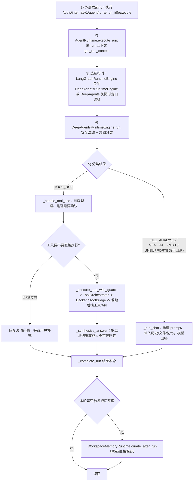
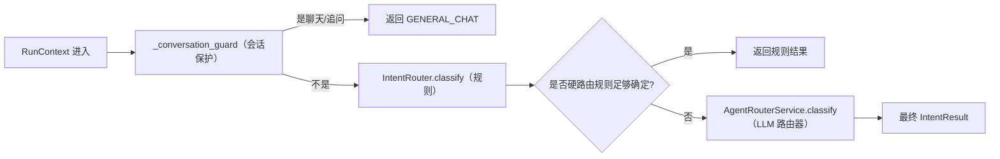
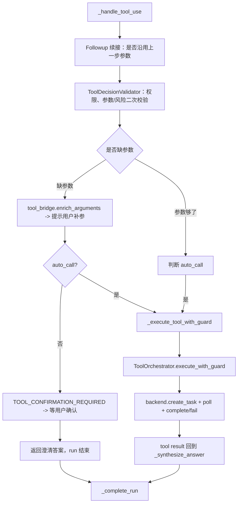
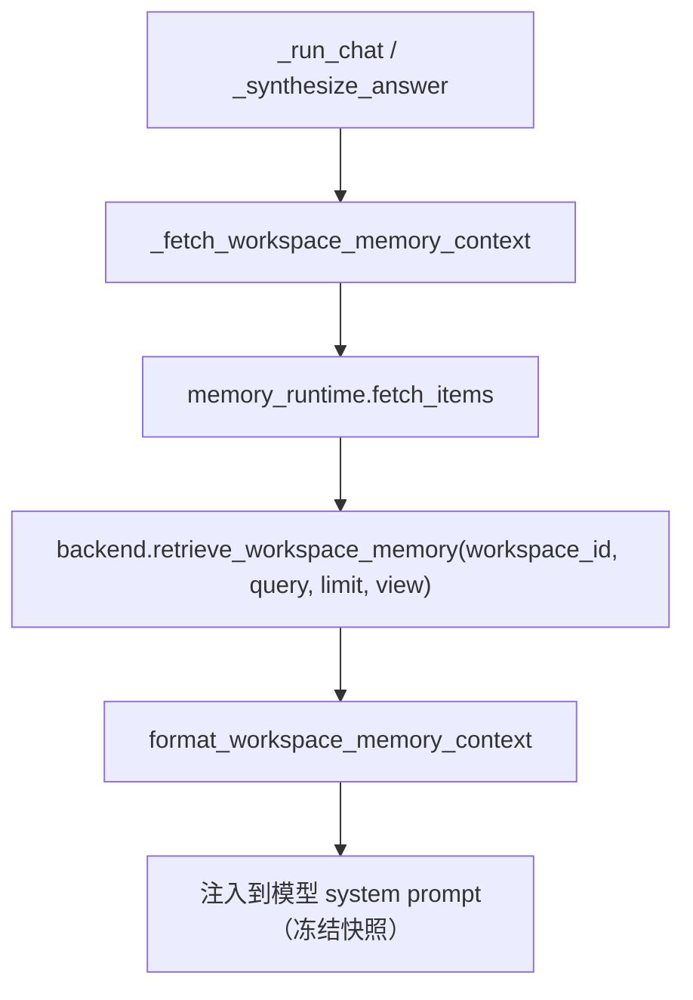
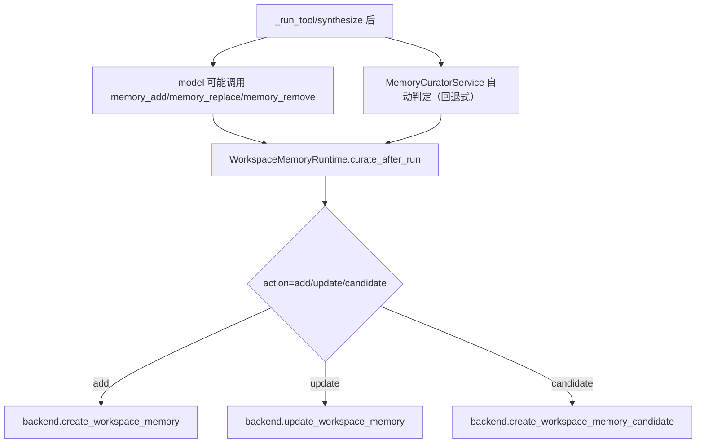

# 当前 Agent 链路梳理（小学生也能看懂版）

## 先说一句

可以把这个项目的 agent 想成三位“员工”：

- **门卫（入口）**：收到任务就拿取上下文（RunContext）；
- **老师（决策）**：判断这次是“直接聊”还是“去调用工具”；
- **小工人（工具执行 + 回答）**：执行工具、整理答案、再把信息存进“记忆库”。

---

## 一次请求的主线（总体流程）

---

## 先判断意图：是聊天还是工具

### 意图决策链（decision service）

1. 先看是不是明文聊天场景（短句问候、追问、上文回溯提示）=> **GENERAL_CHAT**
2. 再做规则路由（`IntentRouter.classify`）
3. 规则不够清晰时，调用可选的 LLM 路由（`AgentRouterService`）再一次二次判断
4. 最终产出 `IntentResult`（意图+置信度+候选工具）

### 决策的关键字段（给前端排障很有用）

| 字段 | 来源 | 作用 |
|---|---|---|
| `intent` | `IntentResult` | 本轮要走聊天还是工具 |
| `selectedToolCode` | 规则/LLM 路由 | 优先选择的工具编码 |
| `candidateToolCodes` | 规则/LLM 路由 | 可选工具列表 |
| `clarifyingQuestion` | 路由层 | 不确定时向用户追问 |
| `requiresConfirmation` | 追溯 + 风险判定 | 是否需要用户确认 |

---

## 工具调用链（如果意图是 TOOL_USE）

### 工具阶段里的“看门人”职责

| 组件 | 负责内容 |
|---|---|
| `ToolDecisionValidator` | 风险分级、确认策略、跟进参数策略 |
| `ToolOrchestrator` | 本地参数拼装、必填检查、预算占用前置 |
| `BackendToolBridge` | 与后端工具 API 通信，创建任务并回填结果 |

---

## 记忆链路（你前面问的“有无跨对话”核心）

记忆不是保存在“聊天窗口内存”里，而是按 `workspaceId` 落到“工作区记忆库”。

### 记忆如何“进来”（读取）

### 记忆如何“存进去”（保存）

### 一句话看懂“跨对话”真假

- **跨对话生效**：同一个 `workspaceId` 下，下次请求会再取到同一份记忆。
- **看起来不生效**：通常是因为 `workspaceId` 不一致、这次没写入成功、或写入是“候选未审核/未固化”。

---

## 关键文件（你可以直接对照）

| 文件 | 作用 |
|---|---|
| `agent-service/app/core/runtime.py` | run 入口，取上下文、选模型、选引擎 |
| `agent-service/app/runtime/router.py` | runtime 选择（LangGraph/DeepAgents） |
| `agent-service/app/runtime/deep_agents_engine.py` | 主要执行流程（意图、工具、聊天、归档） |
| `agent-service/app/core/agent_decision.py` | 决策融合（规则 + LLM + 会话保护） |
| `agent-service/app/core/intent_router.py` | 规则路由分类 |
| `agent-service/app/core/schemas.py` | `RunContext`、`RunEventCreate`、`WorkspaceMemoryItem` |
| `agent-service/app/runtime/memory_runtime.py` | 记忆读取 + 归档调度入口 |
| `agent-service/app/runtime/memory_curator.py` | 候选/自动记忆归档策略 |
| `agent-service/app/tools/memory_tool.py` | memory tool（add/replace/remove） |
| `agent-service/app/clients/backend_client.py` | 与后端 memory API 交互 |

---

## 给同学版的“极简总结”

`用户问题 -> 取上下文 -> 判断意图 -> 要么聊要么用工具 -> 回答用户 -> 有价值信息写入 workspace 记忆 -> 下次再用。`

如果你要，我可以再给你做一版“排查清单版”流程图（比如“为什么这次明明写了记忆但下次没命中”），按红黄绿三色步骤标注。
