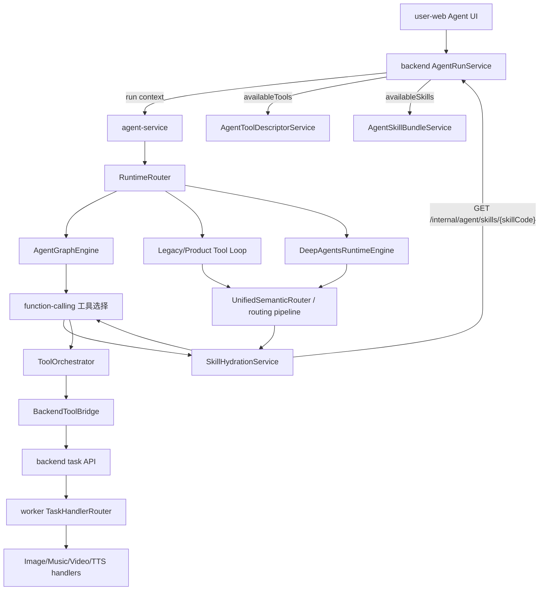

# Agent 工具路由链路与 Skill 分层评估

> 日期：2026-06-29  
> 背景：用户侧已出现 `suno_music` 工具执行态；图像生成已有 `image_generation` Skill Bundle，音乐生成尚未看到同等的运行时 Skill。本文梳理当前链路，并评估“一个模型一个 skill”是否适合长期维护。

## 结论

当前项目已经不是“把所有工具完整 schema 一次性塞给模型”的旧方案，而是：

1. 后端提供工具目录、工具 schema、可用 Skill descriptor。
2. agent-service 先做工具目录摘要和 shortlist，必要时通过 `expand_tool` 延迟展开。
3. 模型首次选中某个工具后，再按 toolCode 做 Skill Hydration，把对应 Skill 的 SOP/examples 注入上下文并重跑一步。
4. 产品工具执行统一经过 `ToolOrchestrator -> BackendToolBridge -> backend task API -> worker`，不允许模型绕过积分、权限、确认、审计。

图像生成已经有一个按“能力族”聚合的 `image_generation` Skill Bundle；音乐生成目前有工具模板、Suno worker、provider registry 和工具执行链路，但没有默认 seed 的 `music_generation` / `suno_music` Skill Bundle。

长期不建议“一个后台模型一个 skill”。更可维护的分层是：

- **Skill 按能力族 / 工具族建**：如 `image_generation`、`music_generation`、`video_generation`、`text_to_speech`。
- **工具按任务形态建**：如文生图、图生图、图生视频、多图视频、音乐生成。
- **模型版本按字段或绑定选择**：同一 API/Handler 下用 `params.model`，跨 provider/协议/定价差异大时用 `modelConfigId` 或未来 `tool_model_bindings`。

## 当前路由链路



关键实现点：

| 层 | 当前实现 | 说明 |
| --- | --- | --- |
| Run context | `AgentRunServiceImpl.context` | 下发 `availableTools`、`availableSkills`、历史、记忆、最近工具调用、附件指针等。 |
| 工具 descriptor | `AgentToolDescriptorServiceImpl` | 由后台工具字段编译出 Agent 可见 schema；GPT/OpenAI 图像工具有 v2-lite 语义 schema。 |
| 工具披露 | `agent-service/app/runtime/tool_disclosure.py` | 工具目录摘要 + Top-K shortlist + `expand_tool` 延迟展开。 |
| 语义路由 | `agent-service/app/routing/v2/unified_router.py` | 单次 function-calling 判断聊天还是工具调用；可通过 `expand_tool` 补 schema。 |
| 多步执行 | `agent-service/app/runtime/agent_graph/engine.py` | Graph 引擎支持计划、链式工具、产物回填、失败反思、确认 checkpoint。 |
| Skill 水合 | `agent-service/app/runtime/skill_hydration.py` | 根据 toolCode 匹配 `availableSkills`，拉取已发布 Skill 的 `sopRules` / `examples` 注入。 |
| 工具执行 | `ToolOrchestrator -> BackendToolBridge` | 统一走后端 task，保持积分、权限、审计边界。 |
| Worker 分发 | `worker/task_queue/task_handler_router.py` | 按 `executionHandler`、`toolType`、兼容 toolCode 分到 Image/Music/Video/TTS handler。 |

## Skill 现状

### 已落地

项目里已经有数据库版 `agent_skill_bundles`：

- 后端实体：`AgentSkillBundle`
- 管理 API：`/api/admin/v1/agent/skills`
- 内部 API：`/api/internal/v1/agent/skills/{skillCode}`
- 管理端入口：工具页的 Agent Skill 编辑弹窗
- 运行时开关：`AGENT_SKILL_HYDRATION_ENABLED=true`

默认 seed 目前只有 `image_generation`：

- `skill_code=image_generation`
- `toolCodes=["gpt_image","gpt_image2","openai_image","openai_images","image_generation"]`
- 重点解决图像续作、编辑、复合、多参考图角色路由、v2-lite 参数合成。

### 未完整落地

音乐生成已有这些基础设施：

- `music_generation_default` 工具模板。
- `suno_music` provider，`worker_ready=true`。
- `MusicGenerationHandler` 和 `SunoMusicClient`。
- Worker 会把 `MUSIC_GENERATION` / `suno` / `suno_music` 分发到音乐 handler。
- `docs/同系列模型版本表单配置规范.md` 明确 Suno 采用单工具内 `model` 字段切 V4/V5/V5.5。

但目前未看到默认 seed 的 `music_generation` 或 `suno_music` Skill Bundle。因此截图中 `suno_music` 能执行，靠的是工具 schema、表单字段、LLM 路由和 worker 链路；它还没有类似图像 Skill 那样的运行时 SOP 来约束：

- 歌词 vs 风格描述如何拆分。
- 常规模式和高级模式如何填参。
- 纯音乐时 prompt/title/style 如何处理。
- 翻唱参考音频何时必须追问。
- 不要把“像某首歌”写成复制旋律、人声或歌词，而应转成非侵权的风格特征描述。

## “一个模型一个 Skill”为什么不适合长期

不建议按后台模型逐个建 skill，原因很实际：

1. **模型版本增长太快**：Suno V4/V4.5/V5/V5.5 如果各自一个 skill，规则会重复且容易漂移。
2. **路由目标会被稀释**：用户要的是“生成日系女团歌曲”，不是“选择 V5_5 模型 SOP”。路由层应先选能力，再选工具/版本。
3. **字段策略重复**：prompt、model、style、title、instrumental、referenceAudio 等规则属于音乐生成能力族，不属于某个模型。
4. **运行时 token 成本上升**：Skill catalog 越碎，descriptor 越多，匹配和水合都更贵。
5. **运营维护困难**：多个 skill 修改同一条风控规则时容易漏改。

更合理的拆分边界：

| 拆分对象 | 推荐粒度 | 示例 |
| --- | --- | --- |
| Skill | 能力族 / 协议族 / 复杂 SOP 族 | `image_generation`、`music_generation`、`video_generation` |
| Tool | 用户可理解的任务形态 | Suno 音乐生成、可灵图生视频、GPT 图像编辑 |
| Model version | 表单字段或工具绑定 | `params.model=V5_5`、`modelConfigId` |
| Worker Handler | 执行协议 | `MUSIC_GENERATION`、`IMAGE_GENERATION` |
| Provider | 上游账号/协议/能力 | `suno_music`、`ofox_openai_images`、`kling_video` |

## 推荐的音乐 Skill 形态

建议新增一个能力族 skill，而不是每个 Suno 模型一个 skill：

```text
skillCode: music_generation
displayName: 音乐生成
toolCodes: ["music_generation", "suno", "suno_music"]
```

运行时 SOP 应覆盖：

- 用户只给一句自然语言需求时，合成可执行音乐描述。
- 模仿某歌/某艺人时，只提炼非侵权的风格特征，不声称复制旋律、人声或歌词。
- `model` 默认使用工具字段默认值，除非用户明确指定版本。
- 常规模式默认 `customMode=false`，把需求写入 `prompt`。
- 用户给完整歌词、标题、曲风、性别等结构化要求时才进入高级字段。
- `instrumental=true` 时不要生成歌词。
- `generationType=upload_cover` 时必须有 `referenceAudio`，否则追问或等待用户上传。

## 当前方案的不足

1. `AgentSkillBundle` 存了 `whenToUse`、`whenNotToUse`、`fieldPolicyJson`，但 `SkillHydrationService` 当前只注入 `sopRules` 和 `examples`；字段策略还没有真正编译进运行时。
2. skill 与 tool 的匹配是字符串包含匹配，短 code 容易误命中。后续最好支持显式 match type，如 `exact`、`prefix`、`regex` 或直接维护关联表。
3. 默认 seed 只有图像，音乐、视频、TTS 这类有明显 SOP 的能力族还缺少 skill。
4. Skill 发布没有看到“字段策略 diff / schema required diff / 风险等级 diff”的强审核流程，仍依赖人工小心。
5. 路由层和 skill 层边界还需要继续固化：路由只判断能力/工具，Skill 负责参数 SOP，Worker 负责协议适配。

## 建议落地路线

### 阶段 1：补齐音乐能力族 Skill

- 新增 `music_generation` Skill Bundle seed。
- toolCodes 覆盖 `music_generation`、`suno`、`suno_music`。
- SOP 约束歌词、风格、纯音乐、翻唱参考音频、版权风格转写。
- 增加一条回归：用户请求“模仿某歌风格创作歌曲”时，路由到 `suno_music` 且水合 `music_generation`。

### 阶段 2：让 Skill 字段策略参与编译

- 将 `fieldPolicyJson` 编译到 tool descriptor 的 `x-agent-fill-strategy` / `x-user-required` / risk metadata。
- 发布前展示 Skill 变更、schema 变更、字段 required 变更。
- 保持现有字段配置作为执行产物，不让 Skill 直接绕过字段安全边界。

### 阶段 3：收敛 Skill 粒度规范

建议明确一条后台规则：

> 新增模型版本时，默认不建新 Skill；只有当新模型引入新的任务语义、参数结构、风险策略或上下文解析方式时，才新增或拆分 Skill。

示例判断：

| 场景 | 是否新建 Skill |
| --- | --- |
| Suno V5 升 V5.5，仅 `model` 枚举变化 | 否，更新工具字段 options。 |
| 音乐生成新增“上传翻唱”并引入 referenceAudio 强约束 | 否，仍在 `music_generation`，但更新 SOP。 |
| 新增完全不同的语音克隆/发布到外部平台 | 可能需要独立 skill，因为风险和确认策略不同。 |
| 可灵图生视频 V2 升 V3 | 否，工具字段或 modelConfig 处理。 |
| 图像工具从普通文生图扩展到多参考图角色路由 | 是，属于复杂上下文 SOP，当前 `image_generation` 已承担。 |

## 建议维护原则

- Skill 是“Agent 如何理解和填参”的说明书，不是供应商模型清单。
- 工具字段仍是执行边界，Skill 不应直接替代 `executionRequired`、`userRequired`、`riskLevel`。
- 同系列模型优先沿用 `docs/同系列模型版本表单配置规范.md`：单 Handler、同协议、同表单骨架时用 `params.model`。
- 只有跨协议、跨定价、跨风险等级、跨任务形态时，才拆工具或拆 skill。
- 每新增一个能力族 Skill，都应补一条 routing + hydration 回归测试。

## 2026-06-29 落地补充

- 已按能力族新增 `music_generation` Skill seed，匹配 `suno_music`、`suno`、`music_generation`。
- 后台 Skill 生成暂不大改；新增工具时优先补对应模态 Skill SOP，模型版本变化只更新工具字段、模型配置或 pricing。
- 用户禁用工具后，Skill 可见性继续由 `availableTools` 间接决定；如果没有任何可见工具匹配某 Skill，该 Skill 不进入 run context。
- Suno 表单的 `customMode` 不是后台模板缺字段：`musicGenerationTemplateFields()` 已包含 `customMode`，且高级字段通过 `visibleWhen.customMode=true` 联动。此前用户端聊天能力控件把 `customMode` 当成内部高级折叠开关并从字段列表中过滤，导致界面看不到“创作模式/自定义模式”选项。已将 `CapabilityControls` 调整为显式展示 `customMode` 分段控件：选择“高级”会同步 `customMode=true` 并展开歌词、风格、标题等高级字段；选择“常规”会回到 `customMode=false`，避免用户误以为后台 JSON 没配。
