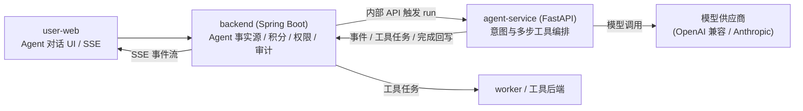
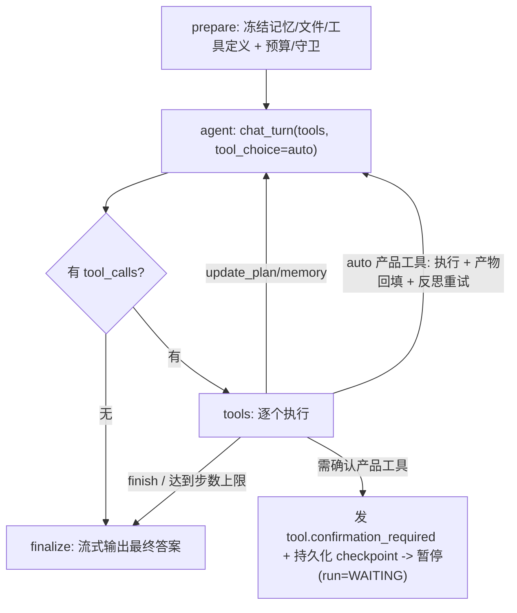
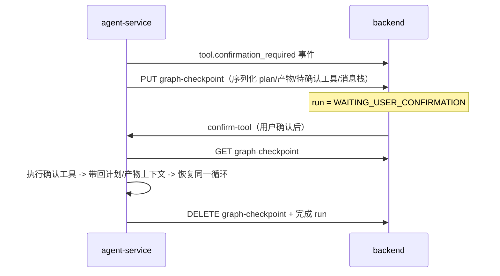

# Agent 架构与维护指南

本文是 Agent 编排当前架构的权威说明，反映「多步 Agentic Loop」重构后的实现。改动引擎 / 节点 / 事件 / checkpoint / 安全边界时，请同步更新本文（见文末「维护清单」）。

## 1. 总体架构与职责边界



- **backend**：业务事实源。拥有会话、run、消息、工具调用、积分冻结/结算、模型配置、工作区记忆。Agent 只能通过 `/api/internal/v1/agent/**` 读上下文、写事件与结果。
- **agent-service**：无状态编排引擎。负责意图判断、工具选择与多步编排、上下文（历史/文件/记忆）注入、受控工具调用。不拥有业务数据。
- **user-web**：通过 SSE 消费 run 事件，渲染消息流、时间线、计划、工具确认与多模态产物。

## 2. 三个执行引擎与选择

入口是 [agent-service/app/core/runtime.py](../../agent-service/app/core/runtime.py) 的 `AgentRuntime`，它取上下文、选模型，然后用 [agent-service/app/runtime/router.py](../../agent-service/app/runtime/router.py) 的 `RuntimeRouter.select_engine` 选引擎。

| 引擎 | 类 | 定位 |
|---|---|---|
| 旧版调度器（默认 / 回滚） | `LegacyDispatcherEngine`（[legacy_engine.py](../../agent-service/app/runtime/legacy_engine.py)） | 重构前的「单轮单工具」调度器，**不使用** 状态图。作为安全回滚路径保留 |
| 多步 graph 引擎 | `AgentGraphEngine`（[agent_graph/](../../agent-service/app/runtime/agent_graph/)） | 基于 LangGraph `StateGraph` 的多步 Agentic Loop，本文重点 |
| deepagents 原生引擎 | `DeepAgentsRuntimeEngine`（[deep_agents_engine.py](../../agent-service/app/runtime/deep_agents_engine.py)） | 可选的 planning / sub-agent 增强层 |

选择优先级（见 `RuntimeRouter.select_engine`）：

1. 显式 `requested_runtime`（来自 `runtimeSettings.intelligenceLevel`）；
2. `graph_engine_enabled` 为真 → `AgentGraphEngine`；
3. `deep_agents_enabled` 为真且请求 deep_agents → `DeepAgentsRuntimeEngine`；
4. 否则 → `LegacyDispatcherEngine`。

开关（[agent-service/app/config.py](../../agent-service/app/config.py)）：

- `AGENT_GRAPH_ENGINE_ENABLED`（默认 false）：全局启用 graph 引擎；
- `AGENT_GRAPH_MAX_ITERATIONS`（默认 8）：graph 循环最大步数；
- 单 run 灰度：后端下发 `runtimeSettings.intelligenceLevel=graph` 即可只让该次 run 走 graph 引擎，无需改全局开关。

> 三个引擎执行产品工具都必须走同一条受控通道（见第 4 节），模型永不直接执行工具或绕过守卫。

## 3. graph 多步循环

实现位于 [agent-service/app/runtime/agent_graph/](../../agent-service/app/runtime/agent_graph/)：

| 文件 | 职责 |
|---|---|
| `engine.py` | `AgentGraphEngine`：编排 `run / run_confirmed_tool / debug_route`，节点实现，run 完成/失败回写 |
| `state.py` | `AgentState`（messages / plan / artifacts / iteration / pending_confirmation 等）与 checkpoint 序列化 |
| `tool_specs.py` | 产品工具与内置工具（`update_plan` / `finish` / `memory_*`）的 function-calling 定义；复用 product 工具循环的别名/schema 构建 |
| `prompts.py` | 系统提示词与可用工具/文件提示、文本切片、token 估算、媒体字段识别等纯函数 |



关键点：

- **原生 function-calling 自决策**：`agent` 节点用 `model_client.chat_turn(messages, tools, tool_choice="auto")` 让模型自行决定聊天还是调工具，取代旧的中文关键词路由（`intent_router` 仅保留基础设施短路）。
- **多工具链式 + 产物回填**：每个成功工具产物（媒体 URL / taskId）写回 `AgentState`，下一个工具缺失的 image/video/audio 输入字段会自动用最近匹配产物回填，实现「文生图 → 图生视频」链式。
- **失败反思重试（reflect）**：工具失败时把错误回传给模型，由模型纠参后有限重试（按工具次数上限 + 预算约束），发 `reflect.retry` 事件。
- **计划 / todo**：`update_plan` 工具写计划，发 `plan.updated` 事件，前端可视化。
- **流式 finalize**：最终答案以 `message.delta` 分片下发并写 `message.completed`。

## 4. 安全边界（不可破坏）

任何产品工具调用必须经过：

```
模型选工具+填参 -> ToolOrchestrator.execute_with_guard -> BackendToolBridge -> 后端 task API（积分冻结/结算 + 权限 + 审计）
```

- `ToolOrchestrator`（[tool_orchestrator.py](../../agent-service/app/runtime/tool_orchestrator.py)）：本地预算守卫前置（`BudgetGuard`：`max_model_calls / max_tool_calls`）。
- `BackendToolBridge`（[backend_tool.py](../../agent-service/app/tools/backend_tool.py)）：创建工具调用记录、创建任务、绑定、轮询、complete/fail，全部走后端。
- **人机确认（HITL）**：非 auto 工具暂停等待用户确认；模型从不直接执行高风险工具。
- **注入防护**：`PromptGuard`（[prompt_guard.py](../../agent-service/app/security/prompt_guard.py)）在 run 起始校验用户输入。
- **预算守卫**：循环步数、模型/工具调用次数、积分预算超限即安全失败（`AGENT_MODEL_CALL_LIMIT` / `AGENT_TOOL_CALL_LIMIT` / `AGENT_RUN_BUDGET_EXCEEDED`）。

## 5. HITL 确认 + 跨请求 checkpoint

确认会跨越两个 HTTP 请求（execute 暂停 → confirm-tool 恢复），因此 graph 状态需持久化到后端。



- 后端内部 API（[InternalAgentController.java](../../backend/src/main/java/com/aiminilab/aitoolmarket/agent/controller/InternalAgentController.java)）：`PUT / GET / DELETE /api/internal/v1/agent/runs/{runId}/graph-checkpoint`。
- 落库：`agent_runs.graph_checkpoint_json` 列，迁移 [sql/060_agent_graph_checkpoint.sql](../../sql/060_agent_graph_checkpoint.sql)；实体/Mapper/Service 见 `AgentRun` / `AgentRunMapper` / `AgentRunServiceImpl`。
- Python 侧：[backend_client.py](../../agent-service/app/clients/backend_client.py) 的 `save_graph_checkpoint / load_graph_checkpoint / clear_graph_checkpoint`；序列化见 `agent_graph/state.py`。
- 兼容：旧引擎的 `run_confirmed_tool`（重跑单个工具）保留作回滚。

## 6. 事件契约

事件由 agent-service 经后端 `appendEvent` 写入并通过 SSE 推到前端。类型定义见 [agent-service/app/core/event_types.py](../../agent-service/app/core/event_types.py) 与前端 [user-web/src/api/types.ts](../../user-web/src/api/types.ts) 的 `AgentRunEventType`。

多步循环新增/重点事件：

| 事件 | 含义 | 前端呈现 |
|---|---|---|
| `agent.step` | 每一轮模型思考步 | 时间线步骤 |
| `plan.updated` | 计划/todo 更新 | 计划步骤列表 |
| `reflect.retry` | 工具失败反思重试 | 警示步骤 |
| `tool.delta` | 工具产物增量（预留） | 产物流式 |
| `tool.confirmation_required` | 需用户确认工具 | 内联确认卡片 |
| `message.delta` / `message.completed` | 答案流式 / 终态 | 消息气泡 |

前端时间线白名单与标题映射：[runTimelineEvents.ts](../../user-web/src/pages/AgentHome/runTimelineEvents.ts)、[RunTimeline.vue](../../user-web/src/pages/AgentHome/RunTimeline.vue)；确认卡片在消息流内联，确认后恢复同一 run 的 SSE。

## 7. 记忆运行时

- 读取：按 `workspaceId` 从后端取工作区长期记忆，格式化后冻结进系统提示（发 `memory.context_frozen`）。
- 写入：模型可调用 `memory_add / memory_replace / memory_remove`；run 结束由 `MemoryCuratorService` 回退式判定候选/直接保存。
- 实现：[memory_runtime.py](../../agent-service/app/runtime/memory_runtime.py)、[memory_curator.py](../../agent-service/app/runtime/memory_curator.py)、[memory_tool.py](../../agent-service/app/tools/memory_tool.py)。
- 「跨对话」生效的前提是同一 `workspaceId` 且写入已固化（候选未审核时不会命中）。

## 8. 关键文件地图

**agent-service（Python）**

| 文件 | 作用 |
|---|---|
| `app/core/runtime.py` | run 入口：取上下文、选模型、选引擎 |
| `app/runtime/router.py` | 引擎选择（legacy / graph / deep_agents） |
| `app/runtime/agent_graph/` | 多步 graph 引擎（engine/state/tool_specs/prompts） |
| `app/runtime/legacy_engine.py` | 旧版单工具调度器（回滚路径） |
| `app/runtime/deep_agents_engine.py` | deepagents 原生引擎（可选） |
| `app/runtime/tool_orchestrator.py` | 预算守卫 + 工具执行编排 |
| `app/tools/backend_tool.py` | 工具调用桥接后端 task |
| `app/core/budget_guard.py` | 预算/次数守卫 |
| `app/security/prompt_guard.py` | 注入防护 |
| `app/core/event_types.py` | 事件类型常量 |
| `app/clients/backend_client.py` | 后端内部 API 客户端（含 checkpoint） |

**backend（Java）**

| 文件 | 作用 |
|---|---|
| `agent/controller/InternalAgentController.java` | 供 agent-service 回调的内部 API（事件、工具调用、完成、checkpoint） |
| `agent/service/impl/AgentRunServiceImpl.java` | Run 编排、确认、积分结算、checkpoint 读写 |
| `agent/mapper/AgentRunMapper.java` / `entity/AgentRun.java` | run 持久化（含 `graph_checkpoint_json`） |

**user-web（前端）**

| 文件 | 作用 |
|---|---|
| `src/pages/AgentHome/AgentChatPane.vue` | 对话主面板，SSE、确认、流式 |
| `src/pages/AgentHome/RunTimeline.vue` / `runTimelineEvents.ts` | 运行时间线渲染与白名单 |
| `src/api/types.ts` | `AgentRunEventType`、`AgentPlanStep` 等类型 |

## 9. 测试、灰度与回滚

- 测试：[agent-service/tests/test_agent_graph_engine.py](../../agent-service/tests/test_agent_graph_engine.py)（聊天/工具/确认-恢复/链式/计划）；黄金评测集 [agent-service/tests/test_agent_graph_golden.py](../../agent-service/tests/test_agent_graph_golden.py)（闲聊回退、失败反思重试、注入拒绝、预算安全失败）。
- 灰度：默认 `AGENT_GRAPH_ENGINE_ENABLED=false`，先用 `runtimeSettings.intelligenceLevel=graph` 对小流量验证，逐步放量。
- 回滚：异常即关闭开关，流量回到 `LegacyDispatcherEngine`；checkpoint 跨栈路径建议先在测试环境验证恢复正确性。

## 10. 维护清单（改动时同步更新）

| 你改了什么 | 需要一起更新 |
|---|---|
| 新增/修改引擎或选择逻辑 | `router.py`、本文第 2 节、`agent-service/README.md` |
| graph 节点/循环行为 | `agent_graph/*`、本文第 3 节、`tests/test_agent_graph_engine.py` |
| 新增事件类型 | `event_types.py`、`user-web/src/api/types.ts`、`runTimelineEvents.ts`、`RunTimeline.vue`、本文第 6 节 |
| checkpoint 契约 | `state.py`、`backend_client.py`、`InternalAgentController.java`、`AgentRunMapper`/`AgentRun`、`sql/`、本文第 5 节 |
| 安全边界/预算 | `tool_orchestrator.py`、`budget_guard.py`、`prompt_guard.py`、本文第 4 节、`tests/test_agent_graph_golden.py` |
