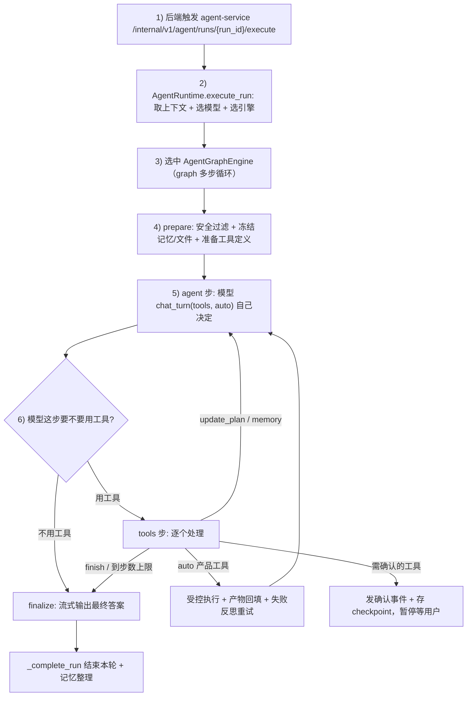
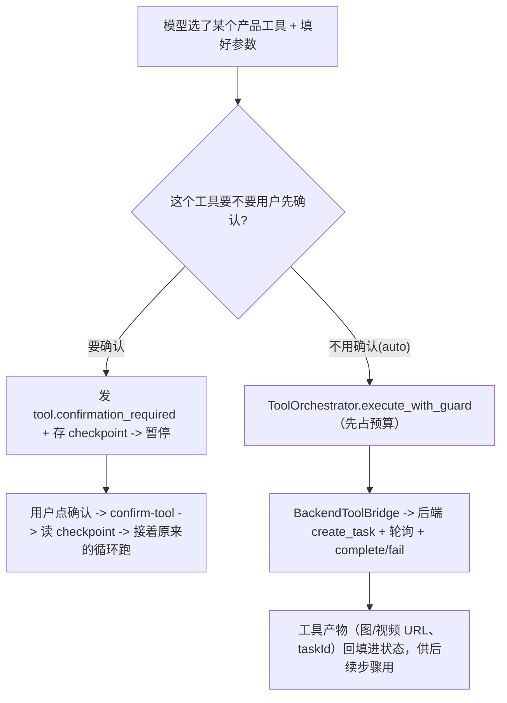
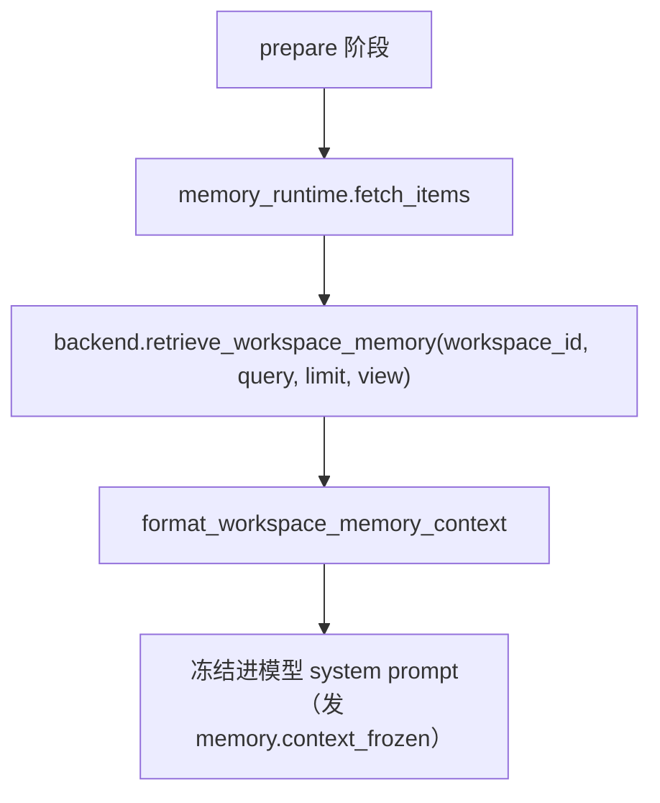
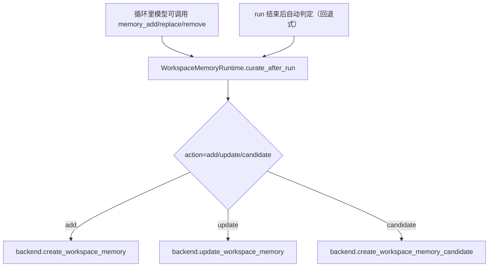

# 当前 Agent 链路梳理（小学生也能看懂版）

> 想看精确的工程细节（引擎选择、事件、checkpoint、文件地图），请看同目录的 [架构与维护指南.md](./架构与维护指南.md)。本文用大白话讲一次请求是怎么走的。

## 先说一句

可以把这个项目的 agent 想成几位“员工”：

- **门卫（入口）**：收到任务就拿取上下文（RunContext）；
- **调度台（选引擎）**：决定这次用哪种“干活方式”；
- **多面手（多步循环）**：自己边想边干，可以连着用好几个工具（比如先生成图、再用图做视频），干完整理答案、把有用信息存进“记忆库”。

---

## 这次用哪种“干活方式”（选引擎）

现在有三种引擎，由 `RuntimeRouter` 挑一个：

- **旧版调度器（默认/兜底）**：老办法，判一次意图、最多用一个工具。出问题时随时切回它。
- **多步 graph 引擎**：新主力。模型自己边想边调用工具，能多步、能链式、能失败重试。开关 `AGENT_GRAPH_ENGINE_ENABLED`，或单次用 `runtimeSettings.intelligenceLevel=graph` 打开。
- **deepagents 引擎**：可选的“会做计划、能拆子任务”的增强版。

不管用哪种，**真正执行工具都要走同一条受控通道**（要花积分、要权限、要确认），模型不能自己偷偷执行。

---

## 一次请求的主线（新主力 graph 引擎）

一句话：**模型自己边想边干，能连着用工具，干完再回答。**

---

## 模型怎么决定“聊还是用工具”

新引擎不再靠中文关键词去猜，而是把工具清单交给模型，用“函数调用（function-calling）”能力让模型自己选：

- 模型这一步**没要工具** → 直接当成回答，结束。
- 模型这一步**要了工具** → 去 tools 步执行，然后回到 agent 步继续想下一步。

（旧版调度器还会用规则 `IntentRouter` 先分类一次意图，那是兜底路径。）

---

## 工具调用链（受控通道，三引擎通用）

看门人各司其职：

| 组件 | 负责内容 |
|---|---|
| `BudgetGuard` | 步数 / 模型调用 / 工具调用 / 积分上限，超了就安全失败 |
| `ToolOrchestrator` | 本地参数拼装、必填检查、预算占用前置 |
| `BackendToolBridge` | 与后端工具 API 通信，创建任务并回填结果（积分/权限/审计都在后端） |

---

## 多步的几个“新本事”

- **链式**：上一步生成的图，会自动填进下一步“做视频”工具缺的图片字段。
- **反思重试**：工具报错时，把错误告诉模型，让它改参数再试（有次数和预算上限），会发 `reflect.retry` 事件。
- **计划/todo**：复杂任务先调 `update_plan` 写步骤清单，发 `plan.updated` 事件给前端展示。
- **确认可恢复**：需要确认时把进度存成 checkpoint，用户确认后接着原来的循环继续，而不是从头再来。

---

## 记忆链路（“跨对话”核心）

记忆不是存在“聊天窗口内存”里，而是按 `workspaceId` 落到“工作区记忆库”。

### 记忆如何“进来”（读取）

### 记忆如何“存进去”（保存）

### 一句话看懂“跨对话”真假

- **跨对话生效**：同一个 `workspaceId` 下，下次请求会再取到同一份记忆。
- **看起来不生效**：通常是 `workspaceId` 不一致、这次没写入成功、或写入是“候选未审核/未固化”。

---

## 关键文件（你可以直接对照）

| 文件 | 作用 |
|---|---|
| `agent-service/app/core/runtime.py` | run 入口，取上下文、选模型、选引擎 |
| `agent-service/app/runtime/router.py` | 引擎选择（legacy / graph / deep_agents） |
| `agent-service/app/runtime/agent_graph/` | 多步 graph 引擎（engine/state/tool_specs/prompts） |
| `agent-service/app/runtime/legacy_engine.py` | 旧版单工具调度器（兜底/回滚） |
| `agent-service/app/runtime/tool_orchestrator.py` | 预算守卫 + 工具执行编排 |
| `agent-service/app/tools/backend_tool.py` | 工具调用桥接后端 task |
| `agent-service/app/runtime/memory_runtime.py` | 记忆读取 + 归档调度入口 |
| `agent-service/app/runtime/memory_curator.py` | 候选/自动记忆归档策略 |
| `agent-service/app/clients/backend_client.py` | 与后端 memory / checkpoint API 交互 |

---

## 极简总结

`用户问题 -> 取上下文 -> 选引擎 -> 模型边想边（多步）用工具/链式/反思 -> 回答用户 -> 有价值信息写入 workspace 记忆 -> 下次再用。`
