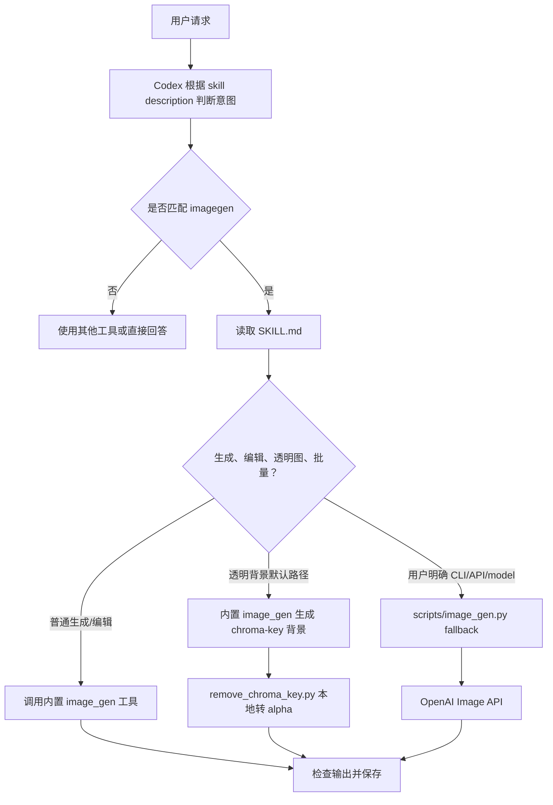

# Codex Agent 开发参考

本文整理 `C:\Users\29987\.codex\skills\.system\imagegen` 的文件结构和工作方式，供后续项目内 agent、skill、插件能力设计参考。

## 1. 核心结论

`imagegen` 目录本身不是一个常驻服务，也不是一个独立的意图识别程序。它主要通过 **Skill 元数据 + Codex 系统提示机制 + 已暴露的内置工具** 完成能力接入。

对 `imagegen` 来说：

- `SKILL.md` 负责告诉 Codex：什么时候应该使用该 skill、如何判断任务类型、如何组织 prompt、如何选择执行路径。
- 默认生图能力来自 Codex 平台暴露的内置 `image_gen` 工具。
- `scripts/image_gen.py` 只是备用 CLI 路径，用于用户明确要求 CLI/API/model 控制，或用户确认走 true transparency fallback 时调用。
- `scripts/remove_chroma_key.py` 是透明背景场景的本地后处理工具。
- `references/*` 是补充说明和 prompt/API/CLI 参考。
- `agents/openai.yaml` 和 `assets/*` 主要服务于 UI 展示和默认入口提示。

换句话说：**skill 是决策说明书和执行规范，不一定是能力本身；真正的能力可能来自平台工具、MCP 工具、本地脚本、API 或它们的组合。**

## 2. 文件结构与职责

以 `C:\Users\29987\.codex\skills\.system\imagegen` 为例：

```text
imagegen/
  SKILL.md
  LICENSE.txt
  agents/
    openai.yaml
  assets/
    imagegen.png
    imagegen-small.svg
  references/
    cli.md
    codex-network.md
    image-api.md
    prompting.md
    sample-prompts.md
  scripts/
    image_gen.py
    remove_chroma_key.py
```

### SKILL.md

最核心文件。顶部 frontmatter 定义 skill 的名称和触发描述：

```yaml
name: "imagegen"
description: "Generate or edit raster images when..."
```

Codex 会根据 `description` 判断用户意图是否匹配该 skill。匹配后，Codex 会读取 `SKILL.md`，再根据文档内规则决定下一步。

`imagegen/SKILL.md` 里主要包含：

- 何时使用：生成照片、插画、纹理、sprite、mockup、透明背景 cutout 等。
- 何时不用：更适合 SVG、HTML/CSS、canvas 或现有矢量系统时不用。
- 执行模式：默认内置 `image_gen`，fallback CLI 仅在明确要求时使用。
- 决策树：区分 generate、edit、reference image、edit target、batch 等。
- 透明图策略：默认先用纯色 chroma-key 背景生成，再本地抠 alpha。
- prompt 组织规范：use case、asset type、subject、style、constraints 等。

### scripts/image_gen.py

备用 CLI 实现。它封装 OpenAI Image API，支持：

- `generate`：从 prompt 生成图片。
- `edit`：编辑一张或多张输入图片。
- `generate-batch`：从 JSONL 批量生成。

默认模型是 `gpt-image-2`。脚本内部会：

- 校验模型、尺寸、质量、背景、输出格式等参数。
- 检查 `OPENAI_API_KEY`。
- 调用 `client.images.generate(...)` 或 `client.images.edit(...)`。
- 解析返回的 `b64_json` 并写入本地文件。

注意：`SKILL.md` 明确要求不要随意修改该脚本。如果能力不足，应先询问用户。

### scripts/remove_chroma_key.py

本地透明背景后处理脚本。用于默认内置生图路径下的透明图需求：

1. 让模型把主体生成在纯色背景上，例如 `#00ff00`。
2. 将生成图保存到本地。
3. 用该脚本识别边缘/背景 key color。
4. 生成带 alpha 通道的 PNG/WebP。

它支持：

- 指定 key color。
- 从边框或角落自动取样背景色。
- soft matte。
- despill 去除边缘溢色。
- edge contract / feather。

### references/prompting.md

prompt 编写原则。包括：

- 如何结构化 prompt。
- 如何根据用户描述的具体程度决定是否补充细节。
- 如何处理输入图片角色。
- 如何写编辑任务中的 invariants。
- 如何处理图片内文字。
- 如何迭代修正。
- 如何处理透明图。

### references/sample-prompts.md

可复制的 prompt 模板库。覆盖：

- 产品图。
- UI mockup。
- 信息图。
- logo。
- 网站素材。
- 游戏资产。
- wireframe。
- 背景抽取。
- 风格迁移。
- 合成。

这些模板是参考，不代表每次都要照搬完整复杂度。

### references/cli.md

CLI fallback 使用说明。包括：

- `generate` / `edit` / `generate-batch` 示例。
- 默认参数。
- gpt-image-2 尺寸和质量建议。
- batch JSONL 用法。
- 输出目录约定。

### references/image-api.md

Image API 参数速查。用于 fallback CLI 路径，说明：

- 模型能力差异。
- 尺寸约束。
- `quality`、`background`、`input_fidelity`、`mask` 等参数。
- generate/edit endpoint。

这些参数不等于内置 `image_gen` 工具参数，不能混用。

### references/codex-network.md

fallback CLI 需要访问 OpenAI API，因此会涉及网络权限、沙箱和审批策略。该文件解释：

- 为什么会要求网络审批。
- approval policy 和 network access 的区别。
- 如何减少重复审批。

### agents/openai.yaml

UI/入口元数据：

```yaml
interface:
  display_name: "Image Gen"
  short_description: "Generate or edit images for websites, games, and more"
  icon_small: "./assets/imagegen-small.svg"
  icon_large: "./assets/imagegen.png"
  default_prompt: "Use $imagegen to make or edit an image for this project."
```

它不负责执行生图，只负责展示名称、简介、图标和默认提示词。

### assets/*

skill 或 agent 入口使用的图标资源。

### LICENSE.txt

许可证文本。

## 3. Codex 如何识别用户生图意图

识别链路可以理解为：

```text
用户输入
  -> Codex 查看可用 skills 的 name/description
  -> 判断用户请求是否匹配 imagegen.description
  -> 若匹配，读取 imagegen/SKILL.md
  -> 根据 SKILL.md 的 When to use / Decision tree / Workflow 继续判断
  -> 决定是否调用内置 image_gen 或 fallback CLI
```

这里的关键不是 Python 脚本，而是 skill 元数据和 Codex 的系统级 skill 选择规则。

典型匹配表达：

- “生成一张产品宣传图”
- “把这张图改成冬天夜晚”
- “做一个游戏道具 icon”
- “生成透明背景的角色立绘”
- “根据参考图做同风格插画”

典型不匹配或应谨慎的场景：

- “写一个 SVG 图标”
- “用 CSS 做背景”
- “改项目已有矢量 logo”
- “画一个简单流程图”

这些更适合代码、SVG、Figma、Mermaid 或其他工具。

## 4. Codex 如何调用生图功能

默认路径：

```text
用户请求生成/编辑图片
  -> Codex 识别 imagegen skill
  -> 读取 SKILL.md
  -> 判断 generate 或 edit
  -> 整理结构化 prompt
  -> 调用内置 image_gen 工具
  -> 检查结果
  -> 如为项目资产，移动/复制到 workspace 并更新引用
```

fallback CLI 路径：

```text
用户明确要求 CLI/API/model 控制
  或用户确认 true transparency fallback
  -> Codex 使用 scripts/image_gen.py
  -> CLI 检查 OPENAI_API_KEY 和参数
  -> 调用 OpenAI Image API
  -> 写入 output/imagegen/ 或用户指定路径
```

透明图默认路径：

```text
用户请求透明背景
  -> 默认仍使用内置 image_gen
  -> prompt 要求纯色 chroma-key 背景
  -> 生成图片
  -> 用 remove_chroma_key.py 转 alpha
  -> 验证透明角落、主体覆盖、边缘溢色
  -> 保存最终 PNG/WebP
```

只有在复杂主体或用户明确要求 true/native transparency 时，才询问是否走 `gpt-image-1.5 --background transparent` fallback。

## 5. 对我们后续 Agent 开发的启发

### 5.1 用 description 做第一层意图识别

skill 的 `description` 要写成“可被模型准确匹配的能力边界”，而不是营销文案。

推荐包含：

- 做什么。
- 适合什么输入。
- 适合什么输出。
- 什么时候不该用。

例如：

```yaml
description: "Generate or edit raster images when the task benefits from AI-created bitmap visuals... Do not use when..."
```

### 5.2 用 SKILL.md 固化决策树

把 agent 的隐性判断写成显式规则：

- 什么时候用。
- 什么时候不用。
- 默认路径是什么。
- fallback 什么时候触发。
- 需要用户确认的高风险路径是什么。
- 输出和保存策略是什么。

这能显著减少 agent 每次“自由发挥”。

### 5.3 把能力实现和操作规范分开

`imagegen` 的能力来源有三层：

- 平台内置工具：默认生图。
- 本地脚本：fallback API 和后处理。
- 参考文档：prompt、API、网络、模板。

后续我们设计 agent 时，也可以采用类似结构：

```text
SKILL.md         负责判断和流程
scripts/        负责可执行操作
references/     负责长文档和参数说明
assets/         负责图标、模板、静态资源
agents/*.yaml   负责入口展示
```

### 5.4 默认路径要简单，fallback 要保守

`imagegen` 的设计重点是：默认走内置工具，只有用户明确要求才走 CLI。

这类设计适合复制到其他 agent：

- 默认路径：最快、最安全、最少依赖。
- fallback 路径：功能更强，但可能需要密钥、网络、审批或额外依赖。
- fallback 不应静默触发，尤其涉及成本、模型降级、外部网络、覆盖文件时。

### 5.5 对文件输出要有明确策略

`imagegen` 明确规定：

- preview-only 可以留在默认生成目录。
- 项目资产必须复制/移动进 workspace。
- 不要覆盖已有资产，除非用户明确要求。
- 最终回答要报告保存路径和使用的 prompt/模式。

我们后续做 agent 也应定义类似输出策略，避免生成物散落在临时目录。

### 5.6 把复杂参考资料放到 references

`SKILL.md` 应该是主流程，不应塞满所有 API 细节。复杂细节拆到：

- `references/api.md`
- `references/cli.md`
- `references/prompting.md`
- `references/examples.md`

这样 Codex 可以按需读取，减少上下文噪音。

## 6. 可复用模板

后续新增 skill 时可以参考：

```text
my-skill/
  SKILL.md
  agents/
    openai.yaml
  assets/
    icon.png
    icon-small.svg
  references/
    workflow.md
    api.md
    examples.md
  scripts/
    tool.py
  LICENSE.txt
```

`SKILL.md` 建议结构：

```markdown
---
name: "my-skill"
description: "清楚描述能力、适用场景、不适用场景。"
---

# My Skill

## When to use

## When not to use

## Decision tree

## Workflow

## Output policy

## Fallback mode

## Reference map
```

`agents/openai.yaml` 建议结构：

```yaml
interface:
  display_name: "My Skill"
  short_description: "一句话说明能力"
  icon_small: "./assets/icon-small.svg"
  icon_large: "./assets/icon.png"
  default_prompt: "Use $my-skill to ..."
```

## 7. imagegen 工作链路总览



## 8. 注意事项

- 不要把 skill 目录误解成完整插件运行时。很多时候它只是 Codex 的“使用说明 + 触发规则”。
- 不要假设 `scripts/*` 一定会被默认调用。对 `imagegen` 来说，默认调用的是内置 `image_gen` 工具。
- 不要把 fallback CLI 的参数当成内置工具参数。
- 需要密钥、网络、模型降级、覆盖文件、成本增加时，应明确告知用户并获得确认。
- 对 agent 开发来说，最重要的是把“什么时候用、怎么用、什么时候不用、失败怎么办”写清楚。
