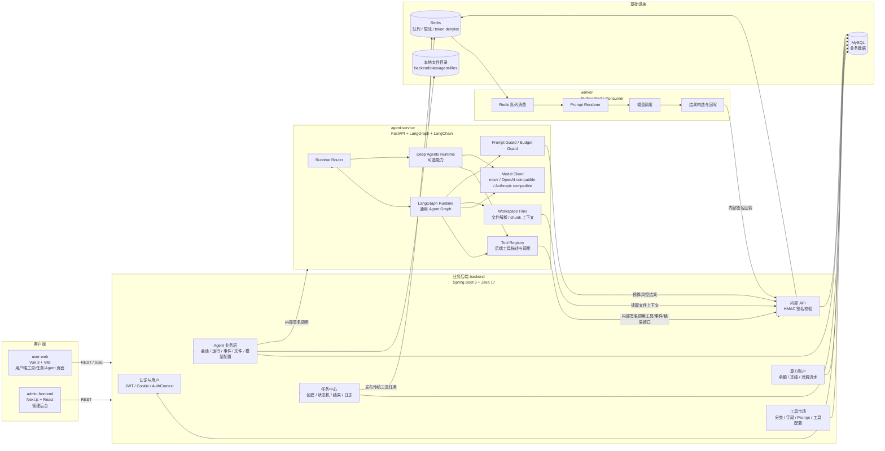
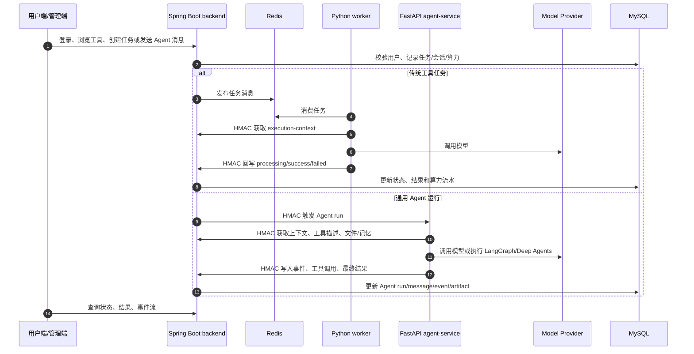

# 当前系统架构图

> 更新日期：2026-05-12
> 范围：当前仓库 `integration/backend-core-team-merge-20260510` 的实际实现现状。

## 一、总体架构

## 二、核心运行链路

## 三、模块边界

| 模块 | 当前职责 | 不应越界 |
| --- | --- | --- |
| `backend` | 用户、认证、工具、任务、算力、Agent 业务事实源、内部签名与审计 | 不直接执行大模型编排逻辑 |
| `agent-service` | Agent 推理、运行时路由、LangGraph/Deep Agents、工具选择、模型调用、文件/记忆上下文注入 | 不绕过后端直接修改用户算力、任务状态或权限数据 |
| `worker` | 传统工具任务队列消费、Prompt 渲染、模型调用、结果回写 | 不负责 Agent 会话状态机 |
| `user-web` | 用户侧工具、任务、素材、Agent 工作区交互 | 不持有管理员能力 |
| `admin-frontend` | 管理工具、任务、用户、算力、模型配置等后台界面 | 不直接访问数据库或内部签名接口 |

## 四、当前审查结论

截至 2026-05-12，本地严格验证结果如下：

| 模块 | 命令 | 结果 |
| --- | --- | --- |
| `backend` | `mvn test` | 通过，98 tests |
| `agent-service` | `pytest -q` | 通过，86 tests |
| `user-web` | `npm run build` | 通过 |
| `admin-frontend` | `npm run build` | 未通过 |

`admin-frontend` 的阻断点是模型配置页面与 API 客户端/后端契约不一致：页面使用多模型配置 CRUD（如 `fetchAgentModelConfigs`、`createAgentModelConfig`、`deleteAgentModelConfig`、`setDefaultAgentModelConfig`），但当前 `admin-frontend/lib/api/agent-model.ts` 与后端 `AdminAgentModelConfigController` 只提供单模型配置的 `GET / PUT / POST /test`。

因此，当前代码不建议直接合入 `dev`。建议先统一模型配置能力的产品形态：要么前端回退为单配置编辑，要么后端补齐多配置 CRUD、默认配置、保存后测试等接口，并补充对应构建/测试验收。
