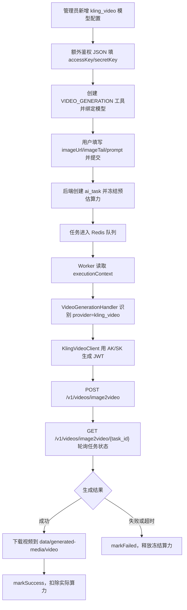

# 可灵 API 接入配置教程

本文以可灵 `image2video` 为例，说明从后台配置到用户提交任务、Worker 调用接口、结果回写的完整落地流程。

> 密钥只允许放在后台模型配置或服务端环境变量中，不要写进前端代码、CSV 示例、截图或提交到 Git。

## 1. 本次落地结论

项目现在按一个通用供应商接入可灵：

| 项目 | 值 |
| --- | --- |
| Provider Code | `kling_video` |
| 默认 Base URL | `https://api-beijing.klingai.com` |
| 视频模型示例 | `kling-v2-6` |
| 支持能力 | `VIDEO_GENERATION`、`IMAGE_GENERATION` |
| 后台鉴权字段 | `extraAuthJson` |
| Worker Client | `worker/client/kling_video_client.py` |
| 视频 Handler | `worker/handlers/video_generation_handler.py` |

后台只需要配置一条模型记录，不需要改 `.env`：

```json
{"accessKey":"你的Access Key","secretKey":"你的Secret Key"}
```

Worker 会用 `accessKey/secretKey` 生成 JWT，然后按 `Authorization: Bearer <token>` 调用可灵。

## 2. 官方 curl 如何映射到项目

你给的接口示例：

```bash
curl --location --request POST 'https://api-beijing.klingai.com/v1/videos/image2video' \
--header 'Authorization: Bearer <token>' \
--header 'Content-Type: application/json' \
--data-raw '{
  "model_name": "kling-v2-6",
  "image": "https://p2-kling.klingai.com/kcdn/cdn-kcdn112452/kling-qa-test/multi-2.png",
  "image_tail": "https://p2-kling.klingai.com/kcdn/cdn-kcdn112452/kling-qa-test/multi-1.png",
  "prompt": "镜头拉远，女生微笑",
  "negative_prompt": "",
  "duration": "5",
  "mode": "pro",
  "sound": "off",
  "callback_url": "",
  "external_task_id": ""
}'
```

在项目里的对应关系：

| 官方字段 | 后台/工具字段 | 说明 |
| --- | --- | --- |
| `https://api-beijing.klingai.com` | 模型配置 `Base URL` | 后台填写 |
| `/v1/videos/image2video` | Worker 内置路径 | 图生视频时自动使用 |
| `Authorization: Bearer <token>` | `extraAuthJson` 里的 AK/SK | Worker 自动生成 token |
| `model_name` | 模型配置 `Model Name` | 例如 `kling-v2-6` |
| `image` | 工具字段 `image` 或 `imageUrl` | 首帧图；用户端可上传 URL，Worker 会转成纯 base64 |
| `image_tail` | 工具字段 `imageTail` | 尾帧图，可选；Worker 会转成纯 base64 |
| `prompt` | 工具字段 `prompt` | 文本提示词 |
| `negative_prompt` | 工具字段 `negativePrompt` | 负向提示词 |
| `duration` | 工具字段 `duration` | 建议传字符串：`5` |
| `mode` | 工具字段 `mode` | 例如 `pro` |
| `sound` | 工具字段 `sound` | 默认 `off` |
| `callback_url` | 工具字段 `callbackUrl` | 可先留空 |
| `external_task_id` | 工具字段 `externalTaskId` | 可先留空 |

## 3. 后台模型配置

进入后台：

```text
系统配置 / AI 模型配置
```

新增一条模型：

| 字段 | 填写 |
| --- | --- |
| 显示名称 | 可灵图生视频 |
| 配置编码 | `kling_image_to_video` |
| Provider | `kling_video` |
| Model Name | `kling-v2-6` |
| Base URL | `https://api-beijing.klingai.com` |
| API Key | 留空，除非你拿到的是固定 Bearer Token |
| 额外鉴权 JSON | `{"accessKey":"...","secretKey":"..."}` |
| Capabilities | `VIDEO_GENERATION` |
| Timeout Seconds | `300` |
| Billing Unit | `PER_CALL` |
| Unit Price | 先按测试成本填，未知可先填 `0` |
| Enabled | 开启 |

保存后，后台返回只会展示 `extraAuthJsonMasked=********`，不会把明文密钥回传给前端。

## 4. 创建图生视频工具

进入：

```text
AI 工具管理
```

新增工具：

| 字段 | 填写 |
| --- | --- |
| 工具名称 | 可灵图生视频 |
| 工具编码 | `kling_image_to_video` |
| Tool Type | `VIDEO_GENERATION` |
| Execution Handler | `VIDEO_GENERATION` |
| Input Modality | `IMAGE` 或 `MULTIMODAL` |
| Output Modality | `VIDEO` |
| 模型配置 | 选择刚才创建的可灵模型 |
| 预估算力 | 先填一个保守值，例如 `50` |
| 状态 | 上线 |

建议工具表单字段：

| fieldKey | 类型 | 必填 | 示例 |
| --- | --- | --- | --- |
| `imageUrl` | 文本/图片 URL | 是 | 首帧图 URL |
| `imageTail` | 文本/图片 URL | 否 | 尾帧图 URL |
| `prompt` | 多行文本 | 是 | 镜头拉远，女生微笑 |
| `negativePrompt` | 多行文本 | 否 | 模糊、低清、畸变 |
| `duration` | 单选 | 是 | `5` |
| `mode` | 单选 | 否 | `pro` |
| `sound` | 单选 | 否 | `off` |

Worker 会自动兼容这些首帧字段：`image`、`imageUrl`、`image_url`、`referenceImage`、`referenceImageUrl`、`firstFrameUrl`。

尾帧字段支持：`imageTail`、`image_tail`、`tailImage`、`tailImageUrl`、`lastFrameUrl`。

## 5. 任务运行流程



## 6. Worker 实际发出的 payload

当用户提交图生视频时，Worker 会构造类似请求体：

```json
{
  "model_name": "kling-v2-6",
  "image": "<纯 base64 图片内容>",
  "image_tail": "<纯 base64 图片内容>",
  "prompt": "镜头拉远，女生微笑",
  "negative_prompt": "",
  "duration": "5",
  "mode": "pro",
  "sound": "off"
}
```

注意：

1. 用户端和后台字段里仍然可以是 `/generated/uploads/...` 或 `https://...` 图片 URL。
2. Worker 调可灵前会把 `image` / `image_tail` 转成纯 base64，不带 `data:image/png;base64,` 前缀。
3. 图生视频创建成功后，查询接口是 `GET /v1/videos/image2video/{task_id}`。
4. `callback_url` 和 `external_task_id` 只有工具参数里传了才会带上；先跑通同步轮询流程时可以不填。

## 7. 本地假链路测试

不消耗可灵额度，只验证项目链路：

```powershell
cd D:\0011\5.20
python worker\scripts\run_fake_kling_integration_test.py
```

看到下面输出说明代码链路正常：

```text
FAKE_KLING_INTEGRATION_TEST_PASSED
```

## 8. 真实接口冒烟测试

1. 后台保存模型配置。
2. 后台创建并上线图生视频工具。
3. 用户端提交最短参数：

```json
{
  "imageUrl": "/generated/uploads/20260521/example.png",
  "imageTail": "",
  "prompt": "镜头拉远，女生微笑",
  "duration": "5",
  "mode": "pro",
  "sound": "off"
}
```

4. 观察 Worker 日志里是否出现 `provider=kling_video`。
5. 成功后检查结果：

```text
data/generated-media/video/{taskId}/video-1.mp4
/generated/video/{taskId}/video-1.mp4
```

## 9. 常见问题

### 后台提示 API Key 必填

现在可灵可以用“额外鉴权 JSON”替代 API Key。确保填了：

```json
{"accessKey":"...","secretKey":"..."}
```

### Worker 报 Kling credentials are not configured

说明 Worker 没拿到可灵鉴权信息。检查后台模型配置返回执行上下文时是否包含 `extraAuthJson`，或确认后台服务已重启并完成 `extra_auth_json` 字段迁移。

### 401 / 403

优先检查：

- `accessKey` 和 `secretKey` 是否填反。
- Secret Key 前后是否有空格。
- Base URL 是否是 `https://api-beijing.klingai.com`。
- 服务器时间是否准确，JWT 对时间敏感。

### 400 File is not in a valid base64 format

可灵 `image2video` 要求 `image` / `image_tail` 是纯 base64。当前 Worker 已支持自动转换：

- `/generated/uploads/...`
- `http(s)://...`
- `data:image/...;base64,...`
- 本地文件路径

如果仍报这个错，优先确认 Worker 已重启，并检查 backend 与 worker 的 `GENERATED_MEDIA_DIR` 是否一致。

### 404 /v1/videos/{task_id}

说明轮询路径错了。图生视频查询路径应为：

```text
/v1/videos/image2video/{task_id}
```

如果日志仍打到 `/v1/videos/{task_id}`，说明 Worker 未重启或仍在运行旧代码。

### 算力冻结后未释放

正常链路是：

```text
FREEZE -> PROCESSING -> SUCCESS/FAILED -> DEDUCT/RELEASE
```

如果任务没进入 `PROCESSING` 就异常退出，可能留下冻结算力。需要继续补任务超时扫描器和冻结算力对账修复器；可灵接入本身会尽量在失败时走 `markFailed`。

## 10. 接入新可灵模型时复用什么

复用项：

| 层 | 可复用内容 |
| --- | --- |
| Provider | `kling_video` |
| 后台鉴权 | `extraAuthJson` |
| Worker Client | `KlingVideoClient` |
| 视频任务 | `VIDEO_GENERATION` + `VideoGenerationHandler` |
| 图片任务 | `IMAGE_GENERATION` + `ImageGenerationHandler` |
| 结果落盘 | `generated_video_persister` / `generated_image_persister` |

新增模型时通常只需要新增后台模型配置，改 `Model Name`、价格、能力、工具绑定关系即可。
