# `/agents` 工作流工具 P0 V2 方案

> 日期：2026-07-13
> 修订日期：2026-07-14
> 状态：设计已确认，等待实施计划评审
> 试点工具：AI 漫剧
> 目标读者：产品、运营、研发、测试和运维

## 1. 核心结论

本期不新建 Workflow 微服务，而是在现有 Spring Boot 后端、Python Worker、RabbitMQ、MySQL 和 root task 体系上完成工作流能力加固。

P0 只交付一条可靠的 AI 漫剧纵向闭环，先解决五个基础问题：

1. 管理员修改流程不能影响已经开始的任务。
2. 重复提交、重复回调不能产生重复任务或重复扣费。
3. 调用付费模型前必须先冻结足够算力，避免平台先产生供应商成本却无法向用户结算。
4. 取消、超时、重试和用户确认必须在 root task、workflow run、step 和账务之间保持一致。
5. `/agents` 和 `/agent` 必须调用同一份工作流工具能力，不能形成两套工具定义和两套执行逻辑。

在这五项通过生产门禁前，不开放自由条件分支、循环、并行节点和全品类工作流迁移。

## 2. 为什么要调整原方案

原方案的平台方向正确，但 P0 同时包含通用执行器、自由 DAG、通用运行页、管理端编排、分步计费和全品类迁移，范围过大。V2 保留 `/agent` 调用这一核心定位，但把自由 DAG 和全品类迁移延后。

现有实现也存在几个直接上线风险：

- run 虽然记录了工作流版本号，执行时仍会读取当前已发布内容，长任务可能中途换流程。
- 工作流启动只检查极低余额，供应商执行成功后才尝试扣款，可能产生无法收回的成本。
- step 和 run 更新缺少数据库条件更新，重复回调或并发操作可能互相覆盖。
- 用户取消目前主要终止 root task，正在执行的 step 和晚到回调仍可能继续推进。
- 现有 AI 漫剧运行页写死了漫剧阶段，不能直接作为所有工作流的通用页面。

V2 方案保留原方案的正确方向，但先把资金和执行正确性独立做成 P0 底座。

## 3. P0 范围

### 3.1 本期包含

- 管理端 `/task-tools` 工作流工具列表。
- 管理端 `/task-tools/:toolId/workflow` 草稿编辑、检查、发布和版本记录。
- 发布时生成不可修改的正式版本。
- 用户端 `/agents` 工作流工具中心。
- 用户端 `/agents/tools/:toolCode` 工具详情、输入表单和费用说明。
- 用户端 `/agents/runs/:taskId` 通用运行页。
- `/agent` 能发现并调用同一个 AI 漫剧工作流工具。
- `/agent` 调用时继续创建 `agent_tool_call`、绑定 root task，并展示可跳转的异步运行卡片。
- AI 漫剧作为唯一正式试点工具。
- 线性 DAG，允许模型节点、工具节点、用户确认和用户补充。
- step 调度前冻结、成功扣除、失败释放的分步计费。
- 重复提交、重复回调、重复反馈和重复取消的幂等保护。
- 取消、超时、重试、余额不足和服务重启后的恢复。
- 旧 `/workflow/studio/:taskId` 到新运行页的兼容跳转。
- 按内部账号、1%、10%、100% 逐级灰度。

### 3.2 本期不包含

- 在 `/agent` 聊天消息中完整复制工作流运行页；聊天页只展示运行卡片、关键状态和跳转入口。
- 让一次 Agent 模型请求持续等待整个长工作流完成；工作流创建成功后异步运行。
- 管理员自由配置条件分支、循环和并行执行。
- 一次性迁移所有工作流工具。
- 新建独立 Workflow 微服务。
- 删除现有任务接口、Agent 工具接口或旧运行页代码。
- 精确预测所有工作流的最终总价。
- 多个 backend 实例的分布式调度。

## 4. 用户能看到什么

### 4.1 页面关系

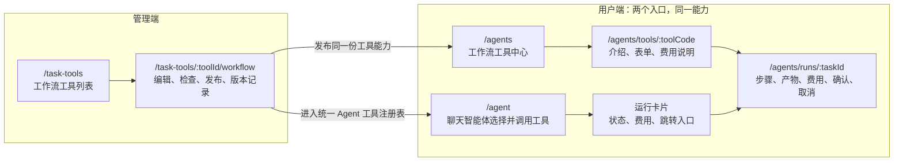

### 4.2 `/agents/runs/:taskId` 必备内容

- 当前任务状态和整体进度。
- 工作流步骤列表，以及当前正在执行的步骤。
- 每一步的开始时间、结束时间、重试次数和费用。
- 当前已消耗算力、仍在冻结的算力和预计下一步费用。
- 文本、图片、音频、视频和文件产物。
- 等待用户确认、等待用户补充和等待充值状态。
- 继续、确认、拒绝、取消和充值后恢复入口。
- 失败原因和可执行的下一步说明。

页面采用“通用运行外壳 + 业务适配器”模式：

- 通用外壳负责步骤、状态、费用、确认、取消、断线恢复和基础产物展示。
- AI 漫剧适配器负责剧本、分镜、场景图、音频和成片等专用视图。
- 没有专用适配器的工具仍可使用通用产物展示，不得出现空白页面。

## 5. 总体架构

核心原则是“定义、执行、资金、交互分离”，但这些边界仍部署在现有 Spring Boot 后端中。

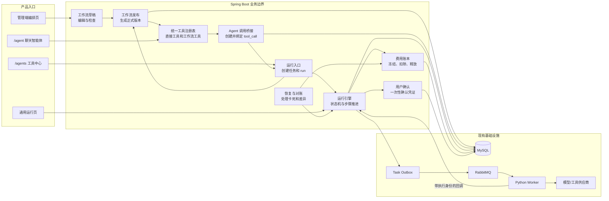

各部分职责：

- 工作流草稿只负责管理员编辑，不直接被运行端读取。
- 工作流发布负责检查草稿并生成不可修改的正式版本。
- 统一工具注册表同时向 `/agents` 和 `/agent` 提供同一份工具 schema、风险策略和执行模式。
- Agent 调用桥接负责创建 `agent_tool_call`、启动工作流、绑定 root task，并把关键状态同步回聊天运行卡片。
- 运行入口负责接收页面直接启动或 Agent 启动，幂等地创建 root task、workflow run 和步骤。
- 运行引擎只读取本次 run 绑定的正式版本，并通过数据库状态条件推进。
- 费用账本负责每次付费调用的冻结、扣除、释放和对账。
- 用户确认负责绑定当前用户、当前步骤和当前参数，凭证使用一次后立即失效。
- 恢复与对账负责服务重启、消息重复、晚到回调、卡死任务和账务差异。

## 6. 草稿、发布和正式版本

### 6.1 浅显理解

管理员编辑的是草稿。点击发布后，系统把草稿复制成一份不能修改的正式版本。用户启动任务时固定使用其中一个正式版本。

管理员后续继续编辑，只会产生新草稿，不会影响已经开始的任务。

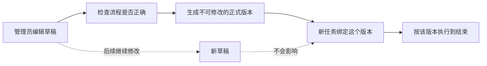

### 6.2 发布流程

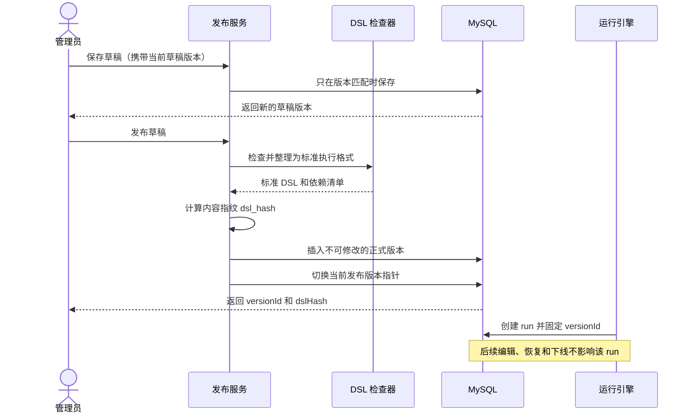

### 6.3 发布版本必须包含

- 标准执行 DSL。
- `dslVersion` 和 `nodeRegistryVersion`。
- 输入表单 schema 快照。
- 模型和工具绑定清单，但不包含 API Key 等密钥。
- 计费规则、价格上限和最大计费单位。
- 风险级别和确认策略。
- `dsl_hash`、发布时间和发布人。

“恢复历史版本”只把历史内容复制成新草稿，不直接替换线上版本。管理员必须重新检查和发布。

## 7. P0 DSL 规则

### 7.1 草稿格式与执行格式分离

管理端可继续保存 React Flow 画布信息，包括节点坐标、颜色和分组。发布时由后端把画布编译为独立的标准执行 DSL。

这样可以避免画布格式变化影响运行器，也能兼容现有 `data.nodeDefType` 格式。

### 7.2 P0 支持的节点

| 中文名称 | 稳定类型码 | P0 行为 |
| --- | --- | --- |
| 开始 | `START` | 接收表单和运行上下文 |
| 表单输入 | `FIELD_INPUT` | 读取经过 schema 校验的用户输入 |
| 模型调用 | `MODEL_CALL` | 创建一次付费或免费模型执行 attempt |
| 工具调用 | `TOOL_CALL` | 调用已登记的后端工具，不允许任意 URL |
| 用户确认 | `USER_CONFIRM` | 暂停并等待用户批准、拒绝或取消 |
| 用户补充 | `USER_INPUT` | 暂停并接收限定字段 |
| 结果输出 | `OUTPUT` | 汇总产物并结束 run |

P0 的 edges 只允许形成一条无环线性路径。发布校验必须拒绝：

- 条件分支。
- 循环和回边。
- 同时执行的并行分支。
- 没有入口或没有出口的节点。
- 未登记的节点类型。
- 没有价格上限的付费节点。
- 没有输出契约的模型和工具节点。

### 7.3 标准执行 DSL 示例

```json
{
  "dslVersion": "1.0",
  "nodeRegistryVersion": "2026-07",
  "nodes": [
    {
      "id": "start",
      "type": "START",
      "typeName": "开始",
      "title": "开始",
      "parameters": {}
    },
    {
      "id": "script",
      "type": "MODEL_CALL",
      "typeName": "模型调用",
      "title": "生成剧本",
      "parameters": {
        "modelConfigCode": "comic_script_model",
        "maxAttempts": 2,
        "timeoutSeconds": 180,
        "maxBillableUnits": 1,
        "maxCreditCost": 20
      },
      "outputContract": {
        "kind": "JSON",
        "required": ["scenes"]
      }
    },
    {
      "id": "output",
      "type": "OUTPUT",
      "typeName": "结果输出",
      "title": "输出结果",
      "parameters": {}
    }
  ],
  "edges": [
    { "source": "start", "target": "script" },
    { "source": "script", "target": "output" }
  ],
  "outputContract": {
    "supportedKinds": ["TEXT", "IMAGE", "AUDIO", "VIDEO", "FILE", "JSON"]
  }
}
```

`typeName` 只用于展示和审计，运行器只能根据稳定类型码 `type` 执行。

## 8. 一次工作流怎样运行和扣费

### 8.1 主流程

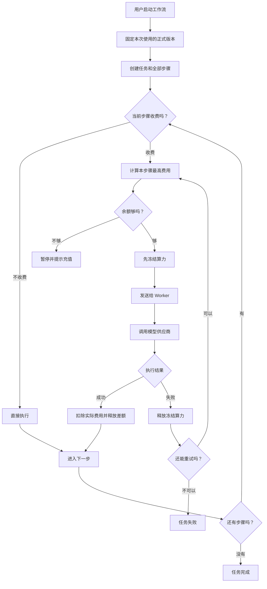

### 8.2 计费规则

- 工作流启动前展示第一个付费步骤的最高费用，而不是固定写“最低 1 算力”。
- 从 `/agent` 启动时复用同一套 step 计费，不再额外收取一笔“工具固定费用”；Agent 自身模型对话费用与工作流步骤费用分别记账。
- Agent run 已冻结的自身预算不能导致工作流错误判断余额，但工作流实际冻结必须保持原子和可审计，避免重复占用同一余额。
- 每个付费 attempt 在发送给 Worker 前创建费用预留记录并冻结上限。
- 冻结、费用预留和 attempt 状态必须在同一数据库事务内成功。
- 供应商成功后扣除实际费用；实际费用低于上限时立即释放差额。
- P0 默认不向用户收取失败 attempt 的费用，但必须记录供应商实际成本。
- 用户取消后，已经完成的步骤不退款，未执行和未捕获的预留立即释放。
- 晚到的成功回调只记录供应商成本，不得继续流程或新增用户扣费。
- run 页面展示的总费用必须由 step charge 聚合得出，不能独立累加一个容易漂移的数字。

### 8.3 幂等键

- 创建任务：用户 ID + `clientRequestId`，数据库唯一。
- step attempt：`workflow:{runId}:step:{stepId}:attempt:{attemptNo}`，数据库唯一。
- 费用记录：直接使用 attempt 幂等键，数据库唯一。
- 用户确认：`workflow:{runId}:confirmation:{stepId}:{nonce}`，token 只保存哈希。

系统接受 RabbitMQ 和供应商回调可能重复的事实，通过唯一键和状态条件保证业务效果只发生一次。

## 9. 状态与用户操作

### 9.1 用户看到的主要状态

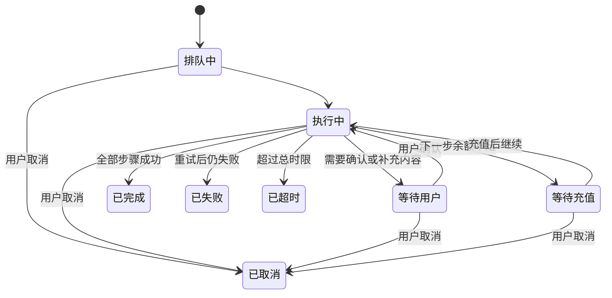

### 9.2 技术状态

workflow run 状态：

- `QUEUED`
- `RUNNING`
- `AWAITING_USER`
- `AWAITING_FUNDS`
- `CANCELLING`
- `SUCCESS`
- `FAILED`
- `TIMEOUT`
- `CANCELLED`

root task 对用户展示的状态与 run 保持一致。P0 在现有 `TaskStatus` 中补充 `AWAITING_FUNDS`；run 处于短暂的 `CANCELLING` 时，root task 仍展示“取消中”，收敛后统一进入 `CANCELLED`。

step 状态：

- `PENDING`
- `READY`
- `QUEUED`
- `RUNNING`
- `AWAITING_USER`
- `SUCCESS`
- `FAILED`
- `SKIPPED`
- `CANCELLED`

attempt 状态：

- `CREATED`
- `RESERVED`
- `DISPATCHED`
- `RUNNING`
- `SUCCESS`
- `FAILED`
- `CANCELLED`
- `LOST`

费用状态：

- `RESERVED`
- `CAPTURED`
- `RELEASED`

所有状态变化必须使用“当前状态 + revision”作为数据库更新条件。更新不到记录时重新读取，不允许无条件覆盖。

余额不足发生在 attempt 创建之前：当前 step 保持 `READY`，run 和 root task 进入 `AWAITING_FUNDS`。充值后调用 `resume`，成功冻结费用后才创建 attempt。

### 9.3 用户确认

确认凭证必须绑定：

- 用户 ID。
- root task 和 workflow run。
- 当前 step 和 attempt。
- workflow version。
- 当前可确认参数的哈希。
- 允许的操作。
- 过期时间和单次 nonce。

服务端只保存 token 哈希。凭证消费后立即标记 `CONSUMED`，重复提交返回第一次的结果，不再次推进任务。

P0 的确认动作没有分支语义：`APPROVE` 和校验通过的 `CONTINUE_WITH_FEEDBACK` 进入下一个线性节点；`REJECT` 以 `USER_REJECTED` 原因结束并归入 `CANCELLED`；`CANCEL` 直接执行普通取消流程。

### 9.4 取消

取消时执行以下操作：

1. 使用数据库条件更新把 run 置为 `CANCELLING` 并增加取消代次。
2. 将未开始的 step 标记为 `CANCELLED`。
3. 向正在排队或执行的 child task 发送取消信号。
4. 尝试调用供应商取消接口；供应商不支持取消时等待晚到结果。
5. 释放尚未捕获的费用预留。
6. 把 root task、run 和 step 收敛到 `CANCELLED`。

所有成功和失败回调都必须携带 attempt 身份，并检查取消代次。取消后的晚到回调不得创建下游步骤。

## 10. 数据模型

### 10.1 浅显理解

数据库主要记录七类信息：

1. 工具：普通工具还是工作流工具，采用什么计费方式。
2. 工作流草稿：管理员当前正在编辑的内容。
3. 正式版本：发布时保存的完整副本，发布后不允许修改。
4. 一次运行：某位用户启动了一次工作流，并绑定一个正式版本。
5. 运行步骤：这次运行需要经过哪些节点，每个节点当前是什么状态。
6. 执行尝试：节点失败重试时，每一次执行分别保存。
7. 费用与确认：每次执行冻结和扣除了多少，以及用户是否确认继续。

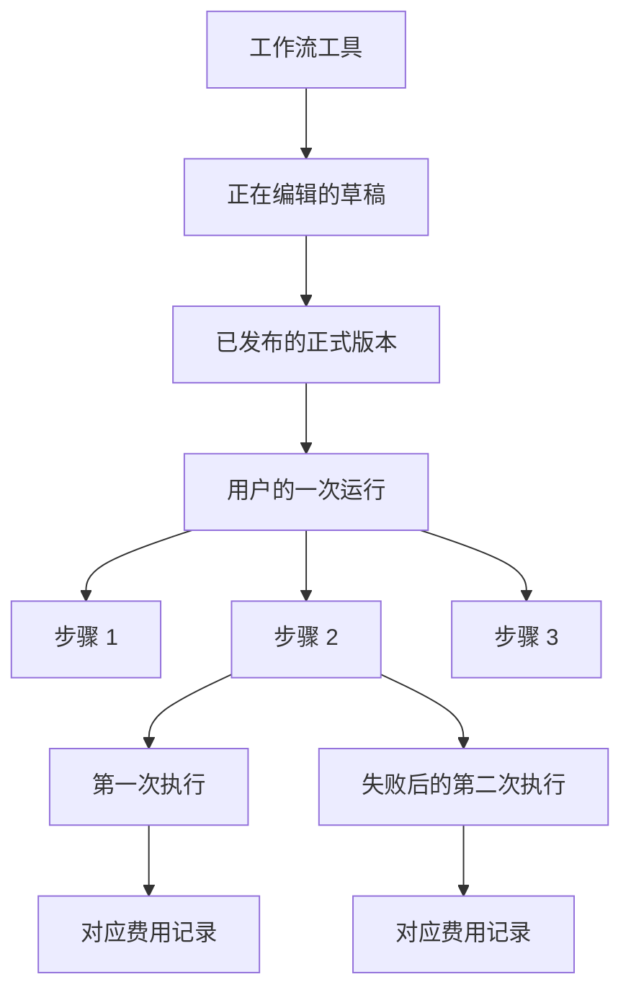

### 10.2 表结构调整

#### `ai_tools`

新增：

- `execution_mode`: `DIRECT | WORKFLOW`。
- `billing_mode`: P0 支持 `FIXED | WORKFLOW_STEP`。
- `agent_surface_enabled`: 是否展示到 `/agents`。
- `minimum_required_credits`: 发布时计算并缓存，用于工具列表展示第一个付费步骤所需的最低算力；运行时权威值来自正式版本的计费策略。

保留现有 `tool_type` 语义，不改成 `MODEL | AGENT | WORKFLOW`。

`/agent` 是否可调用继续使用现有 `agent_tool_descriptor_extension`，不在 `ai_tools` 再建一套重复字段。

#### `tool_workflows`

继续作为草稿表，新增：

- `draft_revision`: 防止两个管理员互相覆盖草稿。
- `published_version_id`: 当前正式版本。
- `execution_enabled`: 工作流执行总开关。

草稿和正式版本并存。是否有未发布修改通过草稿 revision 和正式版本来源 revision 比较得出，不使用单一 `DRAFT/PUBLISHED` 状态表达全部事实。

#### `tool_workflow_versions`

在现有版本表上增加：

- 复用现有 `version` 作为版本序号
- `canonical_dsl_json`
- `dsl_version`
- `node_registry_version`
- `dsl_hash`
- `input_schema_snapshot_json`
- `dependency_manifest_json`
- `billing_policy_json`
- `risk_policy_json`
- `published_at`
- `published_by`

已发布记录不允许更新或删除，只能下线工具或发布新版本。

#### `workflow_runs`

增加：

- `workflow_version_id`
- `launch_source`: `AGENTS_PAGE | AGENT_CHAT | LEGACY_TASK`
- `revision`
- `cancellation_generation`
- `current_step_id`
- `billing_status`
- `started_at`
- `updated_at`

约束：

- `root_task_id` 唯一。
- 运行端只通过 `workflow_version_id` 读取正式版本。
- `dsl_snapshot_json` 如保留，只作为带 hash 校验的审计副本。

#### `workflow_run_steps`

作为逻辑节点表，保留每个节点当前汇总状态，不再覆盖保存某一次 attempt 的 task、错误和产物。

增加：

- `sequence_no`
- `revision`
- `attempt_count`
- `current_attempt_id`

约束：`(run_id, node_id)` 唯一。

#### 新增 `workflow_step_attempts`

每次实际执行一行：

- `step_id`
- `attempt_no`
- `child_task_id`
- `status`
- `claim_token`
- `provider_code`
- `provider_request_id`
- `input_json`
- `output_json`
- `error_code`
- `error_message`
- `lease_expires_at`
- `started_at`
- `finished_at`

约束：

- `(step_id, attempt_no)` 唯一。
- `child_task_id` 唯一。
- `claim_token` 唯一。
- `(provider_code, provider_request_id)` 在供应商提供稳定 ID 时唯一。

#### 新增 `workflow_step_charges`

- `run_id`
- `step_id`
- `attempt_id`
- `user_id`
- `status`
- `reserved_credits`
- `charged_credits`
- `provider_cost`
- `provider_cost_currency`
- `idempotency_key`
- `credit_log_id`
- `billing_usage_id`
- `created_at`
- `updated_at`

约束：

- `attempt_id` 唯一。
- `idempotency_key` 唯一。

#### 新增 `workflow_confirmations`

- `run_id`
- `step_id`
- `user_id`
- `token_hash`
- `parameter_hash`
- `allowed_actions_json`
- `decision`
- `feedback_json`
- `status`
- `expires_at`
- `consumed_at`
- `created_at`

约束：`token_hash` 唯一。

#### 现有 `agent_tool_calls`

继续使用现有 `task_id` 绑定工作流 root task，不新建另一张 Agent 工作流调用表。为异步工作流增加 `DELEGATED` 状态：

- `RUNNING -> DELEGATED`：工作流已创建并绑定 root task，聊天模型可以结束本轮请求。
- `DELEGATED -> SUCCESS | FAILED`：由 workflow root task 的最终状态驱动。
- workflow `CANCELLED` 映射为 `agent_tool_call.status=CANCELLED`、`error_code=WORKFLOW_CANCELLED`；真实的 `workflowStatus=CANCELLED` 同时保留在 `result_json.data` 和 `tool.finished` 事件中。这样聊天事件、运行页和持久化状态表达同一个事实，不把用户取消伪装成执行失败。

普通直接工具仍使用现有 `RUNNING -> SUCCESS | FAILED` 路径。

### 10.3 敏感数据

- input、context、output 和 feedback 设置明确保留期限，P0 默认运行结束后保留 90 天。
- API Key、供应商密钥和内部 token 不得写入 DSL 或运行 JSON。
- 用户上传素材只保存受权限控制的资源 ID，不复制永久公开 URL。
- 日志不得输出完整 prompt、确认 token、个人信息或模型密钥。
- 管理端查看运行详情需要单独权限并记录审计日志。

## 11. API 设计

### 11.1 管理端

页面使用 `/task-tools`，后端继续保留现有 canonical API：

- `GET /api/admin/v1/tools/{toolId}/workflow`
- `PUT /api/admin/v1/tools/{toolId}/workflow`
- `POST /api/admin/v1/tools/{toolId}/workflow/validate`
- `POST /api/admin/v1/tools/{toolId}/workflow/publish`
- `POST /api/admin/v1/tools/{toolId}/workflow/unpublish`
- `GET /api/admin/v1/tools/{toolId}/workflow/versions`
- `POST /api/admin/v1/tools/{toolId}/workflow/versions/{versionId}/restore`

保存草稿请求必须携带 `expectedDraftRevision`。版本不匹配时返回 HTTP 409 和最新 revision。

发布响应返回：

- `workflowVersionId`
- `versionNo`
- `dslHash`
- `publishedAt`
- `publishedBy`
- `warnings`

不新增同功能的 `/api/admin/v1/task-tools/...`，减少双接口维护成本。

### 11.2 用户端

- `GET /api/v1/agents/tools`
- `GET /api/v1/agents/tools/{toolCode}`
- `POST /api/v1/agents/tools/{toolCode}/runs`
- `GET /api/v1/agents/runs/{taskId}`
- `POST /api/v1/agents/runs/{taskId}/feedback`
- `POST /api/v1/agents/runs/{taskId}/resume`
- `POST /api/v1/agents/runs/{taskId}/cancel`

创建 run 请求必须携带 `clientRequestId`。相同用户重复提交相同 ID 时返回第一次创建的任务。

`resume` 只用于 `AWAITING_FUNDS`。服务端重新检查余额并冻结当前步骤费用，不能由前端直接修改状态。

反馈请求包含：

- `stepId`
- `action`: `APPROVE | REJECT | CONTINUE_WITH_FEEDBACK | CANCEL`
- `fields`
- `confirmationToken`
- `idempotencyKey`

服务端校验用户归属、当前状态、token、参数哈希、允许操作、字段 schema 和素材归属。

### 11.3 `/agent`

`/agents` 页面上的工作流工具与普通 `/tools` 工具一样，都属于 `/agent` 可以使用的统一工具能力。页面入口不同，但工具定义、输入 schema、权限、计费和执行服务不能重复建设。

P0 保留 `GET /api/v1/agent/tools` 作为聊天页的轻量工具选择列表，不把它原地改成另一套完整 DTO。完整工具描述符继续通过现有内部 Agent run context 提供，并为工作流工具补充：

- `executionMode: WORKFLOW`
- `billingMode: WORKFLOW_STEP`
- `minimumRequiredCredits`
- `runRouteTemplate`
- `riskLevel`
- `confirmationPolicy`

工作流工具能否出现在 `/agent`、能否由聊天智能体自动调用，继续使用现有 `agent_tool_descriptor_extension.agent_enabled`、`agent_auto_callable` 和确认策略作为唯一配置来源。

调用链如下：

1. agent-service 根据统一 descriptor 选择工作流工具并生成参数。
2. 按现有链路创建 `agent_tool_call`。
3. 通过内部 API 调用共享的 Workflow Run Application Service，不能从一个公开 Controller 调用另一个公开 Controller。
4. Application Service 幂等创建 root task、workflow run 和步骤。
5. 将 `agent_tool_call.task_id` 绑定到 root task。
6. 将该 `agent_tool_call` 标记为 `DELEGATED`。agent-service 不等待整个长工作流完成，立即向当前对话返回“工作流已启动”的结构化结果和 `/agents/runs/:taskId` 地址。
7. `/agent` 页面展示运行卡片；任务进入 `AWAITING_USER`、`AWAITING_FUNDS` 或终态时更新卡片和 Agent 事件。
8. 工作流终态负责把关联的 `DELEGATED` tool call 更新为成功、失败或取消；取消按 `CANCELLED + WORKFLOW_CANCELLED` 映射。此更新按 root task、workflow run、用户和工具身份联合定位，不要求原 Agent run 仍在执行，因此不能把正常异步完成误判为 `RUN_ALREADY_TERMINATED`。

普通直接工具继续沿用当前“创建 task 后等待终态”的路径；只有 `executionMode=WORKFLOW` 的长任务走异步返回，避免改变现有直接工具行为。

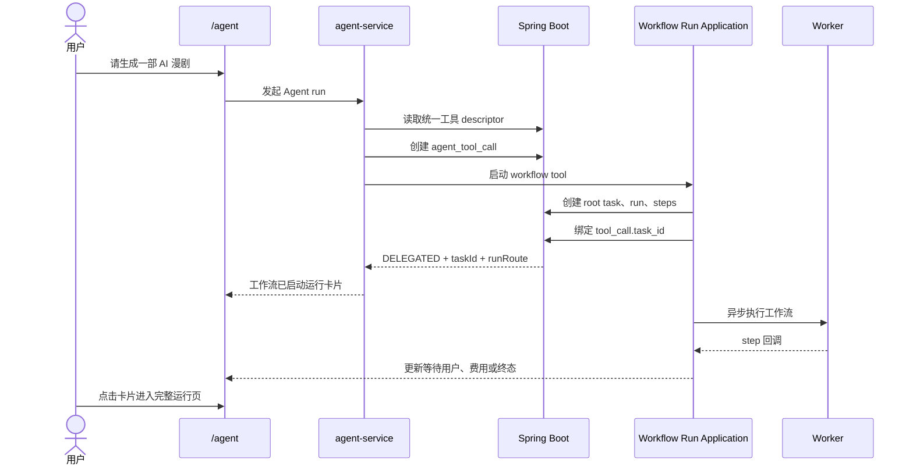

## 12. 故障恢复与对账

### 12.1 服务重启

- task outbox 保证 child task 创建和消息发布可以恢复。
- attempt 使用 lease；超过 `lease_expires_at` 且没有终态回调时进入恢复检查。
- 能通过供应商请求 ID 查询结果时先查询，不直接重复调用供应商。
- 无法确认供应商是否已执行时标记 `LOST` 并进入人工或自动对账，不盲目重试付费请求。

### 12.2 消息和回调重复

- RabbitMQ 使用至少一次投递，不追求消息层面的只投递一次。
- Worker 领取 attempt 时校验 claim token 和当前状态。
- 回调必须携带 run、step、attempt 和 claim token。
- 后端只允许目标 attempt 从预期状态进入终态。

### 12.3 LOST 与新 run 门禁

- 任一关联 attempt 进入 `LOST`，表示供应商是否执行、用户冻结或供应商成本仍未完成可信收敛。
- 即使对应 charge 已是 `RELEASED`，晚到回调仍可能补记供应商成本；在 LOST 被人工或自动 resolution 前，该 run 必须持续判为对账不一致。
- 对账发现 LOST 后立即关闭新 run 门禁，不自动释放 `RESERVED`、不修改余额；已有 in-flight run 和查询仍可继续。
- 只有一次覆盖全部 run 的干净对账扫描完成，且扫描期间没有更新的失败 generation，才能重新打开新 run 门禁。
- charge 唯一键保证重复成功回调不会重复扣费。

### 12.3 每日对账

每天自动核对：

- run 展示总费用与 step charges 合计。
- step charges 与 credit logs。
- step charges 与 billing usage logs。
- provider request 和供应商实际成本。
- 长时间停留在 `RESERVED` 的费用记录。
- root task、run、step 和 child task 的终态一致性。

发现差异时先停用新工作流执行，再执行幂等修复，不通过直接修改余额掩盖问题。

## 13. 监控与开关

### 13.1 必备开关

- 全局工作流执行开关。
- 按工具开关。
- 真实扣费开关，支持 shadow billing。
- 自动重试开关。
- 用户确认节点开关。
- 灰度用户比例。
- 单 run 最大算力和单用户每日最大算力。

开关由后端读取，关闭后立即阻止创建新 run；已开始的 run 按“继续完成”或“安全取消”策略处理，不能直接丢弃。

### 13.2 必备指标

- 各状态 run 数量和停留时间。
- 各状态 attempt 数量和 lease 超时数量。
- 重复创建、重复回调和 CAS 冲突次数。
- reserved、captured、released 算力。
- 用户扣费与供应商成本差额。
- 取消后晚到回调数量。
- outbox、RabbitMQ 和 DLQ 积压。
- 用户确认等待时长和过期数量。
- 按工具、模型和版本统计的成功率、费用和耗时。

财务差异、重复扣费或取消后继续扣费必须触发高优先级告警并自动关闭新 run。

## 14. 自动部署环境下的迁移

当前流水线会在生产应用更新前执行 SQL，因此必须使用只向前兼容的 expand-backfill-switch-contract 方式。

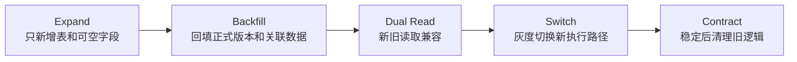

迁移要求：

- 第一阶段只新增表、索引和可空字段，不删除或重命名旧列。
- 先回填现有已发布 AI 漫剧工作流为一个正式版本。
- 新后端能读取旧数据，新 Worker 能处理旧任务。
- 旧后端在切换期间不会因新增字段失败。
- 数据库备份未成功时禁止执行结构迁移。
- 应用回滚不等于数据库回滚；SQL 必须向前兼容并通过修复迁移纠错。
- 旧路由至少保留两个生产发布周期，并在连续 7 天访问量为 0 后才进入删除计划。

## 15. 灰度发布

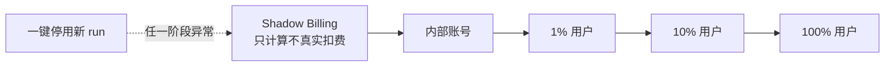

Shadow Billing 只允许内部账号使用，并设置独立的供应商日成本上限。每一级至少完成一轮完整 AI 漫剧任务、取消任务、余额不足任务、失败重试任务和服务重启恢复演练。

任一阶段出现以下情况立即停止扩大灰度：

- 重复扣费。
- 供应商已产生费用但系统没有成本记录。
- 取消后继续创建下游步骤。
- run 使用了非绑定版本。
- 账务对账出现无法自动解释的差异。
- root task、run 和 step 终态不一致。

## 16. 实施顺序

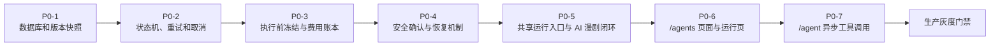

每一步必须能独立测试和部署，不能把七个阶段合并成一次大版本上线。

## 17. 测试与验收

### 17.1 并发和幂等

- 同一用户使用相同 `clientRequestId` 并发提交 100 次，只创建一个 root task、run、冻结记录和 outbox 事件。
- 两个 backend 同时推进同一 run，只创建一个当前 attempt。
- 同一成功回调重复 100 次，只产生一次状态变化和一次扣费。
- 用户确认、取消和成功回调同时发生时，只允许一个符合状态机的结果。

### 17.2 版本

- 100 个 v1 长任务运行期间发布 v2，全部继续使用原 `workflowVersionId` 和 `dslHash`。
- 恢复历史版本后，当前 `published_version_id` 不变。
- 两名管理员同时保存草稿，旧 revision 请求返回 409，不覆盖新内容。

### 17.3 计费

- 余额不足时，不创建供应商请求。
- 成功步骤只扣实际费用并释放差额。
- 失败步骤释放用户冻结，同时保留供应商成本。
- 取消后未执行步骤不扣费。
- `run total = sum(step captured charges) = credit log deduction`。

### 17.4 故障注入

在以下时点终止后端或 Worker，恢复后不能漏账或重扣：

- 创建 run 后、写 outbox 前后。
- 冻结算力前后。
- provider 成功前后。
- attempt 成功状态写入前后。
- 捕获费用前后。
- 取消与晚到回调同时发生时。

还需覆盖 RabbitMQ 重投、DLQ 重放、MySQL 短暂断连、供应商超时和供应商“已执行但响应丢失”。

### 17.5 页面

- SSE 断开后 10 秒内恢复状态刷新；SSE 不可用时自动轮询。
- 任务进入终态后 10 秒内停止持续请求。
- 360、390、768 和 1440 像素宽度下无横向溢出和内容遮挡。
- 关键确认、取消和继续操作可以只使用键盘完成。
- 旧 `/workflow/studio/:taskId` 正确跳转，新页面可以查看历史 AI 漫剧任务。

### 17.6 Agent 调用

- `/agents` 已发布且 `agent_enabled=true` 的工作流工具出现在 `/agent` 可用 descriptor 中。
- `agent_auto_callable=false` 或需要确认时，聊天智能体必须先取得用户确认；不允许绕过现有风险策略。
- 同一个 `agent_tool_call` 重试创建工作流 100 次，只产生一个 root task 和一个 workflow run。
- `agent_tool_call.task_id` 正确绑定 root task，聊天运行卡片链接到 `/agents/runs/:taskId`。
- 工作流创建后 `agent_tool_call` 进入 `DELEGATED`；成功进入 `SUCCESS`，失败和超时进入 `FAILED`，取消进入 `CANCELLED` 并使用 `WORKFLOW_CANCELLED` 错误码。
- 工作流处于等待用户、等待充值、成功、失败或取消时，聊天运行卡片收到对应状态。
- agent-service 在工作流创建后及时返回，不因等待长任务而占住一次模型请求。
- Agent run 先结束、workflow 后完成时，绑定 task 的 `DELEGATED` tool call 仍正确进入终态，不出现 `RUN_ALREADY_TERMINATED`。
- 普通直接工具仍按原路径等待并返回最终结果，行为不发生回归。

### 17.7 P0 上线门禁

以下条件全部满足后才可从内部账号扩大到 1% 用户：

- 上述并发、版本、计费和故障注入测试全部通过。
- 生产等价 MySQL 迁移演练通过。
- 账务每日对账任务和告警可用。
- 工作流执行、真实扣费和灰度比例开关可用。
- AI 漫剧成功、失败、取消、余额不足和用户确认链路均完成验收。
- `/agents` 页面直接启动和 `/agent` 聊天调用两种入口均通过完整验收，并确认创建的是同一种 workflow run。
- 部署回滚和向前修复迁移各演练一次。

### 17.8 Task 12 门禁执行记录

本阶段只完成代码接线和自动化测试第一阶段，以下状态不能解释为“已经可以生产部署”：

- [x] `workflow.runtime.enabled`、`execution-enabled` 默认保持 `false`；新 `/agents` run 在任何 root/run/step/outbox/freeze 写入前执行准入判断。
- [x] 同一个已存在的 `clientRequestId` 先返回原 run；kill switch 只阻止新建，不影响已有 run 查询和 in-flight 收敛。
- [x] 旧 `TaskService.create/createForAgentTool` 的 `executionMode=WORKFLOW` 路径稳定拒绝，避免旧 TASK 冻结与新 WORKFLOW_STEP 冻结同时发生；内部 `createWorkflowRoot` 只供 Workflow Run Application Service 使用，不二次 gate。
- [x] run 预算只读取 canonical workflow 绑定的固定发布版 `billing_policy_json.nodePolicies[*].maxCreditCost`；缺失、非法、节点不匹配或溢出全部 fail closed。
- [x] 用户日额度按 `Asia/Shanghai` 自然日统计已绑定 `CAPTURED` 的实扣 usage，并加上尚未结算的 `RESERVED` 暴露；付费准入通过同一用户 `credit_accounts` 行锁串行化，直到首步预留与 run 一起提交，不同 requestId 不能并发绕过额度。
- [x] confirmation node 在 `confirmation-enabled=false` 时拒绝新 run，不自动通过。
- [x] 任一 LOST attempt 都使对账不一致并关闭新 run gate；不会自动释放或修改余额。
- [x] H2 第一阶段测试包含默认关闭零副作用、100 次同键创建、100 次同 tool call 委派、100 次 callback、余额不足、取消/回调竞争和 LOST 注入。
- [x] 失败 callback 和未领取 attempt 的安全恢复会立即创建下一 attempt；`auto-retry-enabled=false` 时失败 callback 直接收敛，不会暗中重试；RUNNING 超时仍进入 LOST，不自动重派。
- [x] 取消映射统一为 `agent_tool_call CANCELLED + WORKFLOW_CANCELLED`，并保留真实 workflow status 和单次 `tool.finished` 事件。
- [x] 已恢复 `088_workflow_tools_p0.sql` 的不可变内容；新增结构拆入 `089-092`，`093` 明确保留现有漫画工具的 `DIRECT` 旧链路。部署结构迁移不等于执行路径切换，切换必须在后续独立灰度步骤完成。
- [x] 迁移脚本在未执行 `088` 前检查历史 task 幂等键、workflow root 重复和未记账的部分迁移痕迹，发现异常立即停止，不在流水线里自动删历史数据。
- [ ] 尚未执行生产历史 `(user_id, idempotency_key)`、workflow run、usage/credit ledger 重复数据预检和治理。
- [ ] 尚未在真实 MySQL 8 / InnoDB 上执行迁移、回滚与向前修复演练。
- [ ] 尚未执行真实 MySQL 并发门禁；必须覆盖外层 `REPEATABLE READ` 与恢复事务 `READ COMMITTED`。H2 结果不能替代该证据。
- [ ] 尚未完成 RabbitMQ 重投、DLQ、数据库短暂断连和供应商“已执行但响应丢失”的环境级故障注入。
- [ ] shadow billing 的供应商成本保护和财务差异自动告警尚未接通；完成前禁止用 shadow 模式执行付费 provider，生产 runtime 保持关闭。

## 18. P1/P2 路线图

### P1

- 第二个非视频工作流接入，验证通用性。
- 通用运行页更多业务适配器。
- 条件分支及明确的默认分支语义。
- 版本 diff、发布审批和更完整的审计日志。
- 更精确的工作流费用区间估算。

### P2

- `/agent` 在聊天内直接完成复杂工作流节点确认和产物编辑，而不只是展示运行卡片与跳转。
- 并行分支、汇聚策略和受控循环。
- 全流程 `QUOTE_THEN_FREEZE`。
- 多 backend 实例调度和跨实例恢复。
- 删除已无流量的旧路由和旧兼容代码。

## 19. 最终决策

本方案确认以下决策：

- `/agent` 保持 AI 对话入口，`/agents` 作为有状态工作流工具中心。
- `/tools`、`/agents` 的工具能力进入统一 Agent 工具注册表；`/agents` 工具从 P0 开始即可被 `/agent` 调用。
- 管理端可以使用 `/task-tools` 页面名称，管理 API 继续以 `/tools/{toolId}/workflow` 为唯一正式资源路径。
- `tool_type` 保留现有能力分类，只新增 `execution_mode`。
- 草稿与正式版本分离，run 必须锁定不可修改的正式版本。
- P0 采用线性 DAG 和 AI 漫剧单工具试点。
- P0 采用 step 执行前冻结、成功扣除、失败释放。
- 重试使用独立 attempt 行，费用引用具体 attempt。
- `/agent` 按现有权限和确认策略调用工作流进入 P0；条件/并行 DAG 和全流程冻结不进入 P0。
- 所有生产变更通过向前兼容迁移、功能开关和分级灰度交付。
