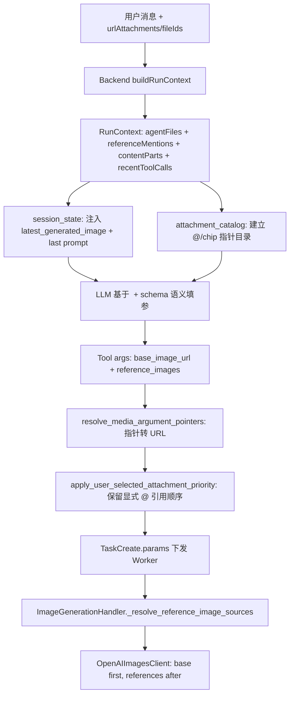

# 参考图解析链路与多图保留 - 2026-06-13

## 文档目的

梳理图像生成/编辑工具（`gpt_image2` / `ofox_gpt_image2`）的**参考图（reference image）从对话上下文到 Worker 实际传参的完整链路**，并记录本轮针对"风格迁移/跨图编辑场景多图参考被覆盖丢失"的修复，方便后续维护与排查同类问题。

> 背景案例（runId=349 / taskId=611）：用户说"刚刚那张改成这张图的日常风格"，意图判别正确、prompt 也生成了"将第一张图的画面改为第二张图的日常风格"，但实际只传了一张参考图。根因见下文「问题与修复」。

## 一、整体数据流



参考图 URL 的三类来源：

1. **用户本轮显式上传/拖入 / inline chip**：`referenceMentions`、`contentParts`、`agentFiles` 中的 `@图片*` 文件或负 id 的 urlAttachment（素材库/历史任务拖入）。
2. **最近生成图（历史图）**：来自 `context.recentToolCalls[].mediaUrls`，由 `session_state.py` 注入 `<SessionState.latest_generated_image.url>`，不靠用户文本关键词硬塞。
3. **LLM 语义填参**：模型读取 `<SessionState>` 和工具 schema 后，决定 `base_image_url` 与 `reference_images` 的归属；业务代码只做结构化状态抽取和指针解析。

## 二、关键文件与函数索引

| 层级 | 路径 | 关键符号 |
|------|------|----------|
| 前端附件标签 | `user-web/src/pages/AgentHome/AgentChatPane.vue` | `referenceAttachmentLabel`、`sendMessage` |
| Context 构建 | `backend/.../agent/service/impl/AgentRunServiceImpl.java` | `buildRunContext`、`urlAttachmentContexts`、`recentToolCallContext`、`extractMediaUrls` |
| Schema 转换 | `backend/.../agent/service/impl/AgentToolDescriptorServiceImpl.java` | `toInputSchema`（`multi_image` → string 数组） |
| 会话状态水合 | `agent-service/app/runtime/session_state.py` | `hydrate_session_state`、`format_session_state_context` |
| 指针目录 | `agent-service/app/core/attachment_catalog.py` | `build_reference_plan`、`resolve_media_argument_pointers`、`ordered_content_parts_for_llm` |
| 决策 | `agent-service/app/core/agent_decision.py` | `AgentDecisionService.decide` |
| LLM Router | `agent-service/app/runtime/agent_router_service.py` | `classify`、`_build_prompt`、`_attachment_payload` |
| 工具调用主流程 | `agent-service/app/runtime/deep_agents_engine.py` | `_handle_tool_use`、`_resolve_router_followup`、`_merge_tool_arguments` |
| Followup 续写 | `agent-service/app/runtime/followup_task_resolver.py` | `FollowupTaskResolver.resolve`、`_patch_arguments` |
| **附件优先级（本轮修复点）** | `agent-service/app/core/user_attachment_priority.py` | `apply_user_selected_attachment_priority` 等 |
| 参数构建 | `agent-service/app/tools/backend_tool.py` | `build_arguments`、`enrich_arguments`、`_compose_generation_prompt` |
| 执行编排 | `agent-service/app/runtime/tool_orchestrator.py` | `_prepare_execution_arguments` |
| Worker Handler | `worker/handlers/image_generation_handler.py` | `handle`、`_resolve_reference_image_sources`、`_resolve_prompt` |
| 图片客户端 | `worker/client/openai_images_client.py` | `generate_images`、`_normalize_reference_images` |
| 图片下载 | `worker/utils/input_image.py` | `resolve_reference_image_data_url` |
| 工具配置 | `ai-tool-market-config-*.json` | `gpt_image2` 的 `fields` / `userPromptTemplate` |
| 单测 | `agent-service/tests/test_user_attachment_priority.py` | 见下文 |
| 指针解析单测 | `agent-service/tests/test_attachment_catalog.py` | `@图片` / contentParts / latest_generated_image 指针转 URL |
| Worker 顺序单测 | `worker/tests/test_image_generation_handler_references.py` | `base_image_url` 在前，`reference_images` 在后 |

## 三、禁止再写的错误模式

- 禁止在 Python / Java 业务层用关键词、正则、白名单识别 `刚刚`、`上一张`、`原图`、`这张` 等上下文代词，然后强行填 `image` 或改工具。
- 禁止把 `@图片1`、`@图片1-xxx`、素材名或 chip 展示文案直接传到 Worker。它们只是 UI 指针，必须在 agent-service 内解析成 URL。
- 禁止让 Agent 首选一个含义模糊的 `image` 字段。GPT/OpenAI 图片编辑必须优先使用 `base_image_url` 和 `reference_images`。
- 禁止把 `电影级`、`构图`、`画面`、`刚刚生成的图` 等风格或上下文词当作视频输出意图；只有明确的视频输出请求才走视频工具。

## 四、`base_image_url` / `reference_images` 如何决定放几张图

核心逻辑集中在 `apply_user_selected_attachment_priority`（`agent-service/app/core/user_attachment_priority.py`）。被调用两次（`deep_agents_engine` 合并参数后、`ToolOrchestrator` 执行前），逻辑幂等。

判定规则：

- **语义化字段（首选）**：
  - `base_image_url`：底图，即要被编辑的当前图 / 上一轮图 / 用户明确指定的原图。
  - `reference_images`：用户 `@` 的人脸、风格、动作、构图等补充参考图。
  - Worker 收到后永远按 `base_image_url` 在前、`reference_images` 在后的顺序发给 OpenAI Images edits。
- **数组字段（multi_image，如 `image`、`referenceImageUrls`）**：
  - 用户有显式上传图时：保留 Router 数组中**属于历史生成图**的 URL（按原顺序）+ 追加用户上传图，丢弃既非历史图也非用户图的"陈旧" Router 猜测。
  - 用户无显式上传图且字段为空时：填入全部 READY 图片。
- **单图字段（如 `referenceImageUrl`）**：用户有上传图取第一张；否则字段为空时取第一张 READY 图。

URL 比较前统一经 `_normalize_media_url` 归一化（相对 `/generated/...` 路径用 `settings.backend_internal_base_url` 补全），保证历史图 URL 与用户上传图 URL 口径一致。

辅助函数：

- `_normalize_media_url(raw)`：URL 归一化（相对路径补全 base）。
- `image_download_url(file)`：基于 `_normalize_media_url`，从 `AgentFileContext.downloadUrl` 得到归一化 URL。
- `_history_media_urls(context)`：汇总 `recentToolCalls[].mediaUrls` 的归一化集合。
- `user_selected_image_urls(context)`：仅"用户显式附件"（负 id 或 `@` 开头文件名）。
- `ready_image_download_urls(context)`：所有 READY 图（用户显式在前）。
- `_merge_user_and_history_urls(existing, user_image_urls, history_urls)`：数组字段的"保留历史 + 追加用户图"合并实现。

## 五、Prompt 中"第一张/第二张"从哪来

代码中**不应**硬编码该类文案，由 LLM 基于 `<SessionState>`、`referenceMentions`、`contentParts` 和工具 schema 填参产生：

- 主路径：LLM 看到 `attachments`（含 `@图片1-…`、`@图片2-…`）、`recentToolCalls.mediaUrls` 水合出的 `<SessionState>` 与工具 schema，生成结构化 `arguments`（含 `prompt`、`base_image_url`、`reference_images`）。
- 次路径：缺参时 `BackendToolBridge.enrich_arguments` 再补 prompt 类字段（不覆盖已有非空字段）。
- 兜底：`_compose_generation_prompt` 仅在 prompt 仍空时把用户消息包成通用生图描述。

Worker 侧 `userPromptTemplate` 只渲染 `prompt/aspectRatio/...` 文本，**参考图走 `image` 参数，不进 prompt 字符串**。因此 prompt 描述的图片张数必须与 `image` 数组张数一致，否则模型行为与意图不符。

## 六、问题与修复（2026-06-13）

### 现象

风格迁移/跨图编辑场景（"把刚刚那张改成这张图的风格"）下，Router 已正确填入 `image=[历史生成图, 新上传图]`，但 Worker 只收到一张参考图（新上传图），历史图被丢弃，prompt 的"第一张/第二张"与实参不符。

### 根因

`apply_user_selected_attachment_priority` 的数组分支原先在"用户有显式上传图"时无条件执行 `normalized[key] = user_image_urls`，把 Router 填好的多图数组整体替换为只剩用户上传图。历史生成图只存在于 `recentToolCalls[].mediaUrls`，从不进入 `agentFiles`，因此不被视为"用户显式附件"，被一并清掉。

该覆盖逻辑原本是为"用户拖图 = 替换错误历史图"设计（见 `test_user_dragged_image_overrides_router_history_image`），但对"组合历史图 + 新上传图"的意图不成立。

### 修复

数组分支改为"合并保留"：保留 Router 数组中属于历史生成图的 URL（保持顺序）+ 追加用户上传图，仅丢弃无关的陈旧 URL。单图字段与无上传图分支保持原行为。这样：

- "把刚刚那张改成这张风格"（Router 数组含历史图）：得到 `[历史图, 上传图]`，两张都在、顺序正确。
- "用 X 替换刚刚那张"（Router 数组不含历史图）：仍只得到用户图，旧行为不变。

### 回归测试

`agent-service/tests/test_user_attachment_priority.py`：

- `test_style_transfer_preserves_history_and_appends_uploaded_image`：复刻 runId=349，断言结果为 `[历史图, 上传图]`。
- `test_stale_router_image_dropped_while_history_and_user_kept`：断言无关陈旧 URL 被丢弃、历史图与用户图保留。
- 既有 `test_user_dragged_image_overrides_router_history_image`、`test_multi_image_*`、`test_single_image_*` 保持通过。

运行：

```bash
cd agent-service
python -m pytest tests/test_user_attachment_priority.py -q
```

## 七、续作上下文修复（2026-06-21）

### 现象

用户说「刚刚的人物面部严格参考 @图片2 再做调整」时，工具只收到 `@图片2`，没有收到刚刚生成的底图；prompt 还被重写成了全新的水墨风，导致输出从哥特杂志封面跳成另一套画面。

另一个故障是 Worker 报错 `reference image must be base64, data url, URL, or readable local file`，说明上游把 `@图片1` 这类 UI 文案当成图片参数传了下来。

### 根因

- 上游没有把最近生成图和原始 prompt 显式注入给 LLM，模型只能从聊天文本猜。
- 工具 schema 没有区分底图和参考图，导致 `image` 字段含义混乱。
- `@图片` chip 没有在任务创建前被统一解析成 URL。
- 输出模态判断曾混入上下文/风格词，导致图片编辑工具被错误拒绝为 `video!=image`。

### 当前契约

- `session_state.py` 只从结构化 `recentToolCalls` 提取状态，禁止读取 `context.message` 做关键词判断。
- `attachment_catalog.py` 负责把 `@图片`、`assetKey`、`fileId`、`contentParts` 和 `latest_generated_image.url` 解析成具体 URL。
- `AgentToolDescriptorServiceImpl` 为 GPT/OpenAI 图片工具注入 `base_image_url`、`reference_images`。
- `BackendToolBridge` 在创建任务前执行 `resolve_media_argument_pointers`，再发 `attachment.resolved` 事件用于排障。
- `worker/handlers/image_generation_handler.py` 按 `base_image_url` → `reference_images` → legacy 字段解析图片来源。
- `registry.py` 的输出模态判断保持保守：只有明确视频输出才返回 video。

### 必跑测试

```bash
cd agent-service
python -m pytest tests/test_session_state.py tests/test_attachment_catalog.py tests/test_user_attachment_priority.py tests/test_backend_tool_bridge.py tests/test_tool_registry.py -q
```

```bash
cd worker
python -m pytest tests/test_image_generation_handler_references.py -q
```

## 八、维护要点与排查清单

排查"参考图张数/内容不对"时，按链路定位：

1. **Backend 上下文**：`recentToolCallContext` 是否带出历史图 `mediaUrls` 和上一轮 `argumentsJson.prompt`；`referenceMentions/contentParts` 是否带出 chip 顺序。
2. **SessionState**：agent-service 消息里是否有 `<SessionState.latest_generated_image.url/prompt>`。
3. **Tool args**：模型是否填了 `base_image_url` 和 `reference_images`；如果是 `@图片` 文案，检查 `resolve_media_argument_pointers` 是否执行。
4. **附件优先级**：`apply_user_selected_attachment_priority` 是否误删历史图或显式 `@` 顺序。新增/调整图片字段名时，需同步维护 `_IMAGE_REFERENCE_ARG_KEYS`、`_IMAGE_REFERENCE_ARRAY_ARG_KEYS`。
5. **Worker 日志**：`image generation request built ... params=...` 中是否已是 URL / data URL / base64；`_resolve_reference_image_sources` 是否按 base first 读取。
6. **协议分支**：`OpenAIImagesClient` 多图走 json-image 数组或 `/images/edits` multipart。

注意事项：

- 历史生成图通过 `<SessionState>` 暴露给 LLM，由 LLM 决定是否作为 `base_image_url`。业务代码不能通过用户文本关键词硬塞。
- 单图字段（`referenceImageUrl` 等）天然只取第一张，不适用于多图组合场景；如工具需要多图，应在配置中使用 `multi_image` 字段。
- URL 归一化口径必须统一走 `_normalize_media_url`，避免相对/绝对路径不一致导致历史图匹配失败。
