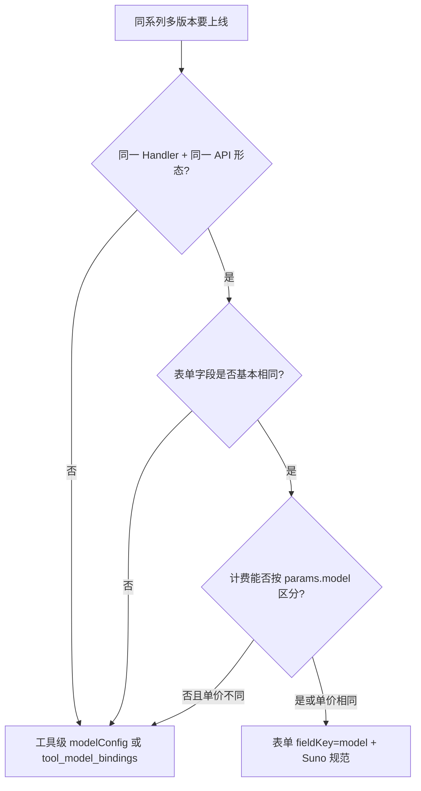

# 同系列模型版本表单配置规范

> 适用范围：同一上游 API / 同一 Worker Handler 下，存在多个可切换版本（如 Suno V4 / V4.5 / V5 / V5.5），希望在**工具表单内**直接选版本，而不是拆成多个工具卡片。  
> 关联文档：[后台工具 JSON 配置说明](./后台工具JSON配置说明.md)、[功能工具化与模型可选改造方案](../功能工具化与模型可选改造方案.md)、[配置包导入导出 — 维护指南](./配置包导入导出-维护指南.md)

---

## 1. 先分清三种「选模型」方式

系统里「模型」可能出现在三个层级，不要混用：

| 层级 | 机制 | 用户看到什么 | 提交字段 | 典型场景 |
| --- | --- | --- | --- | --- |
| **A. 表单字段 `model`** | 工具 `fields` 里配置 `select` / `radio` | 参数区「Suno 模型」下拉 | `params.model` | 同 API、同 Handler，仅上游 `model` 参数不同 |
| **B. 工具绑定 `modelConfigId`** | 每个工具固定绑一个 `agent_model_configs` | 工作台一张功能卡 + 表单内选版本 | 任务走工具绑定网关；版本在 `params.model` | 不同 API 任务类型拆工具；同任务内版本用 A |
| **C. 功能-模型绑定（规划中）** | `tool_model_bindings` 一张功能卡挂多模型 | Composer 内切换模型，表单不变 | 任务级 `modelConfigId` | 同功能、同表单，执行模型可切换（见改造方案） |

**Suno 采用的是 A**：`suno` / `suno_music` 各只有一张工具卡，版本在表单 `model` 字段里选。

---

## 2. 何时参考 Suno（表单内 `model` 字段）

满足以下**全部或大部分**条件时，优先用 Suno 模式：

1. **同一执行入口**：同一个 `executionHandler`、同一个 Worker Client，不因版本切换而换 Handler。
2. **上游协议一致**：版本差异主要体现在请求体里的 `model`（或等价字段），endpoint 与鉴权方式相同。
3. **表单骨架相同**：各版本共用同一套字段；差异可通过 `maxLengthByModel`、`visibleWhen`、placeholder 说明表达。
4. **版本数可控**：通常 2–8 个枚举，适合 `select`；超过 8 个或需分组展示时再考虑 B/C。
5. **计费可按参数区分**（可选）：若各版本单价不同，需确认 Worker / 计费规则能根据 `params.model` 或等价维度计价；否则应走 B/C，按 `modelConfigId` 计费。

### 2.1 当前项目中的对照

| 系列 | 现状 | 是否适合 Suno 模式 | 说明 |
| --- | --- | --- | --- |
| **Suno 音乐** | ✅ 已采用 | 是（标杆） | `MUSIC_GENERATION` + `params.model` → Suno API |
| **可灵** | ✅ 已收敛 | **按任务类型拆工具 + 任务内 `model` 字段** | 6 网关（文生/图生/动作/多图/Omni/生图），同任务内 V1–V3 用 `model` select；见 [可灵模型配置.md](../可灵模型配置.md) |
| **火山 / 豆包** | ✅ 视频/图像已收敛 | **按模态拆工具 + 模态内 `model` 字段** | 2 网关（视频 Seedance / 图像 Seedream）；见 [火山模型配置.md](../火山模型配置.md) |
| **GPT-image** | 单工具 `gpt_image2` | 视网关而定 | 若多版本仅 `model` 参数不同且共用 `IMAGE_GENERATION` Handler，可加 `model` 字段；若走不同 provider / 定价，用 B 或 C |
| **数字人** | 子模型字段 `voiceModel` / `imageModel` | 部分类似 | 已是「表单内选子模型」，但字段名不是 `model`，按上游参数名配置即可 |

### 2.2 决策流程（简图）



---

## 3. Suno 参考配置（完整示例）

### 3.1 模型版本字段

```json
{
  "fieldKey": "model",
  "fieldName": "Suno 模型",
  "fieldType": "select",
  "required": false,
  "sortOrder": 8,
  "defaultValue": "V5_5",
  "optionsJson": "{\"uiTier\":\"all\",\"uiGroup\":\"meta\",\"uiGroupLabel\":\"基本信息\",\"options\":[{\"label\":\"V5.5（推荐）\",\"value\":\"V5_5\"},{\"label\":\"V5\",\"value\":\"V5\"},{\"label\":\"V4.5+\",\"value\":\"V4_5PLUS\"},{\"label\":\"V4.5-all\",\"value\":\"V4_5ALL\"},{\"label\":\"V4.5\",\"value\":\"V4_5\"},{\"label\":\"V4\",\"value\":\"V4\"}],\"defaultValue\":\"V5_5\"}"
}
```

要点：

| 项 | 规范 |
| --- | --- |
| `fieldKey` | 固定为 `model`（与 Worker 读取 `params.model` 一致） |
| `fieldType` | 版本 ≥4 个用 `select`；2–3 个且常显可用 `radio` |
| `value` | 必须与上游 API 枚举**完全一致**（如 `V5_5` 不是 `V5.5`） |
| `label` | 面向用户，可加「（推荐）」 |
| `uiTier` | 常规模式就要选的版本 → `all`；仅专业用户切换 → `advanced` |
| `defaultValue` | 与 options 中推荐项一致 |

管理端快捷方式：字段编辑器 → **选项预设** →「Suno 模型」（`OPTION_PRESETS.suno_model`，见 `admin-frontend/lib/tool-fields.ts`）。

### 3.2 与版本联动的其他字段

Suno 用 `maxLengthByModel` 按当前所选 `model` 动态限制长度（用户端 `resolveMaxLength` 读取 `values.model`）：

```json
{
  "fieldKey": "prompt",
  "fieldName": "音乐描述 / 歌词",
  "fieldType": "textarea",
  "optionsJson": "{\"core\":true,\"uiTier\":\"all\",\"maxLength\":500,\"maxLengthByModel\":{\"V4\":3000,\"default\":5000},\"visibleWhen\":{\"instrumental\":[\"false\"]}}"
}
```

```json
{
  "fieldKey": "title",
  "fieldName": "歌曲标题",
  "fieldType": "text",
  "optionsJson": "{\"uiTier\":\"advanced\",\"visibleWhen\":{\"customMode\":[\"true\"]},\"maxLength\":100,\"maxLengthByModel\":{\"V4\":80,\"V4_5ALL\":80,\"default\":100}}"
}
```

`maxLengthByModel` 的 key 必须与 `model` 字段的 **value** 一致；未命中时用 `default` 键。

### 3.3 Worker 侧约定

Suno Worker 解析顺序（`worker/client/suno_music_client.py`）：

```text
resolved_model = normalize(params.model ?? params.sunoModel ?? modelConfig.model ?? 默认值)
```

配置表单时须保证：

- 表单提交的 `model` 值已被 Worker 识别（含别名规范化，如 `V5.5` → `V5_5`）。
- 工具模板种子见 `ToolTemplateBootstrap.musicGenerationTemplateFields()`，新音乐类工具可直接复用该模板字段集。

---

## 4. 新系列按 Suno 规范配置的步骤

### 4.1 配置前核对

- [ ] 确认上游文档：版本枚举、默认值、各版本参数字段差异。
- [ ] 确认 Worker Handler 已支持从 `params.model` 读取并传给上游。
- [ ] 确认 `fieldKey` 命名与 Worker 一致（默认 `model`；若上游用 `model_name` 等，字段 key 与 Worker 对齐，**不要**与用户端 Composer 的 `modelConfigId` 混淆）。
- [ ] 确认计费：同价可只绑一个 `modelConfigCode`；异价需定价规则或拆分 modelConfig。

### 4.2 后台配置清单

1. **新增 `model` 字段**（`select` / `radio` + `options` + `defaultValue`）。
2. **同步 `defaultValue` 列**：工具字段表的 `defaultValue` 与 `optionsJson.defaultValue` 保持一致。
3. **版本联动**：对长度、可选项、可见性有差异的字段，配置 `maxLengthByModel` 或 `visibleWhen.model`（数组内写允许的 model value）。
4. **分组与层级**：版本放在 `uiGroup: meta`；专业参数 `uiTier: advanced`。
5. **管理端预设**：若该系列会反复配置，在 `OPTION_PRESETS` 增加预设 key（参考 `suno_model`），便于字段编辑器一键填充。
6. **配置包**：通过 `tools[].fields` 导出/导入，见 [配置包导入导出 — 维护指南](./配置包导入导出-维护指南.md)。

### 4.3 选项 value 命名建议

| 规则 | 示例 |
| --- | --- |
| 与上游 API 字面量一致 | `V5_5`、`kling-v3` |
| 避免 UI 文案写入 value | label 用 `V5.5（推荐）`，value 用 `V5_5` |
| 含 `.` / `-` 的版本号 | 以 API 为准；必要时在 Worker 做 alias 映射 |
| 推荐项排序 | 推荐版本排第一，并在 label 标注 |

### 4.4 用户端展示规则（无需前端改代码）

- `uiTier: all` → 常规模式可见。
- `uiTier: advanced` → 仅展开「高级配置」后可见（Suno 的 `customMode` 控制高级区；与 `model` 独立）。
- `select` → 下拉；选项 ≤6 且常显时可改用 `radio` 分段按钮（与 [后台工具 JSON 配置说明](./后台工具JSON配置说明.md) 第五节一致）。

---

## 5. 与「拆多工具 / tool_model_bindings」的取舍

| 维度 | 表单 `model`（Suno） | 多工具 / modelConfig 绑定 |
| --- | --- | --- |
| 用户心智 | 一个功能，参数里选版本 | 多个模型卡片，或 Composer 选模型 |
| 运营维护 | 改 options 即可上下线版本 | 增删工具或 binding 记录 |
| 计费粒度 | 依赖 params 或统一单价 | 每个 modelConfig 独立单价 |
| 表单差异 | 小差异用 meta 表达 | 大差异用不同 tools.fields |
| 适用 | Suno、同 API 内多版本（含可灵单任务类型） | 跨 provider、API 形态差异极大时 |

**高复用同系列**的推荐路径：

1. **API 任务类型不同**（如可灵文生 vs 图生 vs 动作控制）→ **拆工具**，各工具绑一个网关 modelConfig。
2. **同任务类型多版本**（如可灵图生 V1–V3）→ 工具内加 Suno 式 `model` 字段 + `pricingRules` 按 `model`/`mode`/`sound` 倍率。
3. **需要 Composer 级切换、表单完全相同** → `tool_model_bindings`（见改造方案）。

---

## 6. 完整 Suno 字段结构索引

音乐类工具除 `model` 外，通常还包括（可直接复用模板）：

| fieldKey | 类型 | 说明 |
| --- | --- | --- |
| `generationType` | radio | `generate` / `upload_cover` |
| `referenceAudio` | file | 翻唱参考音频，`visibleWhen.generationType` |
| `customMode` | radio | 常规 / 高级 |
| `prompt` | textarea | 核心词，`core: true`，`maxLengthByModel` |
| `instrumental` | checkbox | 纯音乐 |
| `style` | textarea | 高级模式风格 |
| `title` | text | 高级模式标题 |
| `model` | select | **版本选择（本文重点）** |
| `negativeTags` | text | 负面标签 |
| `vocalGender` | radio | 人声性别 |
| `styleWeight` / `weirdnessConstraint` / `audioWeight` | slider | 高级权重 |
| `personaId` / `personaModel` | text / select | Persona |

预设键：`suno_generation_type`、`suno_create_mode`、`suno_model`、`suno_vocal_gender`、`suno_persona_model`。

---

## 7. 验收检查

- [ ] 用户端常规模式能看到 `model`，默认值为推荐版本。
- [ ] 切换 `model` 后，带 `maxLengthByModel` 的字段长度限制随之变化。
- [ ] 提交任务后 Worker 日志中 `model=` 与所选 value 一致。
- [ ] 上游 API 调用成功，无「非法 model」类错误。
- [ ] 配置包导入后 `optionsJson` 与 `defaultValue` 未丢失。
- [ ] Agent 填参策略：`model` 建议 `agentFillStrategy: default`，避免 Agent 随意改写版本。

---

## 8. 维护说明

- 新增同系列版本：改 `options` 列表 + 按需更新 `maxLengthByModel` + Worker 别名表（若有）。
- 下线版本：从 options 移除即可，无需下线整张工具卡。
- 修改本规范或 Suno 模板时，同步更新：
  - `backend/.../ToolTemplateBootstrap.java`（模板种子）
  - `admin-frontend/lib/tool-fields.ts`（`OPTION_PRESETS`）
  - `docs/后台工具JSON配置说明.md` 第九节（交叉引用）
