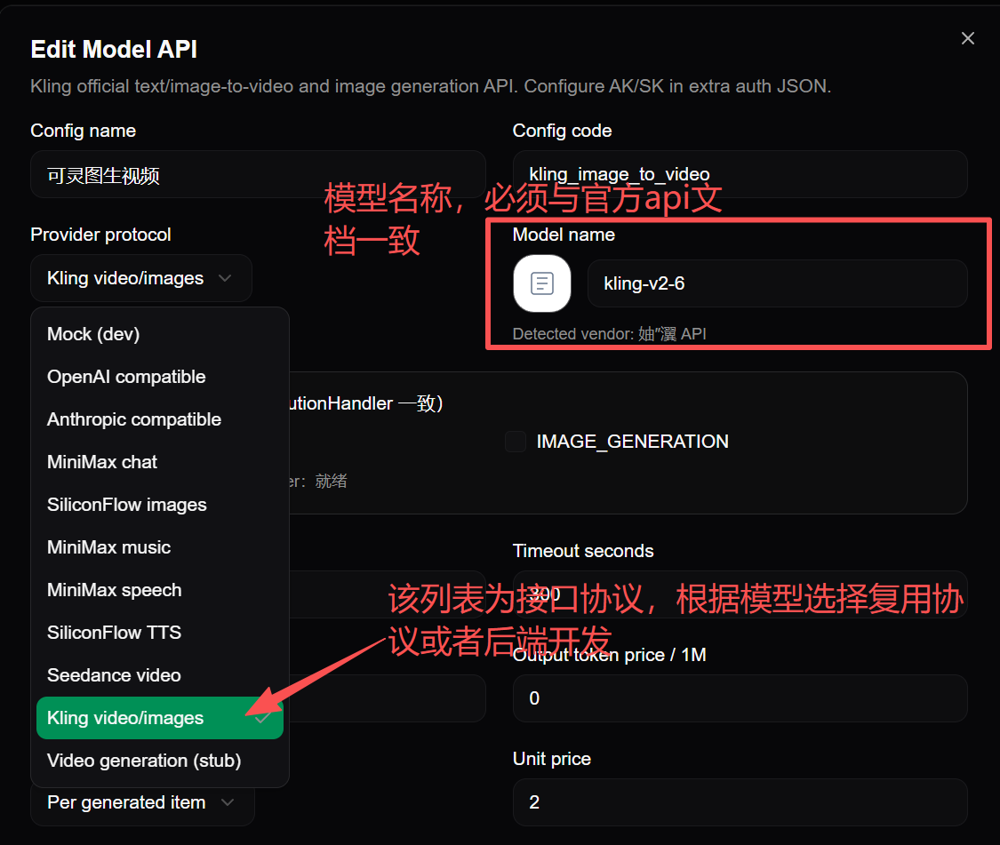
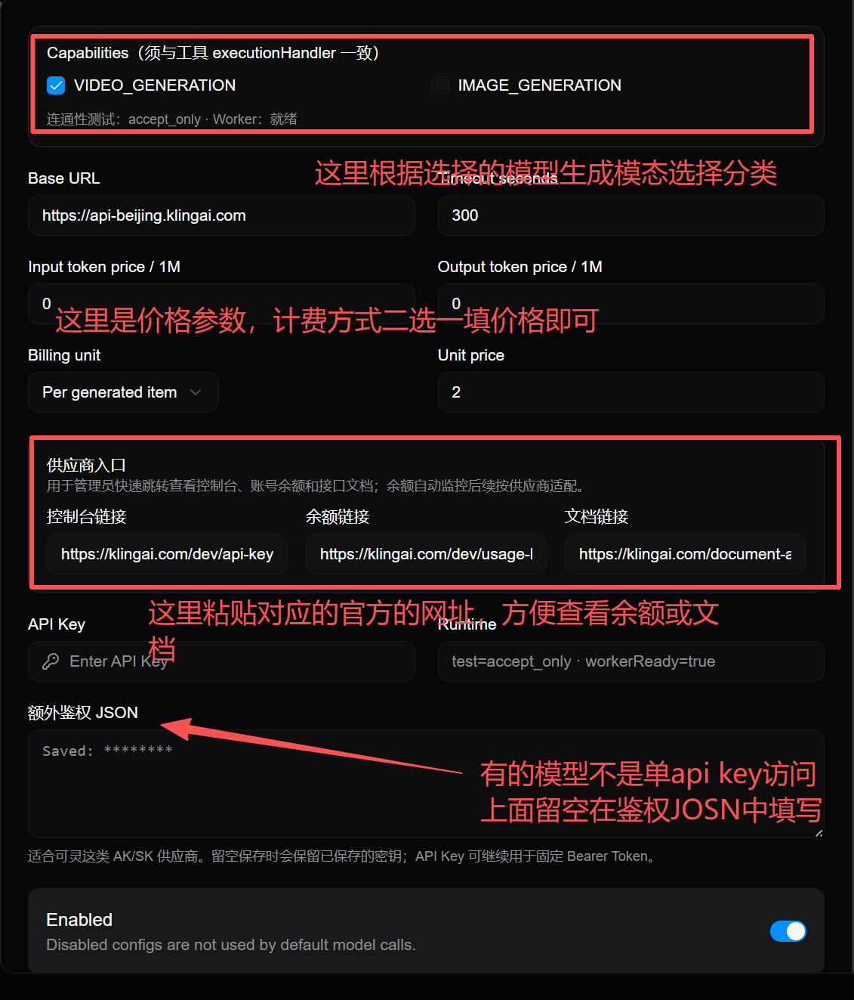
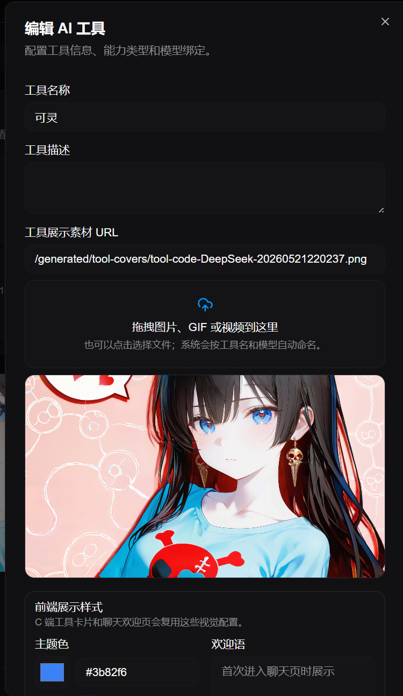
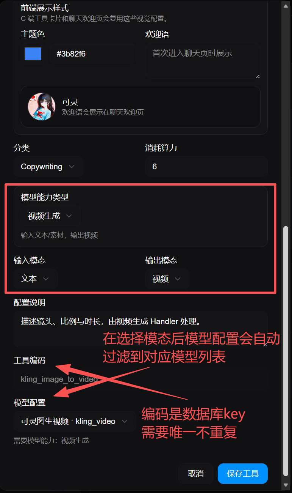
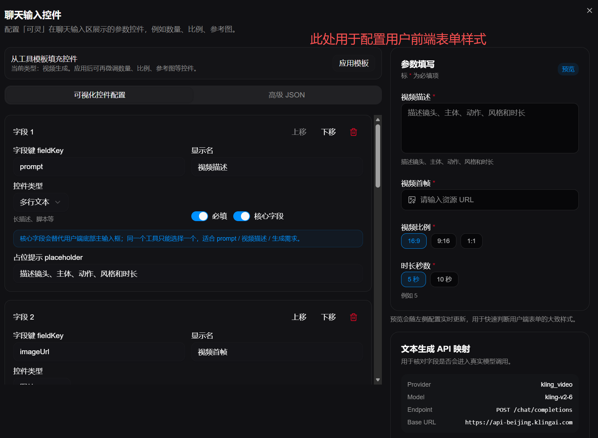
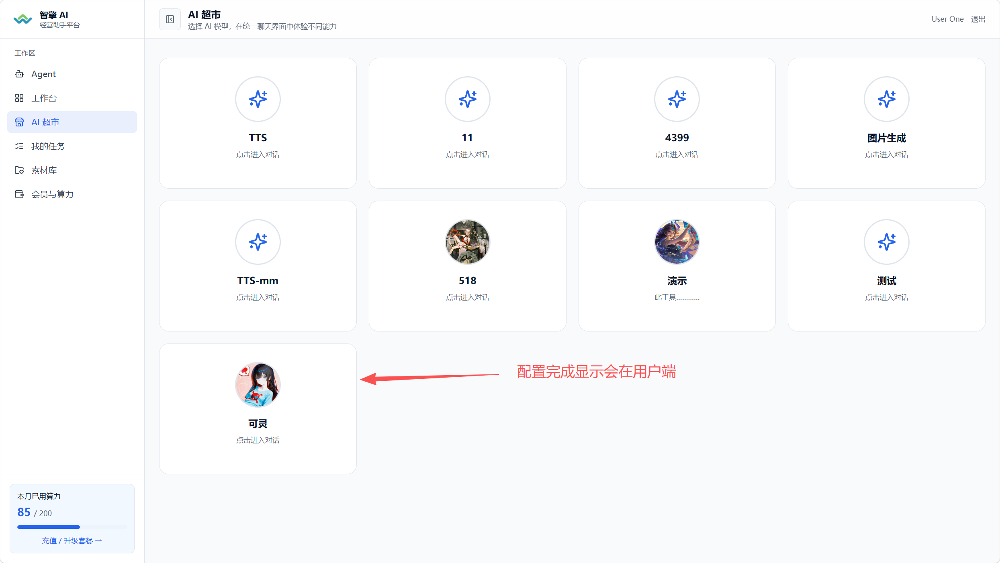
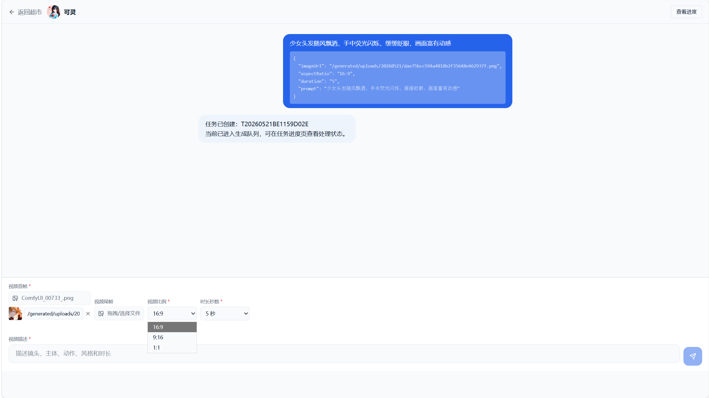

# 后台模型接入操作教程

本文给后台运营、产品和非开发同学阅读。照着做即可完成“新增模型 -> 创建工具 -> 用户端看到工具 -> 提交测试任务”的完整流程。

示例使用已经跑通的可灵图生视频模型。

> 不要把 Access Key、Secret Key、API Key 发到群里或写进文档截图。截图里如果有密钥，必须打码。

## 0. 开始前准备

你需要准备：

1. 后台登录账号。
2. 模型供应商的官方文档链接。
3. 模型名称，例如 `kling-v2-6`。
4. Base URL，例如 `https://api-beijing.klingai.com`。
5. 密钥。
   - 固定 Bearer Token：填到 `API Key`。
   - AK/SK：填到 `额外鉴权 JSON`。
6. 价格或临时测试价格。
7. 这个模型要做什么：图片生成、视频生成、语音生成等。

可灵 AK/SK 的填写格式：

```json
{"accessKey":"你的 Access Key","secretKey":"你的 Secret Key"}
```

## 1. 新增或编辑模型 API

进入后台：

```text
系统配置 -> AI 模型配置
```

点击新增，或编辑已有模型。



### 1.1 填写基础信息

| 页面字段 | 怎么填 | 可灵示例 |
| --- | --- | --- |
| Config name | 给人看的名字 | 可灵图生视频 |
| Config code | 数据库唯一编码，不要重复 | `kling_image_to_video` |
| Provider protocol | 供应商协议 | `Kling video/images` |
| Model name | 官方模型名，必须照 API 文档 | `kling-v2-6` |

注意：

1. `Config name` 可以中文，方便后台识别。
2. `Config code` 不能重复，建议英文小写加下划线。
3. `Model name` 一定要和官方 API 文档一致，不要写展示名。
4. `Provider protocol` 是“接口协议”。如果下拉没有你要的供应商，先找开发确认是否已支持。

### 1.2 选择能力、价格和供应商入口



| 页面字段 | 怎么填 | 可灵示例 |
| --- | --- | --- |
| Capabilities | 模型能做什么，必须和工具一致 | `VIDEO_GENERATION` |
| Base URL | 官方 API 域名 | `https://api-beijing.klingai.com` |
| Timeout seconds | 等待模型结果的最长时间 | `300` 或 `900` |
| Billing unit | 计费方式 | `Per generated item` |
| Unit price | 单次生成成本 | 按供应商价格填 |
| 控制台链接 | 供应商后台地址 | `https://klingai.com/dev/api-key` |
| 余额链接 | 查看额度/用量地址 | 按供应商后台填 |
| 文档链接 | 官方 API 文档 | 可灵 API 文档地址 |

能力怎么选：

| 模型用途 | 勾选能力 |
| --- | --- |
| 文本生成 | `TEXT_GENERATION` |
| 图片生成 | `IMAGE_GENERATION` |
| 视频生成 | `VIDEO_GENERATION` |
| 文字转语音 | `TEXT_TO_SPEECH` |
| 数字人视频 | `DIGITAL_HUMAN` |

价格怎么填：

1. 如果供应商按次收费，`Billing unit` 选 `Per generated item`。
2. 如果供应商按 token 收费，填写 `Input token price / 1M` 和 `Output token price / 1M`。
3. 如果还不知道价格，测试阶段可以先填 `0`，但上线前必须补准确。

### 1.3 填写密钥

页面底部有两个密钥区域：

| 字段 | 什么时候填 |
| --- | --- |
| API Key | 供应商给的是固定 API Key 或 Bearer Token |
| 额外鉴权 JSON | 供应商给的是 AK/SK、appId/secret 这类组合密钥 |

可灵使用 AK/SK，所以：

1. `API Key` 可以留空。
2. `额外鉴权 JSON` 填：

```json
{"accessKey":"你的 Access Key","secretKey":"你的 Secret Key"}
```

3. 打开 `Enabled`。
4. 保存模型。

保存后如果看到 `Saved: ********`，说明密钥已保存，后台不会再明文显示。

## 2. 创建或编辑 AI 工具

进入：

```text
AI 工具管理
```

点击新增工具，或编辑已有工具。



### 2.1 填写工具展示信息

| 页面字段 | 怎么填 |
| --- | --- |
| 工具名称 | 用户端看到的名字，例如“可灵图生视频” |
| 工具描述 | 简短说明工具用途 |
| 工具展示素材 URL | 可手填，也可以拖拽上传图片/GIF/视频 |
| 主题色 | 用户端卡片颜色 |
| 欢迎语 | 用户第一次进入聊天页时看到的提示 |
| 分类 | 用户端超市里的分类 |
| 消耗算力 | 这个工具单次预估消耗 |

展示素材建议：

1. 可以拖图片、GIF 或视频到上传框。
2. 上传后系统会自动填 `/generated/tool-covers/...`。
3. 如果工具是图生视频，建议用能代表模型效果的封面。

### 2.2 选择工具能力、模态和模型



| 页面字段 | 怎么填 | 可灵图生视频示例 |
| --- | --- | --- |
| 模型能力类型 | 工具要做什么 | 视频生成 |
| 输入模态 | 用户输入什么 | 文本 或 多模态 |
| 输出模态 | 结果是什么 | 视频 |
| 配置说明 | 给管理员看的备注 | 描述镜头、比例与时长，由视频生成 Handler 处理 |
| 工具编码 | 唯一编码，不要重复 | `kling_image_to_video` |
| 模型配置 | 选择第 1 步创建的模型 | 可灵图生视频 · `kling_video` |

最容易填错的是三处：

1. `模型能力类型` 要和模型配置里的 `Capabilities` 一致。
2. `模型配置` 下拉只会显示匹配能力的模型。
3. `工具编码` 是数据库 key，不能重复。

如果模型配置下拉看不到刚才的模型：

1. 回到 AI 模型配置，检查模型是否 Enabled。
2. 检查模型 `Capabilities` 是否勾选了 `VIDEO_GENERATION`。
3. 刷新 AI 工具管理页面。
4. 仍然没有，找开发检查 provider 能力注册。

## 3. 配置聊天输入控件

保存工具后，进入工具卡片的“聊天输入控件”配置。



这里决定用户端底部表单显示哪些字段。

### 3.1 推荐字段配置

可灵图生视频建议字段：

| 字段键 fieldKey | 显示名 | 控件类型 | 必填 | 是否核心字段 | 说明 |
| --- | --- | --- | --- | --- | --- |
| `prompt` | 视频描述 | 多行文本 | 是 | 是 | 替代用户端底部主输入框 |
| `imageUrl` | 视频首帧 | 图片 | 是 | 否 | 用户拖拽上传首帧图 |
| `imageTail` | 视频尾帧 | 图片 | 否 | 否 | 可选 |
| `aspectRatio` | 视频比例 | 下拉/单选 | 是 | 否 | `16:9`、`9:16`、`1:1` |
| `duration` | 时长秒数 | 下拉/单选 | 是 | 否 | `5`、`10` |
| `mode` | 生成模式 | 下拉/单选 | 否 | 否 | `std`、`pro` |
| `sound` | 声音 | 下拉/单选 | 否 | 否 | `off` |

### 3.2 核心字段怎么选

核心字段的意思：

```text
这个字段会替代用户端底部主输入框。
```

适合设置为核心字段的字段：

1. `prompt`
2. 视频描述
3. 生成需求
4. 文案内容

一个工具只能有一个核心字段。

可灵图生视频中，把 `prompt / 视频描述` 设置为核心字段。这样用户端不会出现两个“视频描述”输入框。

### 3.3 图片/文件字段怎么用

字段类型选择 `图片` 或 `文件` 后，用户端会显示上传控件：

1. 用户拖拽或选择图片。
2. 系统上传到后端。
3. 字段自动变成 `/generated/uploads/...`。
4. Worker 调供应商时再按供应商要求转换。

可灵要求图片是 base64，用户端仍然只上传图片即可，不需要人工转 base64。

## 4. 在用户端检查工具是否出现

进入用户端：

```text
AI 超市
```



看到新工具卡片就说明：

1. 工具已上线。
2. 工具展示素材可访问。
3. 用户端能拉到工具列表。

如果没看到：

1. 检查工具状态是否上线。
2. 检查工具分类是否可见。
3. 刷新用户端。
4. 检查用户端是否登录正确环境。

## 5. 用户端提交测试任务

点击工具卡片进入聊天页。



测试时这样填：

| 字段 | 示例 |
| --- | --- |
| 视频首帧 | 上传一张图片 |
| 视频尾帧 | 可先不填 |
| 视频比例 | `16:9` |
| 时长秒数 | `5 秒` |
| 视频描述 | 少女头发随风飘洒，手中荧光闪烁，缓缓眨眼，画面富有动感 |

点击发送后，聊天区会显示任务参数和任务编号。

正常现象：

1. 页面出现“任务已创建”。
2. 右上角出现“查看进度”。
3. 后台任务列表能看到任务。
4. Worker 日志出现 `provider=kling_video`。
5. 成功后结果页能看到视频。

## 6. 可灵图生视频标准配置

### 6.1 模型配置

| 字段 | 值 |
| --- | --- |
| Config name | 可灵图生视频 |
| Config code | `kling_image_to_video` |
| Provider protocol | `Kling video/images` |
| Model name | `kling-v2-6` |
| Capabilities | `VIDEO_GENERATION` |
| Base URL | `https://api-beijing.klingai.com` |
| Timeout seconds | `300` 或 `900` |
| Billing unit | `Per generated item` |
| Unit price | 按供应商价格填 |
| API Key | 留空 |
| 额外鉴权 JSON | `{"accessKey":"...","secretKey":"..."}` |
| Enabled | 开启 |

### 6.2 工具配置

| 字段 | 值 |
| --- | --- |
| 工具名称 | 可灵图生视频 |
| 工具编码 | `kling_image_to_video` |
| 模型能力类型 | 视频生成 |
| 输入模态 | 多模态 |
| 输出模态 | 视频 |
| 模型配置 | 可灵图生视频 · `kling_video` |
| 消耗算力 | 按业务定价填 |
| 状态 | 上线 |

### 6.3 聊天控件

| 字段键 | 控件类型 | 必填 | 核心字段 |
| --- | --- | --- | --- |
| `prompt` | 多行文本 | 是 | 是 |
| `imageUrl` | 图片 | 是 | 否 |
| `imageTail` | 图片 | 否 | 否 |
| `aspectRatio` | 单选/下拉 | 是 | 否 |
| `duration` | 单选/下拉 | 是 | 否 |

## 7. 常见问题

### 7.1 保存模型失败

先看报错里有没有 `traceId`。如果只有“系统异常”，刷新后台后重试，并把后台 console 和后端日志发给开发。

重点检查：

1. `Config code` 是否重复。
2. `Model name` 是否为空。
3. `Capabilities` 是否至少选一个。
4. `额外鉴权 JSON` 是否是合法 JSON。

### 7.2 工具里选不到模型

原因通常是能力不匹配。

例如工具选择了“视频生成”，模型配置必须勾选 `VIDEO_GENERATION`。

### 7.3 用户端上传图片后可灵报 base64 错误

现在 Worker 已经会自动把 `/generated/uploads/...` 转成 base64。出现这个错误时：

1. 确认 worker 已重启。
2. 确认用的是最新代码。
3. 检查图片 URL 是否能访问。
4. 检查 `GENERATED_MEDIA_DIR` 是否和 backend 一致。

### 7.4 可灵创建成功但查询 404

图生视频查询路径必须是：

```text
/v1/videos/image2video/{task_id}
```

如果日志里出现 `/v1/videos/{task_id}`，说明 worker 没重启或代码不是最新。

### 7.5 任务失败后算力冻结

正常流程：

```text
冻结算力 -> Worker 处理 -> 成功扣减 / 失败释放
```

如果任务异常退出没有释放，发任务编号和 traceId 给开发检查。

## 8. 给开发同学的最小信息

如果后台配置完仍跑不通，把下面信息发给开发：

```text
模型配置：
- Provider protocol：
- Model name：
- Base URL：
- Capabilities：
- 是否用 API Key：
- 是否用 extraAuthJson：

工具配置：
- 工具编码：
- 模型能力类型：
- 输入模态：
- 输出模态：
- 模型配置：

用户端参数：
- prompt：
- imageUrl：
- imageTail：
- duration：
- aspectRatio：

错误信息：
- 任务编号：
- traceId：
- Worker 日志：
- 供应商返回 body：
```

不要发送明文密钥。
