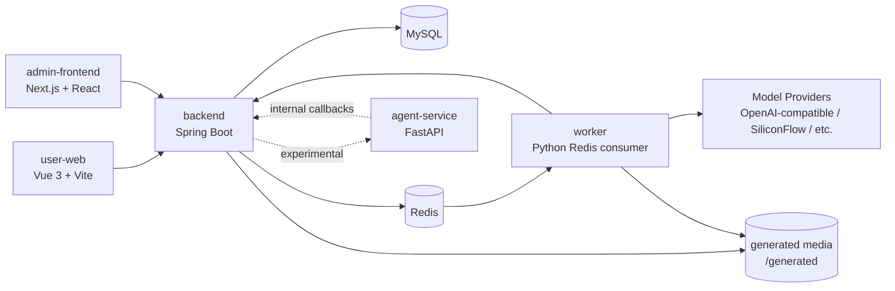

# 当前系统架构

更新时间：2026-05-17

## 架构概览

## 模块职责

| 模块 | 当前职责 | 边界 |
| --- | --- | --- |
| `backend` | 认证、用户、工具、字段模板、任务状态机、算力账户、计费日志、模型配置、内部回调接口 | 作为业务事实源，不直接承载复杂 Agent 编排 |
| `worker` | 消费 Redis 任务、调用模型、保存生成媒体、回写任务结果和 usage | 不维护用户权限、算力账户或任务状态规则 |
| `user-web` | 用户端工具使用、动态表单、任务状态、结果展示 | 不持有后台管理能力 |
| `admin-frontend` | 管理工具、分类、字段模板、模型配置、用户、算力和计费日志 | 不直接访问数据库或内部签名接口 |
| `agent-service` | 实验性 Agent 运行时 | 当前不是稳定主链路；非必要不扩大依赖 |

## 稳定主链路

1. 管理员配置工具、字段 schema、模型配置和算力消耗。
2. 用户端按字段 schema 渲染动态表单。
3. 用户创建任务，后端冻结算力并写入 Redis 队列。
4. Worker 消费任务，读取 execution context。
5. Worker 调用模型供应商，生成文本、图片或其他媒体。
6. Worker 回写 processing/success/failed。
7. 后端更新任务状态、结算或释放算力，并写入计费日志。
8. 用户端展示任务结果。

## 多模态工具模型

工具配置新增：

| 字段 | 说明 |
| --- | --- |
| `toolType` | 工具类型，例如 `TEXT_GENERATION`、`IMAGE_GENERATION` |
| `inputModality` | 输入模态，例如 `TEXT`、`IMAGE`、`FILE` |
| `outputModality` | 输出模态，例如 `TEXT`、`IMAGE`、`VIDEO` |
| `configNote` | 管理员配置说明 |
| `modelConfigId` | 指定工具使用的模型配置 |

用户端动态字段已支持文本、选择、单选、多选、滑块、图片和文件字段。结果渲染按输出模态区分文本、JSON、图片、音频、视频和报告。

## 计费模型

模型配置支持：

| 字段 | 说明 |
| --- | --- |
| `inputTokenPricePer1m` | 输入 token 每 1M 成本 |
| `outputTokenPricePer1m` | 输出 token 每 1M 成本 |
| `billingUnit` | `TOKEN_PER_M` 或 `PER_CALL` |
| `unitPrice` | 按次计费时的单位成本 |

`billing_usage_logs` 记录平台成本观察数据，不是支付订单或财务账本。

## Agent 当前判断

现有 `agent-service` 曾引入 LangGraph/DeepAgents 方向，但当前项目最稳定的业务主链路仍是“工具配置 + 任务队列 + Worker”。Agent 后续应围绕这个主链路做轻量编排：

- 可以做：理解用户意图、选择工具、生成参数、创建内部任务、汇总结果。
- 暂缓做：独立复杂运行时、跨服务状态机、绕过后端直接扣费或改任务状态。

Agent 边界应以后端为事实源，所有任务、算力、计费和审计都回到 backend。
