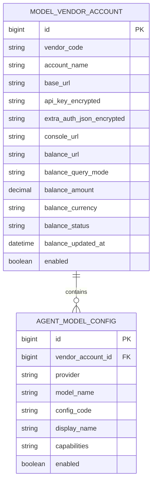

# 统一 API 管理 — 开发文档

> 版本：v1.0（方案稿）  
> 适用范围：管理端「系统配置」、后端模型配置域、后续 ModelGateway 演进  
> 关联文档：[配置包导入导出 — 维护指南](./配置包导入导出-维护指南.md)、[项目整体架构说明](./项目整体架构说明.md)、[模型配置.md](../模型配置.md)

---

## 1. 背景与目标

### 1.1 背景

当前管理端在 **系统配置 → 大模型接入**（组件 [`admin-frontend/components/admin/agent-model-settings.tsx`](../admin-frontend/components/admin/agent-model-settings.tsx)）中，以 **扁平模型卡片** 展示所有 `agent_model_configs` 配置。每个模型单独保存 `apiKey`、`baseUrl`、计费等信息，运营需要 **逐个点进弹窗** 维护，模型数量增多后：

- 同一厂商多模型重复配置密钥；
- 无法在一屏按厂商查看所有已接入模型；
- `balanceUrl` 仅为手工外链，**无法在页内感知余额或欠费风险**；
- 与类 [New API](https://github.com/QuantumNous/new-api) 的「厂商/渠道 → 模型列表 → 余额/健康」体验差距较大。

### 1.2 目标

在 **自有平台管理端** 内建设 **「统一 API 管理」** 能力（不引入 New API 后台 UI），实现：

| 目标 | 说明 |
|------|------|
| 按厂商分栏 | 一个模型厂商一个栏目，其下展示该厂商已接入的模型列表 |
| 账户与模型分离 | 密钥、Base URL 在 **厂商账户** 层维护一次；模型层只维护 upstream 模型名、计费、启用等 |
| 余额可感知 | 支持自动刷新（有 API 的厂商）+ 外链/人工备注（无 API 的厂商）+ 低余额/疑似欠费状态 |
| 兼容现有业务 | 工具 `modelConfigId`、Agent 选模型、算力结算链路保持不变 |
| 可演进 | 为后续渠道权重、失败降级、统一 ModelGateway 预留数据结构 |

### 1.3 非目标（本期不做）

- 不复刻 New API 的终端用户充值、分销、虚拟 Key 售卖体系（平台已有用户算力 [`CreditService`](../backend/src/main/java/com/aiminilab/aitoolmarket/credit/service/impl/CreditServiceImpl.java)）。
- 不要求所有厂商均能提供精确「实时余额」数字（见 [§5 余额策略](#5-余额策略)）。
- 一期不强制改造 Worker/agent-service 调用链（可在 P4 再收敛到网关）。

---

## 2. 现状摘要

### 2.1 前端

| 项 | 说明 |
|----|------|
| 入口 | [`admin-frontend/app/settings/page.tsx`](../admin-frontend/app/settings/page.tsx) → Tab「大模型接入」 |
| 主组件 | [`agent-model-settings.tsx`](../admin-frontend/components/admin/agent-model-settings.tsx) |
| API | [`admin-frontend/lib/api/agent-model.ts`](../admin-frontend/lib/api/agent-model.ts) → `/api/admin/v1/agent/model-config` |
| Provider 目录 | [`model-providers.ts`](../admin-frontend/lib/api/model-providers.ts) → `/api/admin/v1/model-providers`（读 [`model-providers.yml`](../backend/src/main/resources/model-providers.yml)） |
| 余额 | 表单字段 `balanceUrl`，列表卡片外链「余额」，**无后端拉取** |

### 2.2 后端与数据

| 项 | 说明 |
|----|------|
| 表 | `agent_model_configs`（见 [`sql/009_agent_model_configs.sql`](../sql/009_agent_model_configs.sql)） |
| 实体 | [`AgentModelConfig.java`](../backend/src/main/java/com/aiminilab/aitoolmarket/agent/entity/AgentModelConfig.java) |
| 管理 API | `AdminAgentModelConfigController` — list / CRUD / test / default |
| 执行下发 | `ExecutionModelConfigResponse` 等内部接口向 Worker/agent-service 传递配置（含掩码外的 key 逻辑） |

### 2.3 核心痛点对照

| 现状 | 目标 |
|------|------|
| 扁平卡片 + 大弹窗 | 厂商折叠栏 + 模型表格 + 行内/抽屉小编辑 |
| 每模型一条 key | 每厂商账户一条 key，多模型复用 |
| 余额仅链接 | 页内余额/状态 + 刷新 |
| 按模态筛选为主 | 按厂商为主，模态为辅 |

---

## 3. 产品信息架构

### 3.1 命名与入口

- 设置页 Tab 文案：**「大模型接入」→「统一 API」**（或「模型 API 中心」，产品二选一后全文统一）。
- 路由可保持 `/settings`，仅替换 Tab 内组件。
- 「引擎 API」Tab 不变：MinerU、百度 OCR、PPT 旁路等仍独立维护。

### 3.2 页面线框

```
┌─ 统一 API 管理 ─────────────────────────────────────────────┐
│ [全部厂商 ▼] [模态: 全部|文本|图|视频|音频] [搜索] [刷新余额] │
│ 汇总: N 厂商 · M 模型 · X 低余额 · Y 不可用                   │
├────────────────────────────────────────────────────────────┤
│ ▼ DeepSeek                          余额 ¥128.50  ● 正常     │
│   账户: 官方主账号 · Base https://api.deepseek.com          │
│   [编辑账户] [测试连通] [打开控制台] [打开余额页]             │
│   ┌────────────────────────────────────────────────────────┐ │
│   │ 显示名 │ upstream模型 │ configCode │ 能力 │ 启用 │ 状态 │⋮│ │
│   │ 对话-主 │ deepseek-chat │ deepseek_chat │ 文本 │ ✓ │ 正常 │ │
│   └────────────────────────────────────────────────────────┘ │
│   [+ 添加模型]                                               │
├────────────────────────────────────────────────────────────┤
│ ▶ SiliconFlow（未展开）              余额 --      ● 未配置查询  │
├────────────────────────────────────────────────────────────┤
│ ▶ 未接入厂商（3）                     [展开查看可接入列表]      │
└────────────────────────────────────────────────────────────┘
```

### 3.3 交互规则

| 操作 | 行为 |
|------|------|
| 编辑厂商账户 | 弹窗/抽屉：账户名、Base URL、API Key、extraAuthJson、控制台/余额链接、余额查询模式 |
| 添加模型 | 在指定厂商下发起，`vendorAccountId` 已确定，只需选 provider（协议）、upstream `modelName`、显示名、计费、capabilities |
| 编辑模型 | 行内或右侧抽屉，**不展示** API Key（只读提示「使用账户 xxx 的密钥」） |
| 启用/禁用 | 模型行 Switch，与现逻辑一致 |
| 测试 | 账户级测试连通；模型级测试（可选，走账户 key + 该 modelName） |
| 默认模型 | 保留全局 `isDefault`，在模型行操作 |
| 展开/折叠 | 有配置或异常的厂商默认展开；支持「全部展开/折叠」 |

---

## 4. 数据模型设计

### 4.1 概念关系



### 4.2 新表：`model_vendor_accounts`

```sql
CREATE TABLE IF NOT EXISTS model_vendor_accounts (
  id BIGINT PRIMARY KEY AUTO_INCREMENT,
  vendor_code VARCHAR(64) NOT NULL COMMENT '展示用厂商编码，如 deepseek、siliconflow、kling',
  account_name VARCHAR(128) NOT NULL DEFAULT '默认账户',
  base_url VARCHAR(512) NULL,
  api_key VARCHAR(1024) NULL COMMENT '加密存储',
  extra_auth_json VARCHAR(2048) NULL COMMENT '如可灵 AK/SK，加密存储',
  console_url VARCHAR(512) NULL,
  balance_url VARCHAR(512) NULL,
  balance_query_mode VARCHAR(32) NOT NULL DEFAULT 'MANUAL'
    COMMENT 'MANUAL|REST_API|INFERRED|NONE',
  balance_amount DECIMAL(18,4) NULL COMMENT '最近一次查询余额',
  balance_currency VARCHAR(8) NULL DEFAULT 'CNY',
  balance_status VARCHAR(32) NOT NULL DEFAULT 'UNKNOWN'
    COMMENT 'OK|LOW|UNKNOWN|SUSPECTED_INSUFFICIENT|ERROR',
  balance_low_threshold DECIMAL(18,4) NULL COMMENT '低余额告警阈值，NULL 表示不告警',
  balance_updated_at DATETIME NULL,
  balance_error_message VARCHAR(512) NULL,
  enabled TINYINT NOT NULL DEFAULT 1,
  is_deleted TINYINT NOT NULL DEFAULT 0,
  created_at DATETIME NOT NULL DEFAULT CURRENT_TIMESTAMP,
  updated_at DATETIME NOT NULL DEFAULT CURRENT_TIMESTAMP ON UPDATE CURRENT_TIMESTAMP,
  KEY idx_vendor_accounts_vendor (vendor_code, enabled, is_deleted),
  KEY idx_vendor_accounts_balance_status (balance_status, enabled, is_deleted)
) ENGINE=InnoDB DEFAULT CHARSET=utf8mb4;
```

### 4.3 变更表：`agent_model_configs`

```sql
ALTER TABLE agent_model_configs
  ADD COLUMN vendor_account_id BIGINT NULL COMMENT '所属厂商账户' AFTER id,
  ADD KEY idx_agent_model_configs_vendor_account (vendor_account_id, enabled, is_deleted);
```

**字段语义调整：**

| 字段 | 迁移后 |
|------|--------|
| `api_key` | 兼容期保留；新数据以账户为准；读取时 **账户 key 优先** |
| `base_url` | 模型可覆盖账户 Base URL（少见）；默认继承账户 |
| `provider` | 不变，对应协议与 Worker 能力 |
| `model_name` | 上游模型 ID |
| `balance_url` | 建议迁移到账户层；模型层可废弃或只读继承 |

### 4.4 可选表（P4）

**`model_upstream_channels`** — 同一账户下多渠道（主/备 key、权重），用于失败降级；一期可仅用「多账户」代替。

**`model_invoke_logs`** — 调用审计，供厂商头「24h 错误率」展示。

**`model_vendor_balance_logs`** — 每次余额查询结果历史。

### 4.5 厂商编码 `vendor_code` 与协议 `provider`

两套编码分工：

| 编码 | 来源 | 用途 |
|------|------|------|
| `vendor_code` | 产品定义 + 映射表 | UI 分栏、余额账户聚合 |
| `provider` | [`model-providers.yml`](../backend/src/main/resources/model-providers.yml) | 能力校验、Worker 路由、`testStrategy` |

**推荐映射（示例）：**

| vendor_code（栏目） | 归并的 provider |
|---------------------|-----------------|
| `deepseek` | `deepseek` |
| `openai` | `openai_compatible`（upstream 为 OpenAI 时） |
| `siliconflow` | `siliconflow_images`, `siliconflow_speech`, `siliconflow_asr` |
| `volcengine` | `volcengine_images`, `seedance` |
| `kling` | `kling_video` |
| `minimax` | `minimax`, `minimax_speech`, `minimax_music`, `anthropic_compatible`（按 baseUrl 归属可配置） |
| `openai_gateway` | `ofox_openai_images`, `openai_images_gateway`（`vendorKind=gateway`） |

映射配置建议新增 **`config/model-vendor-mapping.yml`** 或由 `model-providers.yml` 扩展字段 `vendorCode`，避免前端硬编码。

---

## 5. 余额策略

### 5.1 档位定义

| 档位 | `balance_query_mode` | 行为 | UI 展示 |
|------|----------------------|------|---------|
| L0 | `MANUAL` | 运营手填 `balance_amount` 或仅备注 | 「余额（人工）¥xx」或 `--` |
| L1 | `REST_API` | 后台适配器调厂商开放接口 | 「余额 ¥xx · 更新于 N 分钟前」 |
| L2 | `NONE` | 仅 `balance_url` 外链 | 「余额 -- · [去查看]」 |
| L3 | `INFERRED` | 根据近期 401/402/余额类错误推断 | 「● 疑似欠费」 |

### 5.2 刷新机制

- 管理端按钮：**刷新全部余额** / 厂商头 **刷新**。
- 后端：`POST /api/admin/v1/model-vendor-accounts/{id}/refresh-balance`。
- 定时任务：每 5～15 分钟扫描 `balance_query_mode=REST_API` 的账户（可配置）。
- 列表接口返回 `balanceUpdatedAt`，前端显示「陈旧」提示（如超过 30 分钟）。

### 5.3 余额适配器（Balance Adapter）

```java
// 概念接口
public interface VendorBalanceAdapter {
  boolean supports(String vendorCode);
  BalanceQueryResult query(ModelVendorAccount account);
}
```

按厂商实现，注册到 Spring；`model-providers.yml` 或 `model-vendor-mapping.yml` 中声明：

```yaml
vendorBalanceAdapters:
  deepseek:
    mode: REST_API
    adapterBean: deepseekBalanceAdapter
  siliconflow:
    mode: REST_API
    adapterBean: siliconflowBalanceAdapter
  kling:
    mode: NONE
```

**已接入（P3）：**

| 厂商 | 接口 | 实现类 |
|------|------|--------|
| DeepSeek | `GET {origin}/user/balance` | `DeepSeekBalanceAdapter` |
| SiliconFlow | `GET {origin}/v1/user/info` | `SiliconFlowBalanceAdapter` |

**待接入：** 火山/豆包、MiniMax、可灵、OpenAI 兼容代理等。其余厂商仍用 L0/L2。

**定时刷新：** `app.model-vendor-balance.scheduled-enabled=true` 时每 10 分钟刷新 `REST_API` 账户（默认关闭）。

### 5.4 低余额与告警

- 账户字段 `balance_low_threshold`：低于阈值 → `balance_status=LOW`。
- 汇总条 `lowBalanceCount` 统计 LOW + SUSPECTED_INSUFFICIENT。
- 二期对接管理端通知中心（若已有 [`notification-center`](../admin-frontend/components/admin/notification-center.tsx)）。

---

## 6. 后端 API 设计

### 6.1 路由前缀

建议：`/api/admin/v1/unified-api`（聚合读）+ `/api/admin/v1/model-vendor-accounts`（账户 CRUD）。

保留现有 `/api/admin/v1/agent/model-config`，避免破坏其他调用方；新 UI 优先用新接口。

### 6.2 接口清单

| 方法 | 路径 | 说明 |
|------|------|------|
| GET | `/unified-api/overview` | 一页拉取：汇总 + 厂商树（账户 + 模型） |
| GET | `/unified-api/vendor-catalog` | 未接入厂商 + yml 支持的 provider/默认模型 |
| GET | `/model-vendor-accounts` | 账户列表（可按 vendorCode 过滤） |
| GET | `/model-vendor-accounts/{id}` | 账户详情（apiKey 掩码） |
| POST | `/model-vendor-accounts` | 创建账户 |
| PUT | `/model-vendor-accounts/{id}` | 更新账户 |
| DELETE | `/model-vendor-accounts/{id}` | 软删（需校验无启用模型或强制下线） |
| POST | `/model-vendor-accounts/{id}/test` | 账户连通性测试 |
| POST | `/model-vendor-accounts/{id}/refresh-balance` | 刷新单账户余额 |
| POST | `/model-vendor-accounts/refresh-balance-all` | 批量刷新 |
| GET | `/model-vendor-accounts/{id}/models` | 账户下模型（overview 已含则可省略） |
| POST | `/agent/model-config` | 创建模型，**必填** `vendorAccountId` |
| PUT | `/agent/model-config/{id}` | 更新模型，不传 apiKey |
| POST | `/agent/model-config/{id}/test` | 模型测试（使用账户密钥） |

### 6.3 `overview` 响应结构（示例）

```json
{
  "summary": {
    "vendorCount": 8,
    "accountCount": 10,
    "modelCount": 42,
    "enabledModelCount": 38,
    "lowBalanceCount": 2,
    "unhealthyAccountCount": 1
  },
  "vendors": [
    {
      "vendorCode": "deepseek",
      "label": "DeepSeek",
      "iconAsset": "deepseek",
      "accounts": [
        {
          "id": 1,
          "accountName": "官方主账号",
          "baseUrl": "https://api.deepseek.com",
          "enabled": true,
          "healthStatus": "OK",
          "balanceAmount": 128.5,
          "balanceCurrency": "CNY",
          "balanceStatus": "OK",
          "balanceQueryMode": "REST_API",
          "balanceUpdatedAt": "2026-06-01T14:30:00",
          "consoleUrl": "https://platform.deepseek.com",
          "balanceUrl": "https://platform.deepseek.com/billing"
        }
      ],
      "models": [
        {
          "id": 10,
          "vendorAccountId": 1,
          "displayName": "对话-主站",
          "configCode": "deepseek_chat",
          "provider": "deepseek",
          "modelName": "deepseek-chat",
          "capabilities": ["TEXT_GENERATION"],
          "enabled": true,
          "agentEnabled": true,
          "isDefault": false,
          "healthStatus": "OK",
          "lastTestAt": "2026-06-01T12:00:00"
        }
      ]
    }
  ],
  "unconfiguredVendors": [
    {
      "vendorCode": "kling",
      "label": "可灵",
      "supportedProviders": ["kling_video"]
    }
  ]
}
```

### 6.4 DTO 与权限

- 所有响应中 `apiKey` 仅返回掩码；明文仅在创建/更新请求体传入。
- 管理端接口沿用现有 Admin 鉴权。
- `overview` 可做 30s 短缓存（Redis 可选），余额刷新后主动失效。

### 6.5 服务层职责

| 类 | 职责 |
|----|------|
| `UnifiedApiOverviewService` | 聚合厂商树、汇总统计 |
| `ModelVendorAccountService` | 账户 CRUD、密钥加解密、测试、余额刷新 |
| `VendorBalanceAdapterRegistry` | 按 vendorCode 选择 Balance Adapter |
| `AgentModelConfigService` | 扩展：创建/更新时校验 `vendorAccountId`，解析有效 apiKey/baseUrl |
| `ModelVendorMigrationService` | 一次性数据迁移（见 §8） |

---

## 7. 前端开发说明

### 7.1 文件规划

| 文件 | 说明 |
|------|------|
| `admin-frontend/components/admin/unified-api-settings.tsx` | 新主页面组件 |
| `admin-frontend/components/admin/model-vendor-section.tsx` | 单个厂商折叠块 |
| `admin-frontend/components/admin/model-vendor-account-dialog.tsx` | 账户编辑弹窗 |
| `admin-frontend/components/admin/model-row-drawer.tsx` | 模型行编辑抽屉 |
| `admin-frontend/lib/api/unified-api.ts` | overview、refresh-balance 等 |
| `admin-frontend/lib/api/model-vendor-account.ts` | 账户 CRUD |
| `admin-frontend/lib/api/types.ts` | 新增 TS 类型 |
| `admin-frontend/app/settings/page.tsx` | Tab 文案与组件替换 |

**过渡期：** `agent-model-settings.tsx` 保留至新页稳定后删除或标记 `@deprecated`。

### 7.2 状态与请求

- 进入页：`GET /unified-api/overview` 一次渲染整树。
- 刷新余额：`POST refresh-balance-all` 后局部更新 `accounts` 状态或重新 overview。
- 避免「每个厂商一次 list」的 N+1 请求。

### 7.3 UI 组件复用

继续使用现有 shadcn：`Card`、`Collapsible`、`Table`、`Badge`、`Dialog`、`Drawer`、`Switch`、`Alert`。

厂商 Logo 复用 [`agent-model-settings.tsx`](../admin-frontend/components/admin/agent-model-settings.tsx) 中 `vendorCatalog` / `public/assets/vendor-icons/` 逻辑，抽到 `lib/vendor-meta.ts`。

### 7.4 工具页联动（可选 P2）

[`admin-frontend/app/tools/page.tsx`](../admin-frontend/app/tools/page.tsx) 绑定模型下拉：展示 `displayName · vendor · healthStatus` 小圆点，避免绑到不可用模型。

---

## 8. 数据迁移方案

### 8.1 迁移原则

1. 每条现有 `agent_model_configs` 至少生成一个 `model_vendor_accounts`（按 `provider` + `baseUrl` + 相同 apiKey 哈希聚合）。
2. 回填 `vendor_account_id`。
3. 原 `api_key` 复制到账户后，模型表 key 可保留但逻辑只读。

### 8.2 聚合算法（伪代码）

```
for each config in agent_model_configs where not deleted:
  vendor_code = resolveVendorCode(config.provider, config.baseUrl, config.displayName)
  group_key = hash(vendor_code, normalize(baseUrl), hash(apiKey))
  find or create model_vendor_accounts(group_key)
  config.vendor_account_id = account.id
```

### 8.3 迁移脚本

- SQL 迁移：`sql/0xx_model_vendor_accounts.sql`
- Java 一次性任务：`ModelVendorMigrationRunner`（启动参数或 admin 专用接口触发，需幂等）。

### 8.4 配置包导入导出（v1.3 已落地）

配置包（Config Bundle）用于在环境间同步系统设置、厂商账户、模型、分类与工具（含字段/提示词/工作流）。**完整格式、导入顺序、密钥策略、prune 行为与管理端/CLI 操作见权威文档：[配置包导入导出 — 维护指南](./配置包导入导出-维护指南.md)。**

摘要：

- API：`GET/POST /api/admin/v1/config-bundles/{export|import}`；前端 [`config-bundles.ts`](../admin-frontend/lib/api/config-bundles.ts)
- 格式：`format: "ai-tool-market-config-bundle"`, `version: 1`
- 导入顺序：settings → vendorAccounts → modelConfigs → categories → tools → prune → 清缓存
- `accountRef` / `vendorAccountRef`：`{vendorCode}::{accountName}`
- 旧包（无 `vendorAccounts`）仍可导入（密钥写在 `modelConfigs`）
- `includeSecrets=true` 时从厂商账户表导出密钥；已绑定账户的模型行不再重复导出 `apiKey`

---

## 9. 与执行链 / 业务兼容性

| 模块 | 一期影响 | 说明 |
|------|----------|------|
| 工具 `model_config_id` | 无 | 仍指向 `agent_model_configs.id` |
| Agent `modelConfigId` | 无 | 同上 |
| `ModelCapabilityService` | 小改 | 解析模型时合并账户 `baseUrl`/`apiKey` |
| `InternalTaskServiceImpl` execution-context | 小改 | 下发配置从账户取密钥 |
| Worker / agent-service | 可无改 | 仍收完整 execution 配置 |
| PPT 引擎同步 | 二期 | [`PptEngineSettingsSyncService`](../backend/src/main/java/com/aiminilab/aitoolmarket/ppt/service/PptEngineSettingsSyncService.java) 对齐账户层 |

**密钥解析优先级（实现约定）：**

```
effectiveApiKey    = account.apiKey ?? config.apiKey
effectiveBaseUrl   = config.baseUrl ?: account.baseUrl ?: provider.defaultBaseUrl
effectiveExtraAuth = account.extraAuthJson ?? config.extraAuthJson
```

---

## 10. 实施阶段

### P1 — 只改 UI + 聚合 API（不改表）

| 项 | 内容 |
|----|------|
| 目标 | 快速呈现厂商树，去掉「一模型一大弹窗」 |
| 后端 | `overview` 用现有 configs + 前端同款 `resolveVendorMeta` 逻辑服务端实现 |
| 余额 | 仍外链 + 汇总条占位 |
| 风险 | 聚合规则与 P2 不完全一致，仅作过渡 |

### P2 — 数据模型 + 账户 CRUD（推荐 MVP）

| 项 | 内容 |
|----|------|
| 目标 | 密钥只配一次；树结构稳定 |
| 交付 | 新表、迁移、账户 API、新 UI 全量切换 |
| 余额 | L0 手填 + L2 外链 |

### P3 — 余额 L1 + 健康

| 项 | 内容 |
|----|------|
| 目标 | 主力厂商页内余额、低余额状态 |
| 交付 | Balance Adapter、定时刷新、厂商头状态 |

### P4 — 渠道降级 + 网关（可选）

| 项 | 内容 |
|----|------|
| 目标 | 单厂商多 key 权重、失败切换；执行面停发明文 key |
| 交付 | `model_upstream_channels`、`ModelGateway` |

---

## 11. 测试要点

### 11.1 功能

- [ ] overview 厂商分组与迁移后数据一致
- [ ] 创建账户 → 添加模型 → 工具绑定 → 任务/Agent 可调用
- [ ] 更新账户 key 后，其下所有模型生效且无需逐条改 key
- [ ] 禁用账户后，其下模型不可被新任务选中（或自动禁用）
- [ ] 删除账户前校验/级联策略符合预期
- [ ] 余额刷新：REST_API 成功/失败/超时 UI
- [x] 配置包导入导出含 vendorAccounts

### 11.2 回归

- [ ] 现有 `agent/model-config/list` 调用方（工具页、工作流画布）正常
- [ ] `adminTest` / 模型测试在账户密钥下通过
- [ ] 默认模型 `isDefault` 全局唯一

### 11.3 安全

- [ ] API 响应无明文 key
- [ ] 日志脱敏
- [ ] 迁移脚本不输出明文 key 到日志文件

---

## 12. 文档与运营

| 文档 | 动作 |
|------|------|
| [配置包导入导出 — 维护指南](./配置包导入导出-维护指南.md) | 配置包格式与跨环境同步（已建立） |
| [模型配置.md](../模型配置.md) | 模型运营手册；余额列可补充「自动/外链」说明 |

---

## 13. 待产品确认项

实施前请确认：

1. **Tab 名称**：「统一 API」还是「模型 API 中心」？
2. **厂商分组维度**：按品牌（DeepSeek）还是按 protocol provider 分栏？
3. **余额预期**：是否接受「部分厂商仅外链 + 疑似欠费」？
4. **一期范围**：仅 P2，还是先做 P1 过渡（1～2 天）？

确认后即可按 §10 拆分任务进入开发。

---

## 14. 修订记录

| 版本 | 日期 | 说明 |
|------|------|------|
| v1.0 | 2026-06-01 | 初稿：统一 API 管理方案开发文档 |
| v1.1 | 2026-06-01 | P2 落地：model_vendor_accounts、overview API、管理端统一 API 页 |
| v1.2 | 2026-06-01 | P3 落地：DeepSeek / SiliconFlow REST 余额适配、定时刷新配置 |
| v1.3 | 2026-06-01 | 配置包 `vendorAccounts` 导入导出；MiniMax/火山/可灵/OpenAI 网关余额探测适配 |
| v1.4 | 2026-06-13 | §8.4 收敛为摘要并链接 [配置包导入导出 — 维护指南](./配置包导入导出-维护指南.md) |
