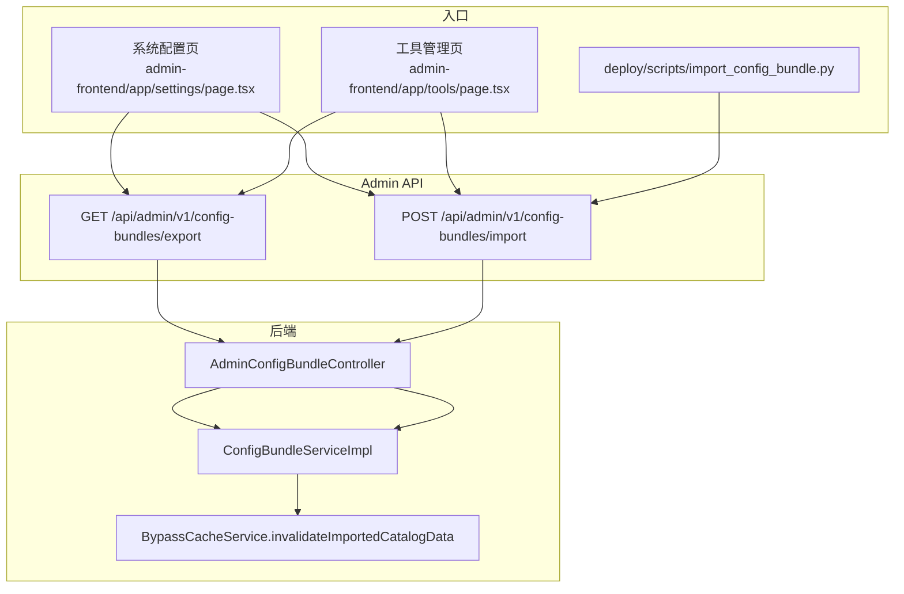
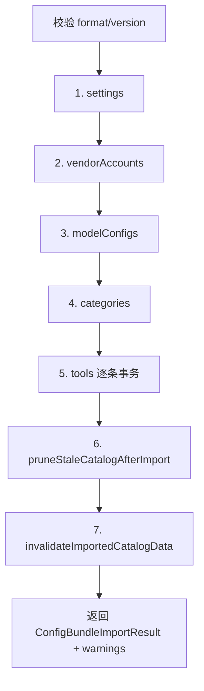

# 配置包导入导出 — 维护指南

本文是管理后台 **Config Bundle（配置包）** 导入/导出的权威说明。改动 `ConfigBundleServiceImpl`、DTO 结构、脱敏/prune 逻辑或管理端入口时，请同步更新本文（见文末「维护清单」）。

关联文档：[统一 API 管理 — 开发文档](./统一API管理-开发文档.md)（厂商账户与模型层）、[后台工具 JSON 配置说明](./后台工具JSON配置说明.md)（工具字段 schema）、[模型配置.md](../模型配置.md) / [可灵模型配置.md](../可灵模型配置.md)（模型运营手册）。

---

## 1. 定位与边界

### 1.1 配置包是什么

配置包是一份 JSON 文件，用于在环境之间同步 **运营配置**，格式标识为：

- `format`: `"ai-tool-market-config-bundle"`
- `version`: `1`

覆盖内容：

| 节点 | 对应数据 |
| --- | --- |
| `settings` | 系统设置（`system_settings`） |
| `vendorAccounts` | 厂商账户（`model_vendor_accounts`） |
| `modelConfigs` | Agent/工具模型配置（`agent_model_configs`） |
| `categories` | 工具分类 |
| `tools` | 工具本体 + `fields` + `prompts` + `workflow` |

**不包含**：用户、任务、额度、Agent 会话/记忆、社区、PPT 项目等运行时业务数据。

### 1.2 配置包不是什么

- 不是 MySQL 全库备份或 restore dump
- 不是单条设置的「恢复默认」（那是 `POST /api/admin/v1/settings/{key}/restore-default`）
- 不是工作流历史版本回滚（那是 `POST /api/admin/v1/tools/{toolId}/workflow/versions/{version}/restore`）

### 1.3 典型使用场景

1. **开发 → 测试/生产**：管理端导出 JSON，在目标环境导入
2. **部署脚本**：维护仓库根目录 `ai-tool-market-config-*.json`，部署时调用 `deploy/scripts/import_config_bundle.py`
3. **专项 patch**：用 `scripts/patch_config_bundle_workflows.py` 等脚本改 JSON 后再导入

---

## 2. 架构与 API



| 方法 | 路径 | 说明 |
| --- | --- | --- |
| `GET` | `/api/admin/v1/config-bundles/export?includeSecrets=false` | 导出；`includeSecrets=true` 含 API Key / extraAuthJson |
| `POST` | `/api/admin/v1/config-bundles/import` | Body 为完整配置包 JSON |

认证：Admin JWT（`Authorization: Bearer ...`），与其它 `/api/admin/v1/*` 一致。

前端 API 封装：[admin-frontend/lib/api/config-bundles.ts](../admin-frontend/lib/api/config-bundles.ts)

---

## 3. JSON 格式 v1

### 3.1 顶层字段

| 字段 | 说明 |
| --- | --- |
| `format` | 必须为 `ai-tool-market-config-bundle` |
| `version` | 必须为 `1` |
| `exportedAt` | ISO 8601 时间（导出时写入） |
| `exportedBy` | 操作员 userId |
| `secretsRedacted` | `true` 表示包内密钥已脱敏或为空 |
| `settings` | `key → value` 字符串 map |
| `vendorAccounts` | 厂商账户数组 |
| `modelConfigs` | 模型配置数组 |
| `categories` | 分类数组 |
| `tools` | 工具数组 |

完整 DTO 定义：[ConfigBundleDto.java](../backend/src/main/java/com/aiminilab/aitoolmarket/admin/dto/ConfigBundleDto.java)

### 3.2 引用规则

| 引用 | 格式 | 示例 |
| --- | --- | --- |
| 厂商账户 | `{vendorCode}::{accountName}` | `moonshot::默认账户` |
| 模型绑定账户 | `vendorAccountRef` | 同上 |
| 工具绑定模型 | `modelConfigCode` | `deepseek-v4-flash`（非数据库 id） |
| 工具所属分类 | `categoryCode` | 须在 `categories` 中存在或可解析 |

旧包（无 `vendorAccounts`）仍可导入：密钥写在 `modelConfigs.apiKey` / `extraAuthJson`，行为与历史一致。

### 3.3 工具子结构

- `tools[].fields[]`：字段 schema，语义见 [后台工具 JSON 配置说明](./后台工具JSON配置说明.md)
- `tools[].prompts[].versions[]`：提示词版本
- `tools[].workflow`：工作流画布（`nodesJson` / `edgesJson` / `groupsJson` / `configJson`，或等价的 `nodes` / `edges` 数组）

---

## 4. 导出

### 4.1 流程

1. 读取并脱敏 `system_settings`（见 §5.1）
2. 导出全部活跃厂商账户
3. 导出全部模型配置（工具引用用 `stableModelConfigCode`）
4. 导出分类；分页（200/页）导出全部工具及 fields / prompts / workflow
5. 组装 JSON 返回；管理端可下载为 `ai-tool-market-config-{YYYY-MM-DD}.json`

### 4.2 includeSecrets

| `includeSecrets` | `secretsRedacted` | 行为 |
| --- | --- | --- |
| `false`（默认） | `true` | settings 过滤敏感 key；账户/模型 apiKey、extraAuthJson 置空 |
| `true` | `false` | 从厂商账户表导出真实密钥；**已绑定账户的模型行不再重复导出 apiKey** |

### 4.3 已知限制（P1-BE-08）

若模型未设置 `configCode`，导出时会生成 legacy 标记 `model_{id}`。导入时若 `configCode` 为纯数字或 `model_\d+`，且 DB 中已有相同 `provider + modelName + baseUrl` 的模型，会 **复用已有记录** 而非新建。后续应禁止继续导出 legacy code（见 [优化清单](./优化清单-2026-06-02.md) P1-BE-08）。

---

## 5. 导入

### 5.1 固定顺序



单条工具导入失败 **不会中断整包**：捕获异常写入 `warnings`，继续下一条。

### 5.2 导入结果字段

[ConfigBundleImportResult.java](../backend/src/main/java/com/aiminilab/aitoolmarket/admin/dto/ConfigBundleImportResult.java)：

| 字段 | 含义 |
| --- | --- |
| `settings` | 写入的设置条数 |
| `vendorAccounts` | 导入涉及的账户数 |
| `modelConfigs` | 新建/更新的模型数 |
| `categories` | 分类数 |
| `tools` / `fields` / `prompts` / `promptVersions` / `workflows` | 工具相关计数 |
| `warnings` | 非致命告警列表（管理端最多展示 20 条） |

### 5.3 工具导入要点

- 按 `toolCode` upsert；软删工具会先 restore
- `status=ONLINE` 时尝试 publish；无 API key 等失败则保持 DRAFT 并 warning
- 绑定已 disabled 的模型时仍保留 binding 但 publish 可能失败

---

## 6. 密钥与安全

### 6.1 settings 脱敏

导出/导入均跳过 key 名含以下片段的设置（不区分大小写）：`secret`、`token`、`password`、`apikey`、`api_key`、`key`。

OSS Access Key 等应放在 `.env`，通过 `assetStorage.note` 等说明字段引用，**不要**指望配置包携带。

### 6.2 secretsRedacted 导入保护

当包或单条记录的 `secretsRedacted=true` 时：

- 导入 **不会覆盖** DB 已有 apiKey / extraAuthJson（传 `null` 给 update 层保留原值）
- 适用于「结构同步、密钥留在目标环境」的跨环境迁移

### 6.3 管理端导出模式（P2-ADMIN-IA-03 已落地）

系统配置页、工具管理页导出对话框均提供：

- **不含密钥**：可分享、可进 Git（仍勿提交含运营数据的完整包）
- **含密钥**：仅可信成员临时流转；导出后勿提交仓库

### 6.4 有效密钥判定

`hasSecret` 排除空值、`replace-with-*` 占位符、`sk-xxx` 等测试占位。

---

## 7. 特殊逻辑

### 7.1 mineru 厂商账户

`vendorCode=mineru` 的账户 **跳过导入**（MinerU 属于系统设置 Engine API，不属于 model vendor accounts）。

### 7.2 无凭证模型

导入时若请求 enabled 但无 vendor 账户/inline 密钥，自动 `enabled=false` 并 warning。

### 7.3 extraAuthJson 清理

导入时移除非鉴权 metadata：`pricingVerifiedAt`、`pricingNote`、`pricingSource`、`billingDetail`、`billingNote`、`balanceNote`、`costAffectingParams`、`defaultBillingParams`。

### 7.4 厂商账户去重

同 `vendorCode + baseUrl + 兼容 credential` 的重复账户会被合并/软删。

### 7.5 pruneStaleCatalogAfterImport（运维必读）

导入完成后会 **删除** 满足以下条件的 catalog 数据：

| 对象 | 删除条件 |
| --- | --- |
| 模型 | 不在包内 `modelConfigs.configCode` 集合中，且 **无有效凭证** |
| 厂商账户 | 不在本次导入保留集合中，**无有效凭证**，且 **无模型引用** |

有凭证但未出现在包内的模型/账户 **会保留**。prune 产生的删除/跳过信息均在 `warnings` 中。

**风险**：用「仅含部分模型/工具」的小包导入生产，可能 prune 掉其它无密钥的历史配置。生产导入前请确认包范围或使用不含 prune 影响的专项流程。

---

## 8. 管理端操作

| 页面 | 路径 | 导入后刷新 |
| --- | --- | --- |
| 系统配置 | [admin-frontend/app/settings/page.tsx](../admin-frontend/app/settings/page.tsx) | settings + 模型列表 |
| 工具管理 | [admin-frontend/app/tools/page.tsx](../admin-frontend/app/tools/page.tsx) | `loadAll()` 全量工具树 |

两处按钮共用同一套 API；工具页侧重 tools/fields/workflows 计数展示，设置页展示 vendorAccounts 等完整结果。

---

## 9. CLI 与部署

### 9.1 import_config_bundle.py

路径：[deploy/scripts/import_config_bundle.py](../deploy/scripts/import_config_bundle.py)

```bash
python deploy/scripts/import_config_bundle.py [bundle.json] \
  --base-url http://127.0.0.1:8080 \
  --account admin \
  --password <password>
```

| 环境变量 | 作用 |
| --- | --- |
| `IMPORT_BASE_URL` | 默认 `--base-url` |
| `IMPORT_ADMIN_ACCOUNT` | 登录账号 |
| `IMPORT_ADMIN_PASSWORD` | 登录密码 |

默认 bundle：`ai-tool-market-config-2026-06-12.json`（仓库根目录）。

流程：`POST /api/admin/v1/auth/login` → `POST /api/admin/v1/config-bundles/import`。

多个 `deploy/scripts/_deploy_*.py` 在部署收尾阶段会调用此脚本。

### 9.2 仓库示例包

当前 git 内全量示例：[ai-tool-market-config-2026-06-12.json](../ai-tool-market-config-2026-06-12.json)。

历史专项包（如 `ai-tool-market-config-domestic-models-2026-05-25.json`）可能不在仓库中；需要时从管理端导出或使用全量包。

---

## 10. 运维 patch 脚本（索引）

| 脚本 | 用途 |
| --- | --- |
| [scripts/sync_comic_config_bundle.py](../scripts/sync_comic_config_bundle.py) | 为漫剧工作流工具 patch 配置包 JSON |
| [scripts/patch_config_bundle_workflows.py](../scripts/patch_config_bundle_workflows.py) | patch 漫剧 + 数字人工作流与字段 |
| [scripts/sync_workflow_json_fields.py](../scripts/sync_workflow_json_fields.py) | 从配置包同步 workflow 字段 |
| [scripts/repair_workflow_db.py](../scripts/repair_workflow_db.py) | 用配置包修复 DB 工作流 |

修改 JSON 后仍需通过管理端或 `import_config_bundle.py` 导入才生效。

---

## 11. 测试

集成测试：[AdminConfigurationApiTest.java](../backend/src/test/java/com/aiminilab/aitoolmarket/admin/AdminConfigurationApiTest.java)

覆盖：默认导出脱敏、含密钥导出、vendorAccounts 导入、legacy 模型复用、账户去重、prune 等。

---

## 12. 维护清单

| 你改了什么 | 需要一起更新 |
| --- | --- |
| `ConfigBundleDto` 字段 | 本文 §3、前端 `lib/api/types.ts`、示例 JSON、`AdminConfigurationApiTest` |
| 导入顺序 / prune / 脱敏规则 | 本文 §5–§7、`ConfigBundleServiceImpl`、集成测试 |
| 管理端入口或导出对话框 | 本文 §8、`settings/page.tsx` / `tools/page.tsx` |
| CLI 默认路径或环境变量 | 本文 §9、`import_config_bundle.py`、部署脚本 |
| 模型运营与导入包文件名 | [模型配置.md](../模型配置.md)、[可灵模型配置.md](../可灵模型配置.md) |
| 工具字段 schema | [后台工具 JSON 配置说明](./后台工具JSON配置说明.md) |
| 禁止 legacy configCode 导出（P1-BE-08） | `stableModelConfigCode()`、测试、本文 §4.3 |

---

## 13. 修订记录

| 版本 | 日期 | 说明 |
| --- | --- | --- |
| v1.0 | 2026-06-13 | 初稿：从 `ConfigBundleServiceImpl` 与管理端/UI/CLI 整理权威说明 |
