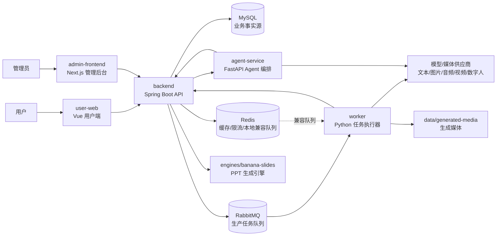
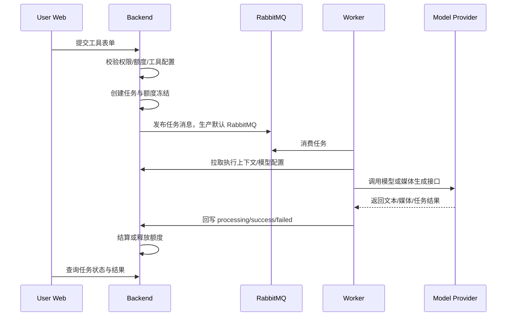
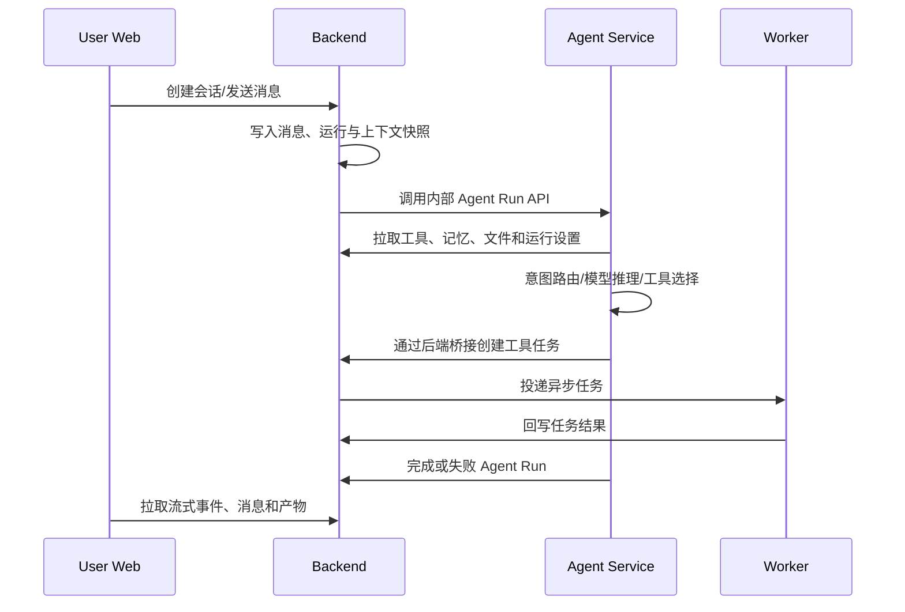

# 项目整体架构说明

本文采用“总--分”结构说明 AI Tool Market 的整体架构、核心模块、调用链路与后续优化方向。

## 总：整体架构

AI Tool Market 是一个多服务 AI 工具市场系统。后端 Spring Boot 负责业务事实源与权限/计费边界，用户端和管理后台分别提供 C 端使用体验与运营配置能力，Worker 负责异步执行多模态任务，Agent Service 负责复杂意图识别、工具编排和受控调用。

### 架构分层

| 层级 | 模块 | 职责 |
| --- | --- | --- |
| 入口层 | `user-web`, `admin-frontend` | 用户使用、管理配置、任务/结果/社区/Agent UI |
| 业务事实源 | `backend` | 用户、权限、工具、任务、额度、计费、模型配置、Agent 状态、审计 |
| 异步执行层 | `worker` | 队列消费、模型调用、生成媒体持久化、任务回写 |
| Agent 编排层 | `agent-service` | 意图路由 + 多步 graph 引擎、上下文注入、受控工具调用、文件与记忆运行时 |
| 引擎扩展层 | `engines/banana-slides` | PPT 专项生成与导出 |
| 基础设施 | MySQL, RabbitMQ, Redis, Nginx, Docker Compose | 存储、队列、缓存、反向代理和本地/生产编排 |

### 核心设计原则

- 后端是事实源：任务状态、额度冻结/结算、Agent 会话、工具配置、模型供应商信息都以后端为准。
- 异步任务闭环：前端发起任务，后端入库并投递队列，Worker 执行后通过内部 API 回写状态和结果。
- Agent 受控执行：Agent Service 可以路由和编排，但工具执行、额度边界、权限和审计仍回到后端。
- 工具配置数据化：工具字段、模板、工作流、模型供应商和计费口径尽量通过后台与数据库配置驱动。
- 多模态分层适配：文本、图片、音频、视频、数字人的供应商协议由 worker/client 和 handler 层隔离。

## 关键数据流

### 普通工具任务链路

### Agent 工具调用链路

## 分：模块详情

### 1. Backend

#### 功能定位

`backend` 是系统核心业务服务和事实源，负责用户认证、工具市场、任务状态机、额度计费、模型配置、Agent 运行记录、PPT 集成和管理后台 API。

#### 核心逻辑与核心类

| 领域 | 关键目录/类 | 说明 |
| --- | --- | --- |
| 应用入口 | `AiToolMarketApplication` | Spring Boot 启动入口 |
| 配置 | `src/main/resources/application.yml` | 端口、数据库、Redis、RabbitMQ、Agent、支付、PPT 引擎配置 |
| 认证用户 | `auth/`, `user/` | JWT 登录、验证码/短信、用户与后台用户管理 |
| 工具配置 | `tool/controller`, `tool/service` | 工具、分类、模板、字段 schema、工作流配置 |
| 任务队列 | `task/service/TaskServiceImpl`, `TaskStateMachine`, `TaskQueuePublisher` | 任务创建、状态迁移、队列发布、worker 回调 |
| 额度计费 | `credit/`, `admin/service/BillingServiceImpl` | 额度账户、充值订单、支付回调、计费日志 |
| Agent 事实源 | `agent/controller`, `agent/service` | 会话、运行、消息、工具调用、模型配置、工作区记忆 |
| 统一 API | `agent/service/UnifiedApiOverviewServiceImpl`, `ModelVendor*` | 模型供应商、账号、能力、余额检测与后台统一配置 |
| PPT | `ppt/` | PPT 项目、工作流、文件与 banana-slides 引擎集成 |

#### 数据流向/调用链路

输入来自用户端、管理后台或内部服务。Controller 完成权限与参数入口，Service 处理业务规则和状态机，Mapper/MyBatis-Plus 访问 MySQL。异步任务由 `TaskQueuePublisher` 投递到 RabbitMQ；Redis 队列仅保留本地开发或历史兼容。Worker 通过内部接口回写任务状态。Agent Service 只通过 `/api/internal/v1/agent` 相关接口读取上下文或提交运行结果。

### 2. Worker

#### 功能定位

`worker` 是异步任务执行层，面向文本生成、图片生成、音乐、语音、视频、数字人等多模态任务，隔离供应商协议差异，并负责生成媒体落盘和结果回写。

#### 核心逻辑与核心类/函数

| 目录/文件 | 说明 |
| --- | --- |
| `main.py` | 根据 `TASK_QUEUE_BACKEND` 选择消费器；生产默认 RabbitMQ |
| `config.py` | 统一读取 Redis、RabbitMQ、后端内部 API、供应商 Key、媒体路径等环境变量，并在生产环境拒绝默认 token、占位模型 key、mock provider 和 Redis 队列 |
| `task_queue/rabbitmq_consumer.py` | RabbitMQ 消费、重试和死信队列入口 |
| `task_queue/redis_consumer.py` | Redis 队列兼容消费入口 |
| `task_queue/task_handler_router.py` | 根据任务类型路由到具体 handler |
| `handlers/*_handler.py` | 文本、图片、音频、视频、数字人执行逻辑 |
| `client/*_client.py` | OpenAI、Kling、Suno、Seedance、SiliconFlow 等供应商客户端 |
| `tools/*` | 文案类工具的 prompt、parser、schema 与示例 |

#### 数据流向/调用链路

Worker 从 RabbitMQ 拉取生产任务消息，通过后端内部 API 获取任务上下文和模型配置，调用对应供应商生成结果。Redis 队列只作为本地开发或历史兼容入口。文本结果直接回写，媒体类结果先写入 `data/generated-media`，再以公开路径回写后端，由用户端展示。

### 3. Agent Service

#### 功能定位

`agent-service` 是独立 FastAPI 服务，负责 Agent 意图路由 + 多步 graph 引擎编排、工具选择、上下文组织、工作区文件/记忆注入以及受控工具调用。它不拥有业务数据，运行结果和审计记录仍写回后端。

> Agent 架构权威说明见 [agent/架构与维护指南.md](agent/架构与维护指南.md)；通俗链路见 [agent/链路梳理（小学生版）.md](agent/链路梳理（小学生版）.md)。

#### 核心逻辑与核心类/函数

| 目录/文件 | 说明 |
| --- | --- |
| `app/main.py` | FastAPI 应用创建、trace id 中间件、路由注册 |
| `app/core/runtime.py` | AgentRuntime 主运行时，组织模型调用、工具调用和完成回写 |
| `app/api/internal_runs.py` | 后端触发 Agent run 的内部 API |
| `app/clients/backend_client.py` | 访问 Spring Boot 内部接口 |
| `app/tools/registry.py` | 工具注册与可调用工具集合 |
| `app/tools/backend_tool.py` | 将 Agent 工具调用桥接到后端任务体系 |
| `app/tools/memory_tool.py` | 记忆新增、替换、删除请求 |
| `app/security/prompt_guard.py` | prompt 注入、敏感内容与控制字符防护 |

#### 数据流向/调用链路

后端创建 Agent Run 后调用 Agent Service。Agent Service 拉取当前运行上下文、可用工具、历史消息、文件摘要和记忆快照，模型完成路由后通过后端桥接创建工具任务。任务执行仍由后端/Worker 闭环，Agent Service 最后把运行结果、失败原因和事件写回后端。

### 4. User Web

#### 功能定位

`user-web` 是用户侧入口，提供 AI 工具市场、工具详情与动态表单、任务结果、Agent 工作台、社区内容和充值相关页面。

#### 核心逻辑与核心类/函数

| 目录 | 说明 |
| --- | --- |
| `src/pages/` | 用户端页面级视图 |
| `src/components/` | 工具卡片、表单、结果展示、Agent UI 等业务组件 |
| `src/api/` | 后端 API 请求封装 |
| `src/store/` | Pinia 全局状态 |
| `src/utils/taskResultBlocks.ts` | 任务结果块解析与展示适配 |
| `src/utils/assetPreviewAdapter.ts` | 生成媒体预览适配 |
| `src/utils/toolEntryRoute.ts` | 工具入口路由映射 |

#### 数据流向/调用链路

页面从后端获取工具、模型能力、用户额度和任务状态。用户提交表单后创建任务，轮询或订阅任务结果。媒体结果由后端返回公开 URL，前端按结果块类型渲染文本、图片、音频、视频或 PPT 产物。

### 5. Admin Frontend

#### 功能定位

`admin-frontend` 是运营和配置后台，面向工具、模型供应商、统一 API、任务队列、计费、用户、系统设置和社区管理。

#### 核心逻辑与核心类/函数

| 目录 | 说明 |
| --- | --- |
| `app/` | Next.js App Router 页面与 API 代理入口 |
| `components/` | 管理端页面组件、表单、表格、图表和弹窗 |
| `lib/` | API 客户端、类型定义、格式化与业务工具 |
| `scripts/` | 图标生成等辅助脚本 |

#### 数据流向/调用链路

后台页面通过后端 admin API 读写工具、字段 schema、模型供应商账号、系统设置和任务信息。复杂配置变更最终落入 MySQL，并影响用户端展示、Worker 执行上下文或 Agent 可用工具集合。跨环境同步运营配置见 [配置包导入导出 — 维护指南](./配置包导入导出-维护指南.md)。

### 6. Engines / Banana Slides

#### 功能定位

`engines/banana-slides` 是 PPT 生成与导出引擎，作为专项能力被后端 `ppt/` 模块调用。

#### 核心逻辑与核心类/函数

| 目录/文件 | 说明 |
| --- | --- |
| `README.md`, `README_EN.md` | 引擎使用说明 |
| `backend/` | PPT 引擎服务端实现 |
| `cli/banana_cli/` | 批处理与命令行能力 |
| `scripts/export_editable_pptx.py` | 可编辑 PPTX 导出脚本 |
| `docker-compose*.yml` | 引擎独立或一体化部署配置 |

#### 数据流向/调用链路

后端按 PPT 项目状态调用引擎 API，生成大纲、描述、图片、PPTX/PDF 等产物，并结合 `ppt.billing.*` 配置做分步骤额度计费。

## 优化与重构建议

| 优先级 | 建议 | 说明 |
| --- | --- | --- |
| P0 | 敏感文件出库与密钥轮换 | `.env`、`WXcert/*.pem`、`_remote.py`、`_fix_remote.py` 已从 Git 索引移除；上线前仍必须轮换可能暴露过的支付证书、内部 token、部署密码和模型 API key |
| P0 | 商业上线门禁 | 按 [商业上线P0发布门禁-2026-06-30.md](./商业上线P0发布门禁-2026-06-30.md) 执行生产配置、队列、mock/legacy、冻结额度和黄金链路检查 |
| P0 | 建立统一迁移机制 | 当前 `sql/*.sql` 数量较多，建议引入 Flyway/Liquibase 或明确 `_sql_migration_log` 规范，减少环境漂移 |
| P1 | 固化任务状态机契约 | 将任务状态、重试、死信、额度冻结/结算整理成状态机文档和测试矩阵，降低多模态任务扩展风险 |
| P1 | 收敛 Worker 供应商适配接口 | 为图片/视频/音频供应商定义统一 request/result/error 协议，减少 handler 与 client 的耦合 |
| P1 | 强化 Agent 内部 API 契约 | Agent Service 与后端之间建议维护 OpenAPI/契约测试，重点覆盖签名、运行设置、工具桥接和记忆写入 |
| P1 | 统一前端 API 类型来源 | 用户端和管理端都依赖后端 API，建议从 OpenAPI 生成 TypeScript 类型，减少手写 DTO 漂移 |
| P2 | 拆分历史阶段文档 | `docs/` 中阶段记录较多，建议保留“当前架构/开发指南/运维手册/API 契约”作为主入口，历史记录统一归档 |
| P2 | 提升本地启动可观测性 | `start-dev.ps1` 已较完整，可补充日志目录、健康检查摘要和失败诊断提示，方便新人定位启动失败 |
| P2 | 建立模块级 README | 为 `backend`, `worker`, `agent-service`, `user-web`, `admin-frontend` 补充各自 README，说明入口、配置和测试 |
| P2 | 增加端到端冒烟测试 | 围绕“创建工具任务 -> worker 回写 -> 前端结果可读”和“Agent 调工具任务”建立稳定 e2e smoke |

## 新成员阅读顺序

1. 阅读根目录 `README.md`，完成本地启动。
2. 阅读本文，理解服务边界和主数据流。
3. 阅读 `docs/api/openapi.yml`、`docs/统一API管理-开发文档.md` 与 [配置包导入导出 — 维护指南](./配置包导入导出-维护指南.md)，理解接口、模型供应商与跨环境配置同步。
4. 按职责进入对应模块：后端看 `backend/src/main/java/...`，Worker 看 `worker/main.py` 和 `worker/task_queue/`，Agent 看 `agent-service/app/main.py` 与 `app/core/runtime.py`，前端看页面目录和 API 封装。
5. 修改数据库或任务链路前，先补 SQL、测试 schema、任务状态/计费说明和回归测试。
